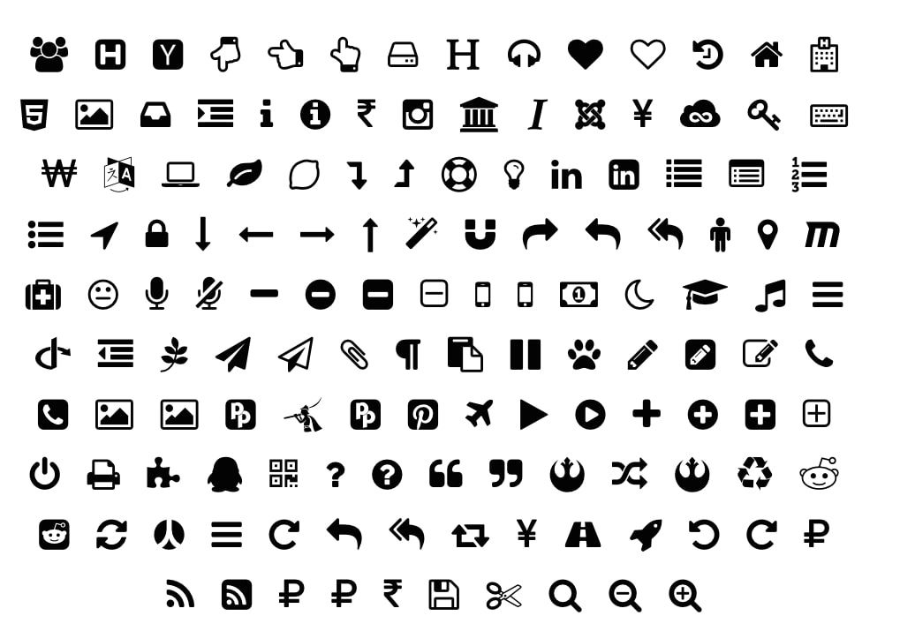

<!-- README.md is generated from README.Rmd. Please edit that file -->

# ggpop 
<!-- badges: start -->

[](https://ci.appveyor.com/project/dmi3kno/polite)
[](https://app.codecov.io/gh/dmi3kno/polite?branch=master)
[](https://CRAN.R-project.org/package=polite)
[](https://lifecycle.r-lib.org/articles/stages.html#maturing)
[](https://github.com/dmi3kno/polite/actions/workflows/R-CMD-check.yaml)
<!-- badges: end -->


`ggpop` is an R package that extends the capabilities of ggplot2 to create visually engaging and informative population charts.`ggpop` allows users to represent population data proportionally using customizable icons, enabling the creation of circular representative population charts with ease. Additionally, the package offers tools for adding descriptive captions adorned with icons, enhancing visualizations' interpretability and aesthetic appeal.

## Alternative Way to Show Information

`ggpop` is an alternative to conventional visualization techniques by incorporating icons and proportional representation into population charts. This method enhances the aesthetic quality of the plots and facilitates better audience engagement and understanding. By transforming numerical data into meaningful visual symbols, `ggpop` enables users to tell a more compelling story with their data, making complex information accessible and memorable.


## Installation

You can install `ggpop` from [CRAN](https://cran.r-project.org/) with:

``` r
install.packages("ggpop")
```

Development version of the package can be installed from
[Github](https://github.com/jurjoroa/ggpop) with:

``` r
install.packages("remotes")
remotes::install_github("jurjoroa/ggpop")
```

## Basic Example


### 1.- Create a Small Dataset or Use a Built-in Dataset

The dataset **`df_pop_mx`** is a **minimal example** illustrating population counts by sex in Mexico in 2024. It has the following structure:

- **sex**:  
  A categorical variable indicating the sex, with two entries:
  - `"male"`
  - `"female"`

- **n**:  
  A numeric variable representing the population size for each sex category.

- **country**:  
  A constant value `"Mexico"`, indicating the country these observations belong to.

- **continent**:  
  A constant value `"America"`, indicating the continent these observations belong to.


``` r
library(ggpop)

df_pop_mx <- data.frame(sex = c("male", "female"),
                        n = c(63459580, 67401427),
                        country = "Mexico",
                        continent = "America")
```

| **Sex**  | **Population (n)** | **Country** | **Continent** |
|----------|---------------------|-------------|---------------|
| Male     | 63,459,580          | Mexico      | America       |
| Female   | 67,401,427          | Mexico      | America       |

### 2.- Process data

``` r

df_pop_mx_prop <- process_data(data = df_pop_mx, group_var = sex, sum_var = n, sample_size = 1000)

head(df_pop_mx_prop)
```

| type   |        n |      prop   |
|:-------|---------:|------------:|
| male   | 63459580 | 0.4849388    |
| female | 67401427 | 0.5150612    |
| female | 67401427 | 0.5150612    |
| male   | 63459580 | 0.4849388    |
| male   | 63459580 | 0.4849388    |
| female | 67401427 | 0.5150612    |
| female | 67401427 | 0.5150612    |
| male   | 63459580 | 0.4849388    |
| female | 67401427 | 0.5150612    |
| male   | 63459580 | 0.4849388    |
| female | 67401427 | 0.5150612    |
| ...    | ...      | ...         |

We apply the `process_data()` function to the population data `df_pop_mx` with the following parameters:

- **group_var = sex**: groups the data by sex (male/female). This is our grouping variable
- **sum_var = n**: uses the column `n` (population counts) for group totals. This is the variable that will be summed up to calculate proportions.
- **sample_size = 1000**: generates 1,000 sampled records, proportionally allocated to each group. The package allows up to a sample size of 1000. 

The function calculates group proportions, then performs sampling to create a new data frame (`df_pop_mx_prop`). Each row represents one draw from the 1,000 samples. Notable columns:

- **type**: which group (male or female) was sampled.
- **n**: total population count of the corresponding group.
- **prop**: proportion of that group in the overall dataset.


```r
df_pop_mx_prop <- process_data(data = df_pop_mx, group_var = sex, 
                               sum_var = n, sample_size = 1000)
```

### 3.- Assign icons to groups

Here, we create a new column called `icon` in the `df_pop_mx_prop` dataset. The `case_when()` function checks each row’s **type** (either "male" or "female") and assigns a matching value ("male" or "female") to the `icon` column.

``` r
df_pop_mx_prop <- df_pop_mx_prop %>% 
  mutate(icon = case_when(
    type == "male" ~ "ggmale",
    type == "female" ~ "ggfemale"))
```

### 4.- Icons

The package includes a set of native icons. The icons are stored in the `inst/figures/` directory. The icons are in SVG format, which is a vector format that allows for scaling without loss of quality. The icons are used to represent different groups in the population chart.
Nevertheless, the package also allows the use of `fontawesome` icons. The difference between these two approaches is that the native icons are optimized for size and quality, while the `fontawesome` icons are more flexible and can be easily customized, however, the plot will be slow to render, especially if the plots contains a big sample size. 

##### 4.1.- Native Icons

Here is the list of native icons available in the package:


| Icon         | Icon Preview                                                                                               |
|:------------------|:-----------------------------------------------------------------------------------------------------------|
| `ggbike`           |                                     |
| `ggbuild`          |                                   |
| `ggcar`            |                                       |
| `ggcancer`         |                                 |
| `ggdollar`         |                                 |
| `ggfemale`         |                                 |
| `gggraduation_cap` |                 |
| `ggdisability`       |                             |
| `ggmale`           |                                     |
| `ggmoney`          |                                   |
| `gggsyringe`        |                               |
| `ggtree`           |                                     |
| `ggadenoma`        |                               |
| `ggdistal`         |                                  |
| `ggproximal`       |                              |
| `ggrectum`         |                                  |
| `ggone`            |                                       |
| `ggtwo`            |                                       |
| `ggthree`          |                                     |
| `ggfour`           |                                      |


All of these are optimized to generate the plot fast, regardless of the sample size.


##### 4.2.- Fontawesome Icons

<p style="display: flex; align-items: center;">
  
  
</p>

The package also allows the use of `fontawesome` icons. The icons are stored in the `fontawesome` package. The only thing that you need to specify is the name of the icon.

For example, this is ust a few sample of more than 1,500 icons available in the `fontawesome` package:
| List of Font Awesome icons                                                                                                                     | Preview                                                                                                       |
|:-----------------------------------------------------------------------------------------------------------------------------------------------:|:--------------------------------------------------------------------------------------------------------------:|
| **Sample icons:** <br>- home <br>- user <br>- envelope <br>- bell <br>- camera <br>- cog <br>- heart <br>- calendar <br>- cart-plus <br>- check <br>- cloud <br>- comment <br>- comments <br>- download <br>- edit <br>- file <br>- filter <br>- flag <br>- folder <br>- phone |  |


More icons will be available in the future upon request to be optimized. 

### 4.- Plot population chart

``` r
ggplot() +
  geom_pop(data = df_prop_mx_f, aes(icon = icon, group=type, color=type),
  size = 1, arrange=F) +
  theme_void() +
  theme(legend.position = "bottom")
```


The `geom_pop()` function creates a population chart using the `df_prop_mx_f` dataset. The object work as a gem_point figure plotted by determined x and y coordinates. We can also group and color the icons by the **type** variable since the icon it's a svg file. 

#### 4.1 Improve plot 

Like a ggplot object, we can improve it to have a more presentable plot. We can arrange our points, give color to the background, and add a title and caption to the plot.


### 5.- More examples

We can also include more than two icons in the same plot. In this example, we will identify the people that is disabled, and we will change some parameters.


``` r

#1.- We load or create the data
df_pop_dis_mx <- data.frame(sex = c("male", "female", "disabled males", "disabled females"),
                        value = c(53726732, 54978806, 9731396, 11106712),
                        country = "Mexico",
                        continent = "America")

#2.- We process the data
df_pop_dis_mx_prop <- process_data(data = df_pop_dis_mx, group_var = sex, 
                               sum_var = value, sample_size = 500)

#3.- Assign icons to groups
df_pop_dis_mx_prop <- df_pop_dis_mx_prop %>% 
  mutate(icon = case_when(
    type == "male" ~ "ggmale",
    type == "female" ~ "ggfemale",
    type == "disabled males" ~ "ggdisability",
    type == "disabled females" ~ "ggdisability"))

#4.- Plot 

ggplot() +
  geom_pop(data = df_pop_dis_mx_prop, aes(icon = icon, group=type, color=type),
           size = 1.3, arrange=F, legend_icons = T) +
  theme_void() +
  labs(title = "Population in Mexico by Sex and condition",
       subtitle = "2022",
       caption = "As of 2023, 16% of the population in Mexico has some form of disability.") +
  scale_color_manual(values = c("male" = "#1E88E5", "female" = "#D81B60",
                                "disabled males" = "#90CAF9", 
                                "disabled females" = "#F48FB1"),
    labels = c("male" = "Males", "female" = "Females", 
               "disabled females" = "Disabled Females",
               "disabled males" = "Disabled Males")) + 
  theme(legend.position = "bottom",legend.title = element_blank()) +
  guides(color = guide_legend(override.aes = list(icon = c("disability", "disability", 
                                                           "female", "male"), size = 5)))
```


