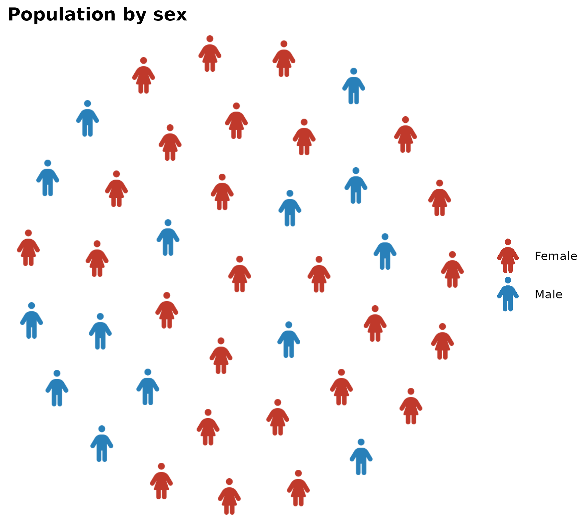

# Getting Started with ggpop

`ggpop` is a `ggplot2` extension for creating icon-based population
charts. Icons from Font Awesome replace bars or dots to represent
population proportions visually.

## Quick example

``` r
df_raw <- data.frame(
  sex = c("Female", "Male"),
  n   = c(55, 45)
)

df_plot <- process_data(
  data        = df_raw,
  group_var   = sex,
  sum_var     = n,
  sample_size = 40
) %>%
  mutate(icon = case_when(
    type == "Female" ~ "person-dress",
    type == "Male"   ~ "person"
  ))

ggplot() +
  geom_pop(
    data = df_plot,
    aes(icon = icon, color = type),
    size = 2.5, dpi = 72
  ) +
  scale_color_manual(values = c(Female = "#C0392B", Male = "#2980B9")) +
  theme_pop() +
  scale_legend_icon(size = 5) +
  labs(title = "Population by sex", color = NULL)
```



## Vignettes

| Vignette                                                                             | Description                                                                                                                                                                                                                                            |
|:-------------------------------------------------------------------------------------|:-------------------------------------------------------------------------------------------------------------------------------------------------------------------------------------------------------------------------------------------------------|
| [`process_data()`](https://jurjoroa.github.io/ggpop/reference/process_data.md)       | Prepare count data for plotting                                                                                                                                                                                                                        |
| [`geom_pop()`](https://jurjoroa.github.io/ggpop/reference/geom_pop.md)               | Population icon grids                                                                                                                                                                                                                                  |
| [`geom_icon_point()`](https://jurjoroa.github.io/ggpop/reference/geom_icon_point.md) | Icon scatter plots                                                                                                                                                                                                                                     |
| [`fa_icons()`](https://jurjoroa.github.io/ggpop/reference/fa_icons.md)               | Search Font Awesome icons                                                                                                                                                                                                                              |
| `Themes`                                                                             | [`theme_pop()`](https://jurjoroa.github.io/ggpop/reference/theme_pop.md), [`theme_pop_dark()`](https://jurjoroa.github.io/ggpop/reference/theme_pop_dark.md), [`theme_pop_minimal()`](https://jurjoroa.github.io/ggpop/reference/theme_pop_minimal.md) |
| `Tips`                                                                               | Rules, gotchas, and best practices                                                                                                                                                                                                                     |
