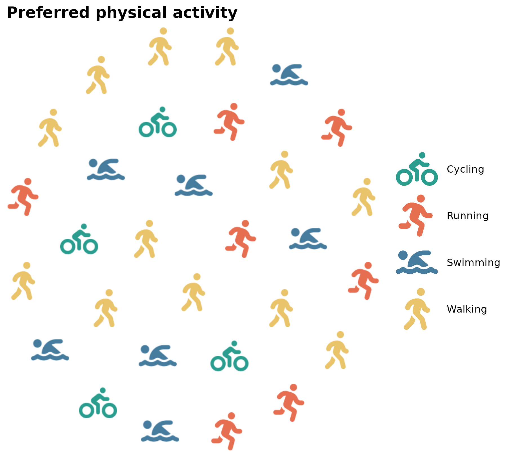
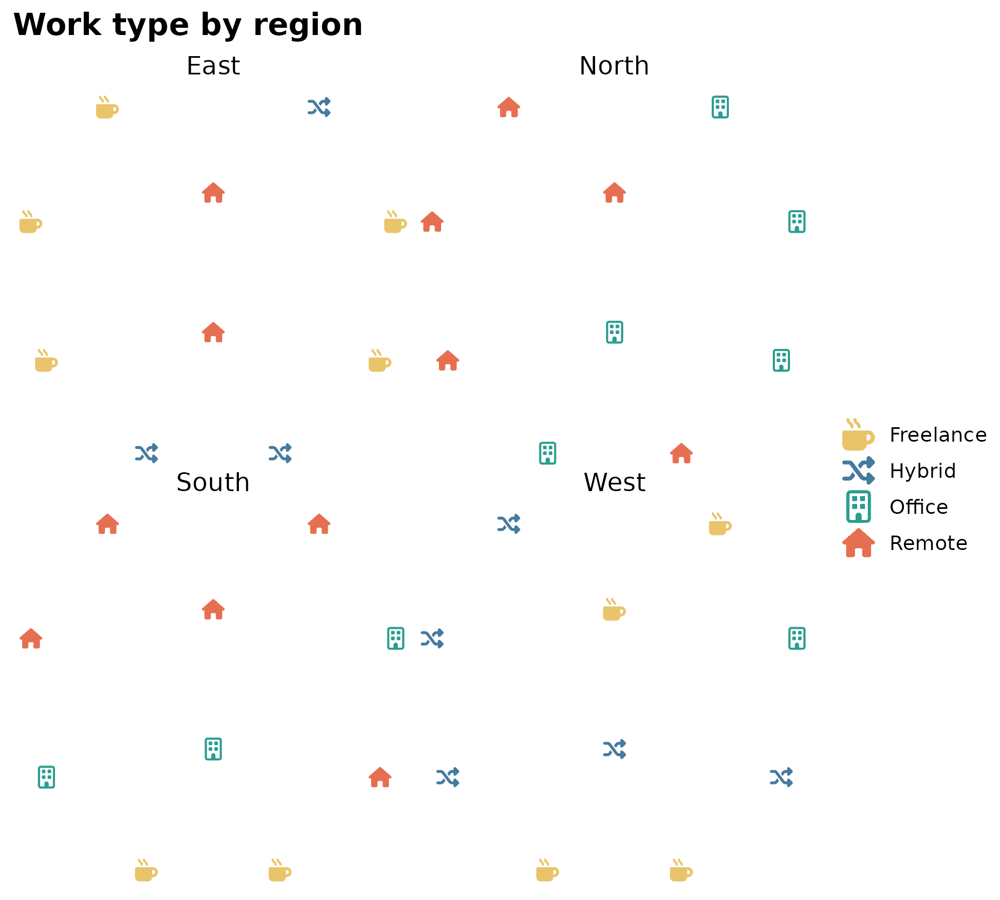
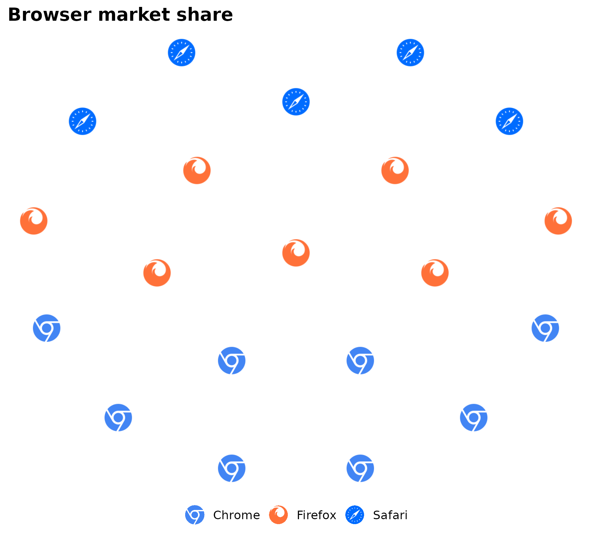

# geom_pop()

[`geom_pop()`](https://jurjoroa.github.io/ggpop/reference/geom_pop.md)
draws icon-based population grids. Add an `icon` column to your data,
then map `icon` and `color` in
[`aes()`](https://ggplot2.tidyverse.org/reference/aes.html). Do not map
`x` or `y` – layout is computed internally.

## Basic usage

``` r

df_raw <- data.frame(
  activity = c("Running", "Cycling", "Swimming", "Walking"),
  n        = c(28, 22, 18, 32)
)

df_plot <- process_data(
  data        = df_raw,
  group_var   = activity,
  sum_var     = n,
  sample_size = 30
) %>%
  mutate(icon = case_when(
    type == "Running"  ~ "person-running",
    type == "Cycling"  ~ "person-biking",
    type == "Swimming" ~ "person-swimming",
    type == "Walking"  ~ "person-walking"
  ))

ggplot() +
  geom_pop(
    data = df_plot,
    aes(icon = icon, color = type),
    size = 3, dpi = 72
  ) +
  scale_color_manual(values = c(
    Running  = "#e76f51",
    Cycling  = "#2a9d8f",
    Swimming = "#457b9d",
    Walking  = "#e9c46a"
  )) +
  theme_pop() +
  scale_legend_icon(size = 7) +
  labs(title = "Preferred physical activity", color = NULL)
```



Verify icon names with `fa_icons(query = "biking")` and
`fa_icons(query = "swimming")` as Font Awesome naming can vary slightly
by version.

## Faceted chart

Use `high_group_var` for the facet panel variable and `group_var` for
the color/icon variable within each panel. Icons from different groups
scatter and mix across each panel by default (`arrange = FALSE`).

``` r
df_raw <- data.frame(
  region    = c("North", "North", "North",
                "South", "South", "South",
                "East",  "East",  "East",
                "West",  "West",  "West"),
  work_type = c("Office", "Remote", "Hybrid",
                "Office", "Remote", "Freelance",
                "Remote", "Hybrid", "Freelance",
                "Office", "Hybrid", "Freelance"),
  n         = c(40, 35, 25,
                20, 45, 35,
                50, 30, 20,
                30, 40, 30)
)

df_plot <- process_data(
  data           = df_raw,
  group_var      = work_type,
  sum_var        = n,
  sample_size    = 10,
  high_group_var = "region"
) %>%
  mutate(icon = case_when(
    type == "Office"    ~ "building",
    type == "Remote"    ~ "house",
    type == "Hybrid"    ~ "shuffle",
    type == "Freelance" ~ "mug-hot"
  ))

ggplot() +
  geom_pop(
    data = df_plot,
    aes(icon = icon, color = type),
    size = 2, dpi = 72, facet = group
  ) +
  facet_wrap(~ group, ncol = 2) +
  scale_color_manual(values = c(
    Office    = "#2a9d8f",
    Remote    = "#e76f51",
    Hybrid    = "#457b9d",
    Freelance = "#e9c46a"
  )) +
  theme_pop() +
  labs(title = "Work type by region", color = NULL)
```



## Clustered layout

`arrange = TRUE` groups icons by category instead of scattering them.

``` r
df_browser <- data.frame(
  browser = c("Chrome", "Firefox", "Safari"),
  n       = c(45, 20, 25)
)

df_browser_plot <- process_data(
  data        = df_browser,
  group_var   = browser,
  sum_var     = n,
  sample_size = 20
) %>%
  mutate(icon = case_when(
    type == "Chrome"  ~ "chrome",
    type == "Firefox" ~ "firefox",
    type == "Safari"  ~ "safari",
    type == "Edge"    ~ "edge"
  ))

ggplot() +
  geom_pop(
    data    = df_browser_plot,
    aes(icon = icon, color = type),
    size    = 2, dpi = 72, arrange = TRUE
  ) +
  scale_color_manual(values = c(
    Chrome  = "#4285F4",
    Firefox = "#FF7139",
    Safari  = "#006CFF",
    Edge    = "#0078D7"
  )) +
  theme_pop() +
  theme(legend.position = "bottom") +
  labs(title = "Browser market share", color = NULL)
```



## Key parameters

| Parameter      | Default | Description                 |
|:---------------|:--------|:----------------------------|
| `size`         | `2`     | Icon size                   |
| `dpi`          | `100`   | Render resolution           |
| `arrange`      | `FALSE` | Cluster icons by group      |
| `legend_icons` | `FALSE` | Show icons in legend        |
| `seed`         | `NULL`  | Fix random layout           |
| `facet`        | `NULL`  | Column driving facet panels |
