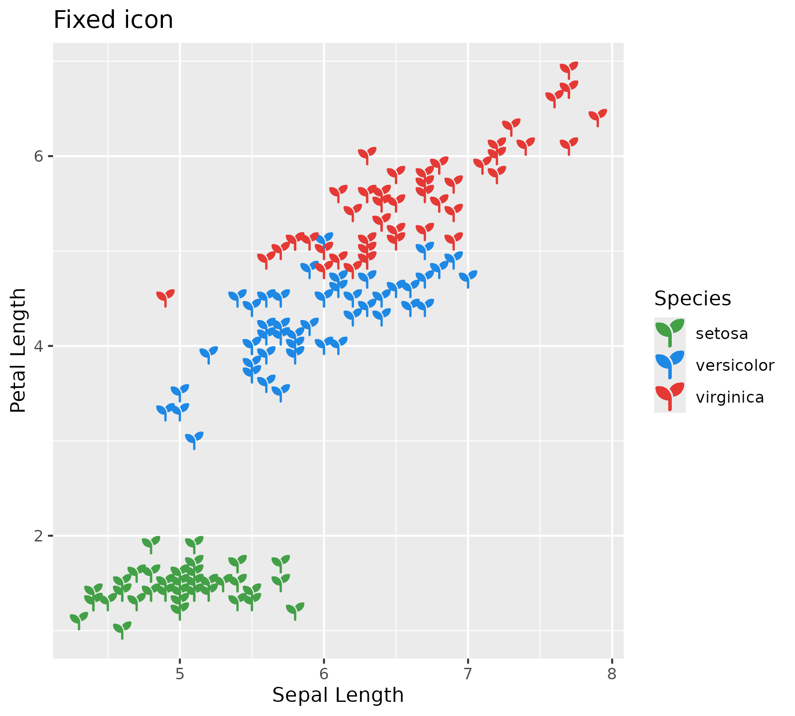
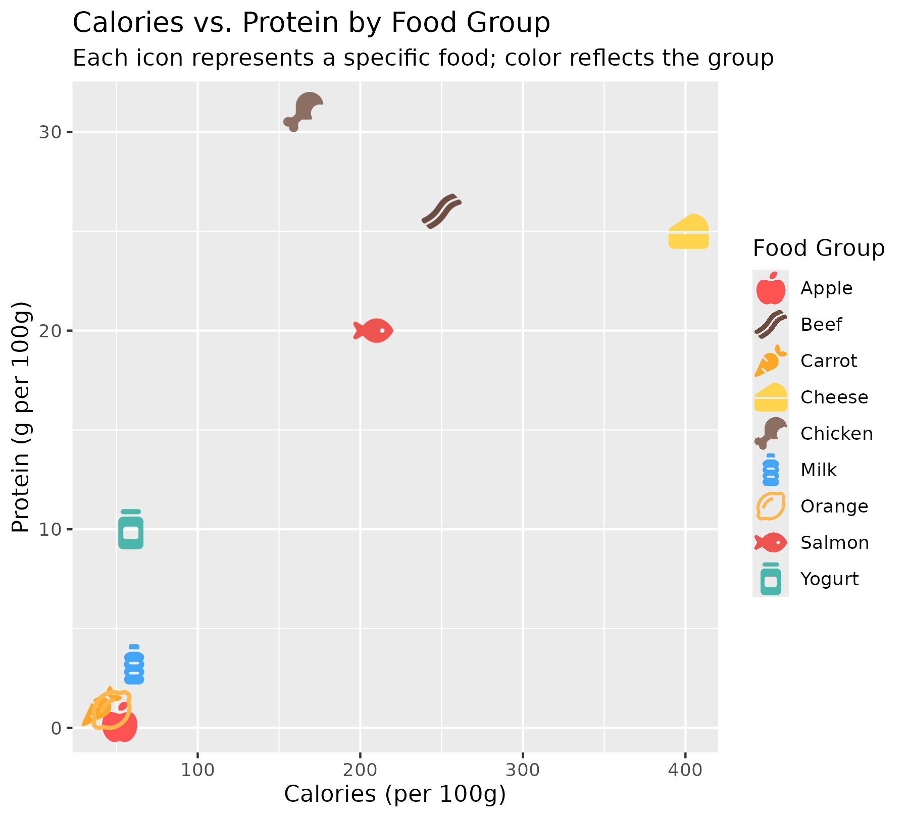

# geom_icon_point()

[`geom_icon_point()`](https://jurjoroa.github.io/ggpop/reference/geom_icon_point.md)
is a drop-in replacement for
[`geom_point()`](https://ggplot2.tidyverse.org/reference/geom_point.html)
that renders Font Awesome icons instead of dots. No preprocessing needed
– use it directly with any data frame that has `x` and `y` columns.

## Fixed icon

Use the `icon` parameter (not
[`aes()`](https://ggplot2.tidyverse.org/reference/aes.html)) to display
one icon across all points.

``` r

ggplot(iris, aes(x = Sepal.Length, y = Petal.Length, color = Species)) +
  geom_icon_point(icon = "seedling", size = 1, dpi = 72) +
  scale_color_manual(values = c(
    setosa     = "#43A047",
    versicolor = "#1E88E5",
    virginica  = "#E53935"
  )) +
  labs(title = "Fixed icon", x = "Sepal Length", y = "Petal Length")
```



## Icon per category

Map `icon` inside
[`aes()`](https://ggplot2.tidyverse.org/reference/aes.html) to assign a
different icon to each group.

``` r

library(ggplot2)
library(ggpop)

df_food <- data.frame(
  food     = c("Apple", "Carrot", "Orange", "Chicken", "Beef", "Salmon",
               "Milk", "Cheese", "Yogurt"),
  calories = c(52, 41, 47, 165, 250, 208, 61, 402, 59),
  protein  = c(0.3, 1.1, 0.9, 31, 26, 20, 3.2, 25, 10),
  group    = c(rep("Fruit", 3), rep("Meat", 3), rep("Dairy", 3)),
  icon     = c("apple-whole", "carrot", "lemon",
               "drumstick-bite", "bacon", "fish",
               "bottle-water", "cheese", "jar")
)

ggplot(df_food, aes(x = calories, y = protein, icon = icon, color = food)) +
  geom_icon_point(size = 2, dpi = 100) +
  scale_color_manual(values = c(
    "Apple" = "#FF5252", "Carrot" = "#FFA726", "Orange" = "#FFB74D",
    "Chicken" = "#8D6E63", "Beef" = "#6D4C41",
    "Salmon" = "#EF5350", "Milk" = "#42A5F5", "Cheese" = "#FFD54F", 
    "Yogurt" = "#4DB6AC"
  )) +
  labs(
    title = "Calories vs. Protein by Food Group",
    subtitle = "Each icon represents a specific food; color reflects the group",
    x = "Calories (per 100g)",
    y = "Protein (g per 100g)",
    color = "Food Group"
  )
```



## Key parameters

| Parameter     | Default    | Description                                 |
|:--------------|:-----------|:--------------------------------------------|
| `icon`        | `"person"` | Fixed icon name (overridden by `aes(icon)`) |
| `size`        | `2`        | Icon size                                   |
| `dpi`         | `100`      | Render resolution                           |
| `show.legend` | `NA`       | Whether to show legend entry                |
