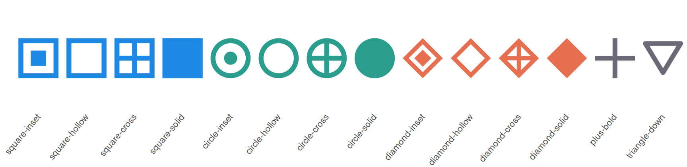

# Custom SVG Icons

ggpop resolves every icon name through a four-step priority chain:

1.  **Local `.svg` path** — a bare file path ending in `.svg`
2.  **`icon_path` folder** — bare name looked up inside a user-supplied
    directory
3.  **Bundled ggpop marker** — one of the 14 solid/outline markers
    shipped with the package
4.  **Font Awesome** — any valid FA name (the default for most icons)

The chain stops at the first match, so your files always take priority
over Font Awesome names.

## Bundled markers

ggpop ships 14 geometric markers you can use by name with no folder
needed. List them with
[`ggpop_markers()`](https://jurjoroa.github.io/ggpop/reference/ggpop_markers.md):

``` r

ggpop_markers()$bundled
```

     [1] "circle-cross"   "circle-hollow"  "circle-inset"   "circle-solid"
     [5] "diamond-cross"  "diamond-hollow" "diamond-inset"  "diamond-solid"
     [9] "plus-bold"      "square-cross"   "square-hollow"  "square-inset"
    [13] "square-solid"   "triangle-down" 

They work anywhere an icon name is expected — in
[`geom_icon_point()`](https://jurjoroa.github.io/ggpop/reference/geom_icon_point.md),
[`geom_pop()`](https://jurjoroa.github.io/ggpop/reference/geom_pop.md),
and
[`marker_legend()`](https://jurjoroa.github.io/ggpop/reference/marker_legend.md).

Show the code

``` r

families <- c("square", "circle", "diamond")
variants <- c("inset", "hollow", "cross", "solid")
pal <- c(square = "#1E88E5", circle = "#2A9D8F", diamond = "#E76F51")

icons <- paste(rep(families, each = 4), variants, sep = "-")
df_markers <- data.frame(
  icon   = c(icons, "plus-bold", "triangle-down"),
  x      = seq_len(14),
  y      = 1,
  colour = c(
    rep(pal["square"],  4),
    rep(pal["circle"],  4),
    rep(pal["diamond"], 4),
    "#6D6875", "#6D6875"
  ),
  stringsAsFactors = FALSE
)

ggplot(df_markers, aes(x = x, y = y, icon = icon, colour = colour)) +
  geom_icon_point(size = 8, dpi = 150, legend_icons = FALSE) +
  geom_text(aes(label = icon), y = 0.55, angle = 50,
            hjust = 1, size = 3, colour = "grey30") +
  scale_colour_identity() +
  scale_x_continuous(expand = expansion(add = c(0.8, 0.5))) +
  scale_y_continuous(limits = c(0.2, 1.4)) +
  theme_void()
```



Figure 1: All 14 bundled markers rendered with
[`geom_icon_point()`](https://jurjoroa.github.io/ggpop/reference/geom_icon_point.md).

## Using your own SVG files

Place your `.svg` files in a folder and pass the path via `icon_path`.
Reference each file by its bare name (no `.svg` extension):

``` r

# Folder layout:
#   my-icons/
#     hospital.svg
#     clinic.svg
#     pharmacy.svg

ggplot(df, aes(x = x, y = y, icon = facility_type, colour = region)) +
  geom_icon_point(size = 5, icon_path = "my-icons/") +
  scale_colour_manual(values = pal)
```

Set `options(ggpop.icon_path = "my-icons/")` once per session to avoid
repeating `icon_path` in every call:

``` r

options(ggpop.icon_path = "~/my-icons/")

# All three calls now resolve from ~/my-icons/ automatically
ggplot(df1, aes(x, y, icon = type)) + geom_icon_point()
ggplot(df2, aes(x, y, icon = type)) + geom_icon_point()
```

## Mixing icon sources

Sources can be mixed in a single plot — each `icon` value resolves
independently through the chain:

``` r

df_mixed <- data.frame(
  x    = 1:3,
  y    = 1,
  icon = c("hospital.svg",   # local absolute path  → resolves at step 1
            "square-solid",  # bundled marker       → resolves at step 3
            "stethoscope"),  # Font Awesome name     → resolves at step 4
  stringsAsFactors = FALSE
)

ggplot(df_mixed, aes(x = x, y = y, icon = icon)) +
  geom_icon_point(size = 6, icon_path = "my-icons/")
```

## Name shadowing

If a file in your `icon_path` folder shares a name with a Font Awesome
icon (e.g. `car.svg`), ggpop warns you at construction time:

``` r

# ~/my-icons/ contains car.svg and bus.svg — both are FA names
geom_icon_point(icon_path = "~/my-icons/")
#> Warning: 2 icon names in `icon_path` shadow Font Awesome names.
#> x Shadowed: "car", "bus".
#> i These will resolve to your SVG files, not Font Awesome icons.
#> i Rename the files (e.g. `my-car.svg`) to avoid the conflict.
```

The warning fires once at layer construction and is silent when there
are no conflicts.

## SVG tips

- **Single colour** — ggpop recolours icons by replacing the fill.
  Multi-colour SVGs will have all fills replaced by the mapped colour.
- **No embedded raster** — keep SVGs as pure vector paths; embedded PNGs
  inside SVGs are not recoloured.
- **`viewBox` required** — make sure your SVG has a `viewBox` attribute
  so ggpop can scale it correctly.
- **Naming** — avoid naming files the same as Font Awesome icons unless
  you intentionally want to override them.
