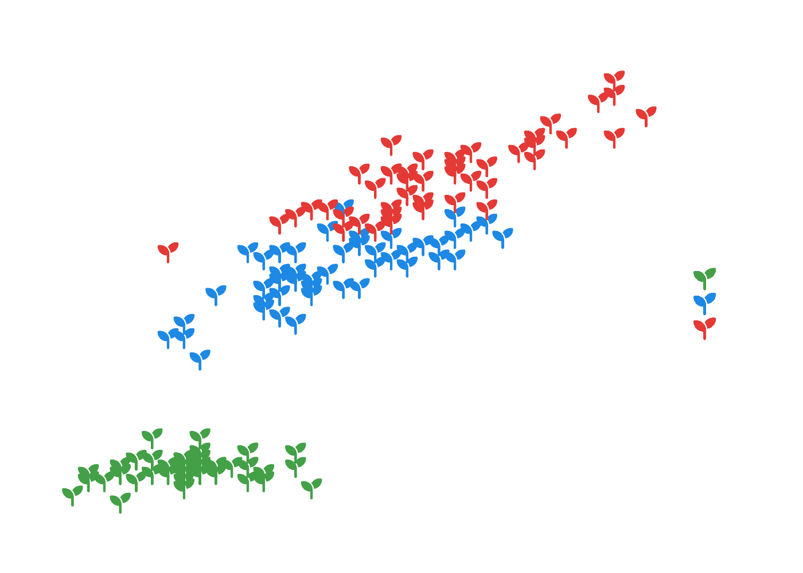
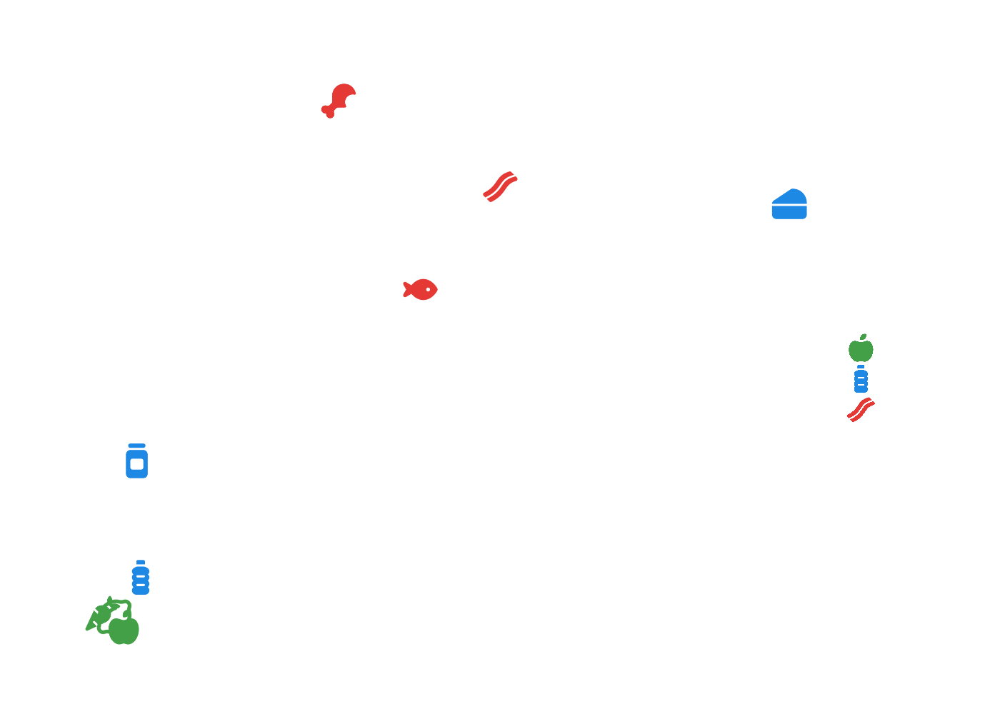
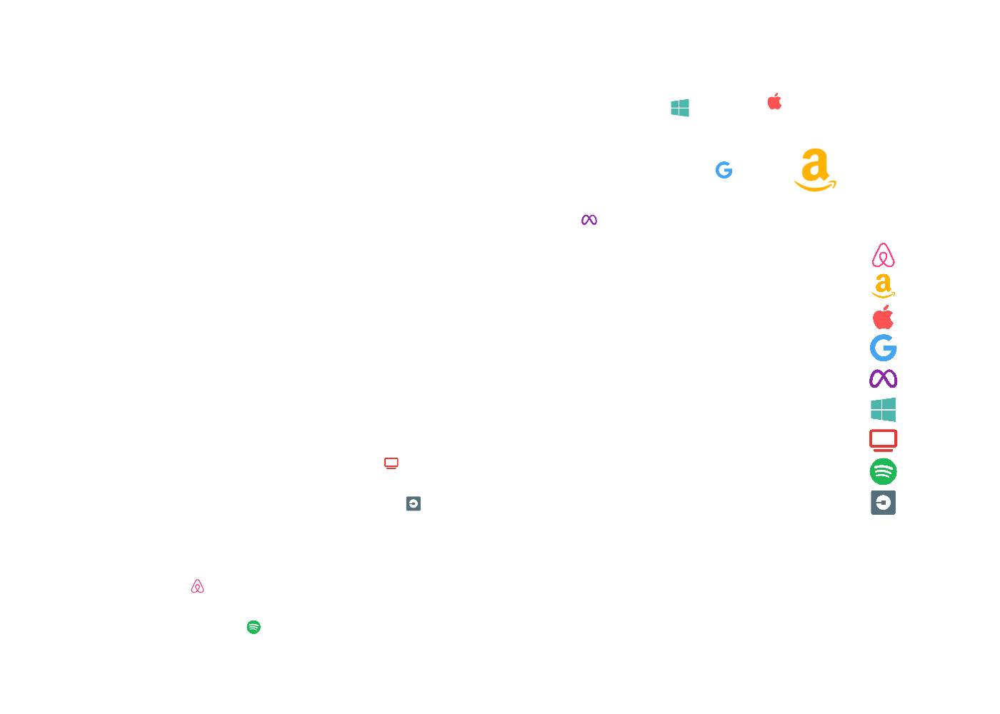
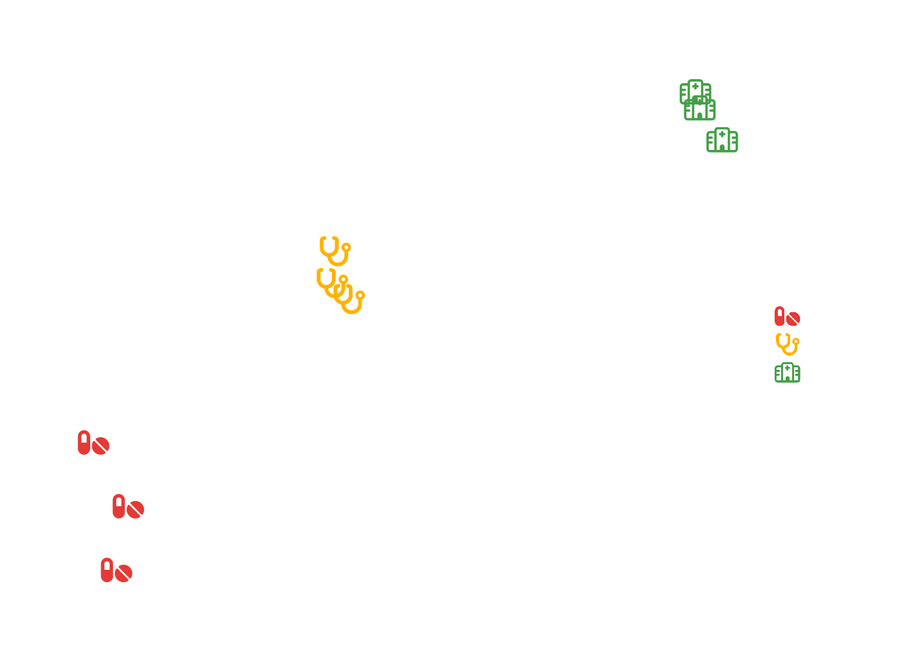
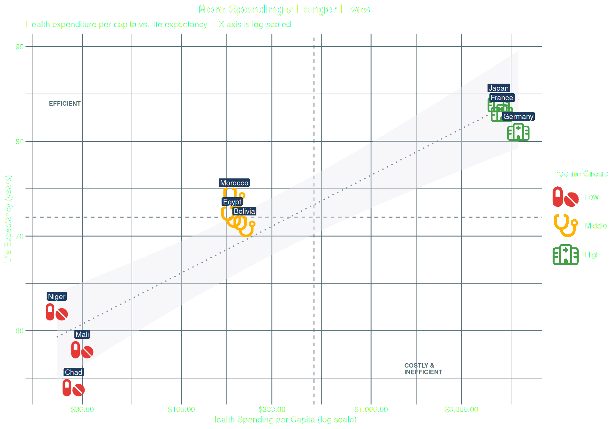
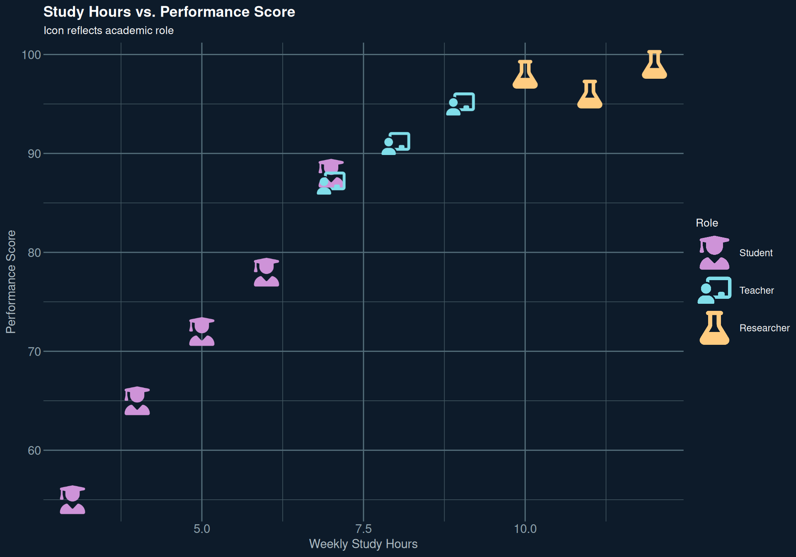

# geom_icon_point() Examples

``` r
library(ggpop)
library(ggplot2)
library(dplyr)
#> 
#> Attaching package: 'dplyr'
#> The following objects are masked from 'package:stats':
#> 
#>     filter, lag
#> The following objects are masked from 'package:base':
#> 
#>     intersect, setdiff, setequal, union
```

------------------------------------------------------------------------

## Example 1: Single Icon Scatter Plot

The simplest use: a fixed icon for all points, color encodes the
grouping variable.

``` r
ggplot(iris, aes(x = Sepal.Length, y = Petal.Length, color = Species)) +
  geom_icon_point(icon = "seedling", size = 1.5, dpi = 100) +
  scale_color_manual(values = c(
    "setosa"     = "#43A047",
    "versicolor" = "#1E88E5",
    "virginica"  = "#E53935"
  )) +
  theme_pop() +
  labs(
    title    = "Iris: Sepal vs. Petal Length",
    subtitle = "Fixed icon — color encodes species",
    x        = "Sepal Length (cm)",
    y        = "Petal Length (cm)",
    color    = "Species"
  )
```



------------------------------------------------------------------------

## Example 2: Different Icon per Category

Each food item gets its own icon. The icon is the identity — no legend
needed to understand what each point represents.

``` r
df_food <- data.frame(
  food     = c("Apple", "Carrot", "Orange", "Chicken", "Beef", "Salmon",
               "Milk", "Cheese", "Yogurt"),
  calories = c(52, 41, 47, 165, 250, 208, 61, 402, 59),
  protein  = c(0.3, 1.1, 0.9, 31, 26, 20, 3.2, 25, 10),
  group    = c(rep("Fruit & Veg", 3), rep("Meat & Fish", 3), rep("Dairy", 3)),
  icon     = c("apple-whole", "carrot", "lemon",
               "drumstick-bite", "bacon", "fish",
               "bottle-water", "cheese", "jar")
)

df_food$group <- factor(df_food$group,
  levels = c("Fruit & Veg", "Dairy", "Meat & Fish"))

ggplot(df_food, aes(x = calories, y = protein, icon = icon, color = group)) +
  geom_icon_point(size = 2, dpi = 100) +
  scale_color_manual(values = c(
    "Fruit & Veg"  = "#43A047",
    "Dairy"        = "#1E88E5",
    "Meat & Fish"  = "#E53935"
  )) +
  theme_pop() +
  labs(
    title    = "Calories vs. Protein by Food",
    subtitle = "Each icon represents a specific food; color reflects the group",
    x        = "Calories (per 100g)",
    y        = "Protein (g per 100g)",
    color    = "Group"
  )
```

    #> Warning: Multiple icons per color/group detected.
    #>   
    #> ! Why you are seeing this warning:
    #>   The legend can only display ONE icon per group, but some groups have
    #>   multiple:
    #>   
    #> - Fruit & Veg: 3 icons (apple-whole, carrot, lemon)
    #> - Dairy: 3 icons (bottle-water, cheese, jar)
    #> - Meat & Fish: 3 icons (drumstick-bite, bacon, fish)
    #>   
    #> ℹ What happens:
    #>   - The most frequent icon for each group will be shown in the legend
    #>   - Other icons in that group will still appear in the plot
    #>   - This may confuse viewers if icons have different meanings
    #>   
    #> ℹ Recommended fixes:
    #>   
    #>   Option 1: Use consistent icons per group
    #>   `df <- df %>% mutate(icon = case_when(`
    #>   `sex == 'A' ~ 'male',`
    #>   `sex == 'B' ~ 'female'`
    #>   `))`
    #>   
    #>   Option 2: Create a separate grouping variable
    #>   `df <- df %>% mutate(group = paste(sex, icon, sep = '_'))`
    #>   `ggplot() + geom_pop(aes(icon = icon, color = group))`
    #>   
    #>   Option 3: Set legend_icons = FALSE to use point markers
    #>   `geom_pop(..., legend_icons = FALSE)`



------------------------------------------------------------------------

## Example 3: Size Mapping

Map a continuous variable to icon size. Use
[`scales::rescale()`](https://scales.r-lib.org/reference/rescale.html)
to keep sizes readable.

``` r
df_brand <- data.frame(
  brand      = c("Apple", "Google", "Microsoft", "Meta", "Amazon",
                 "Netflix", "Spotify", "Uber", "Airbnb"),
  revenue    = c(394, 283, 212, 117, 514, 32, 13, 37, 9),
  market_cap = c(2950, 1750, 2800, 1200, 1750, 190, 55, 140, 75),
  employees  = c(160, 180, 220, 86, 1540, 13, 9, 32, 6),
  icon       = c("apple", "google", "windows", "meta", "amazon",
                 "tv", "spotify", "uber", "airbnb")
)

df_brand$size_scaled <- scales::rescale(df_brand$employees, to = c(0.8, 2.5))

ggplot(df_brand, aes(x = revenue, y = market_cap,
                       icon = icon, color = brand, size = size_scaled)) +
  geom_icon_point(dpi = 100) +
  scale_x_log10(labels = scales::dollar_format(suffix = "B")) +
  scale_y_log10(labels = scales::dollar_format(suffix = "B")) +
  scale_color_manual(values = c(
    "Apple"     = "#FF5252", "Google"    = "#42A5F5",
    "Microsoft" = "#4DB6AC", "Meta"      = "#8E24AA",
    "Amazon"    = "#FFB300", "Netflix"   = "#E53935",
    "Spotify"   = "#1DB954", "Uber"      = "#546E7A",
    "Airbnb"    = "#FF4081"
  )) +
  scale_size_continuous(range = c(1, 3), labels = scales::comma) +
  theme_pop() +
  labs(
    title    = "Tech Giants: Revenue vs. Market Cap",
    subtitle = "Icon = brand  ·  Size = employees (rescaled)  ·  Log scales",
    x        = "Annual Revenue (log scale)",
    y        = "Market Cap (log scale)",
    color    = "Brand",
    size     = "Employees"
  )
```

    #> Ignoring unknown labels:
    #> • size : "Employees"



------------------------------------------------------------------------

## Example 4: Factor Ordering

Factor levels control both legend order and icon assignment. Always set
levels explicitly.

``` r
df_health <- data.frame(
  country  = c("Chad", "Mali", "Niger", "Bolivia", "Egypt",
               "Morocco", "Germany", "France", "Japan"),
  spend    = c(27, 30, 22, 215, 185, 190, 5986, 4902, 4717),
  life_exp = c(54, 58, 62, 71, 72, 74, 81, 83, 84),
  income   = c(rep("Low", 3), rep("Middle", 3), rep("High", 3)),
  icon     = c(rep("pills", 3), rep("stethoscope", 3), rep("hospital", 3))
)

df_health$income <- factor(df_health$income,
  levels = c("Low", "Middle", "High"))

ggplot(df_health, aes(x = spend, y = life_exp,
                        icon = icon, color = income)) +
  geom_icon_point(size = 2, dpi = 100) +
  scale_x_log10(labels = scales::dollar_format()) +
  scale_color_manual(values = c(
    "Low"    = "#E53935",
    "Middle" = "#FFB300",
    "High"   = "#43A047"
  )) +
  scale_legend_icon(size = 6) +
  theme_pop() +
  labs(
    title    = "Health Spending vs. Life Expectancy",
    subtitle = "Factor levels control legend order and icon assignment",
    x        = "Health Spending per Capita (log scale)",
    y        = "Life Expectancy (years)",
    color    = "Income Group"
  )
```



------------------------------------------------------------------------

## Example 5: Combined Geoms

[`geom_icon_point()`](https://jurjoroa.github.io/ggpop/reference/geom_icon_point.md)
works alongside any ggplot2 geom. Here combined with
[`geom_smooth()`](https://ggplot2.tidyverse.org/reference/geom_smooth.html),
reference lines, labels, and quadrant annotations.

``` r
ggplot(df_health, aes(x = spend, y = life_exp,
                        icon = icon, color = income)) +
  geom_vline(xintercept = 500, linetype = "dashed",
             color = "#546E7A", linewidth = 0.5) +
  geom_hline(yintercept = 72, linetype = "dashed",
             color = "#546E7A", linewidth = 0.5) +
  geom_smooth(aes(group = 1), method = "lm", se = TRUE,
              color = "#78909C", fill = "#ECEFF1",
              linewidth = 0.7, linetype = "dotted", alpha = 0.4) +
  geom_icon_point(size = 2, dpi = 100) +
  geom_label(aes(label = country), color = "white",
             fill = "#1E3A5F", label.size = 0,
             label.padding = unit(0.15, "lines"),
             vjust = -1.3, size = 3) +
  annotate("text", x = 20, y = 84, label = "EFFICIENT",
           color = "#546E7A", size = 2.5, hjust = 0, fontface = "bold") +
  annotate("text", x = 1500, y = 56, label = "COSTLY &\nINEFFICIENT",
           color = "#546E7A", size = 2.5, hjust = 0,
           fontface = "bold", lineheight = 0.9) +
  scale_x_log10(labels = scales::dollar_format()) +
  scale_color_manual(values = c(
    "Low"    = "#E53935",
    "Middle" = "#FFB300",
    "High"   = "#43A047"
  )) +
  scale_legend_icon(size = 6) +
  theme_pop() +
  theme(
    axis.text  = element_text(color = "#546E7A", size = 9),
    axis.title = element_text(color = "#37474F", size = 10)
  ) +
  labs(
    title    = "More Spending \u2260 Longer Lives",
    subtitle = "Health expenditure per capita vs. life expectancy  \u00b7  X-axis is log-scaled",
    x        = "Health Spending per Capita (log scale)",
    y        = "Life Expectancy (years)",
    color    = "Income Group"
  )
#> `geom_smooth()` using formula = 'y ~ x'
#> Warning: The following aesthetics were dropped during statistical transformation: icon.
#> ℹ This can happen when ggplot fails to infer the correct grouping structure in
#>   the data.
#> ℹ Did you forget to specify a `group` aesthetic or to convert a numerical
#>   variable into a factor?
#> `geom_smooth()` using formula = 'y ~ x'
#> Warning: The following aesthetics were dropped during statistical transformation: icon.
#> ℹ This can happen when ggplot fails to infer the correct grouping structure in
#>   the data.
#> ℹ Did you forget to specify a `group` aesthetic or to convert a numerical
#>   variable into a factor?
#> Warning: The `label.size` argument of `geom_label()` is deprecated as of ggplot2 3.5.0.
#> ℹ Please use the `linewidth` argument instead.
#> This warning is displayed once per session.
#> Call `lifecycle::last_lifecycle_warnings()` to see where this warning was
#> generated.
#> `geom_smooth()` using formula = 'y ~ x'
#> Warning: The following aesthetics were dropped during statistical transformation: icon.
#> ℹ This can happen when ggplot fails to infer the correct grouping structure in
#>   the data.
#> ℹ Did you forget to specify a `group` aesthetic or to convert a numerical
#>   variable into a factor?
```



------------------------------------------------------------------------

## Example 6: Dark Theme Scatter

[`geom_icon_point()`](https://jurjoroa.github.io/ggpop/reference/geom_icon_point.md)
with
[`theme_pop_dark()`](https://jurjoroa.github.io/ggpop/reference/theme_pop_dark.md)
for a presentation-ready chart.

``` r
df_academic <- data.frame(
  name        = c("Alice", "Bob", "Carol", "Dan", "Eve",
                  "Prof. A", "Prof. B", "Prof. C",
                  "Dr. X", "Dr. Y", "Dr. Z"),
  study_hours = c(6, 4, 7, 3, 5, 8, 9, 7, 10, 12, 11),
  score       = c(78, 65, 88, 55, 72, 91, 95, 87, 98, 99, 96),
  role        = c(rep("Student", 5), rep("Teacher", 3), rep("Researcher", 3)),
  icon        = c(rep("user-graduate", 5), rep("chalkboard-user", 3), rep("flask", 3))
)

df_academic$role <- factor(df_academic$role,
  levels = c("Student", "Teacher", "Researcher"))

ggplot(df_academic, aes(x = study_hours, y = score,
                          icon = icon, color = role)) +
  geom_icon_point(size = 2, dpi = 100) +
  scale_color_manual(values = c(
    "Student"    = "#CE93D8",
    "Teacher"    = "#80DEEA",
    "Researcher" = "#FFCC80"
  )) +
  scale_legend_icon(size = 6) +
  theme_pop_dark(bg_color = "#0D1B2A", text_color = "white") +
  theme(
    axis.text  = element_text(color = "#90A4AE"),
    axis.title = element_text(color = "#B0BEC5")
  ) +
  labs(
    title    = "Study Hours vs. Performance Score",
    subtitle = "Icon reflects academic role",
    x        = "Weekly Study Hours",
    y        = "Performance Score",
    color    = "Role"
  )
```


