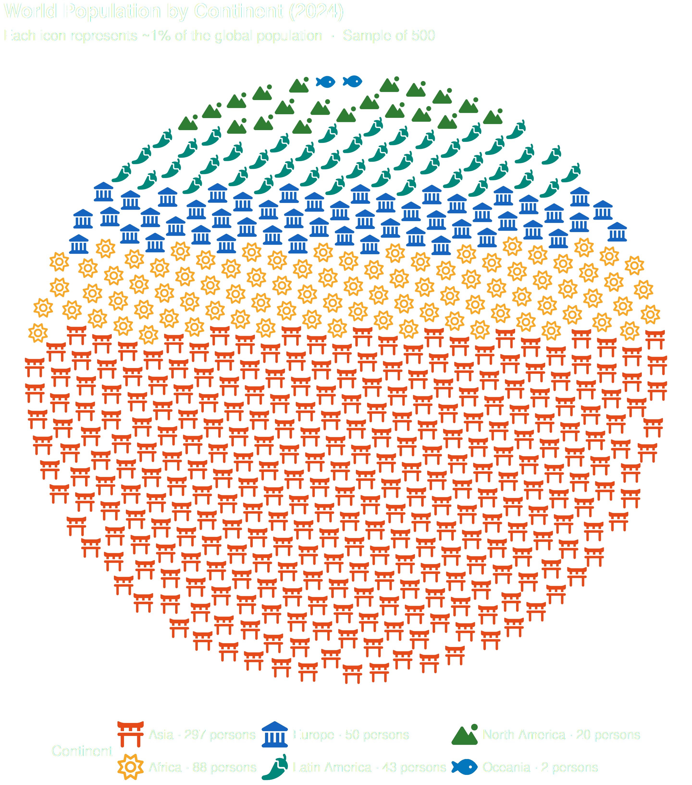
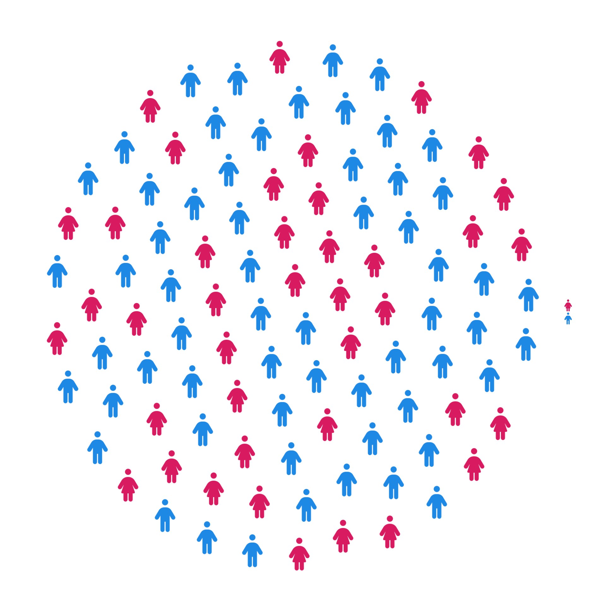
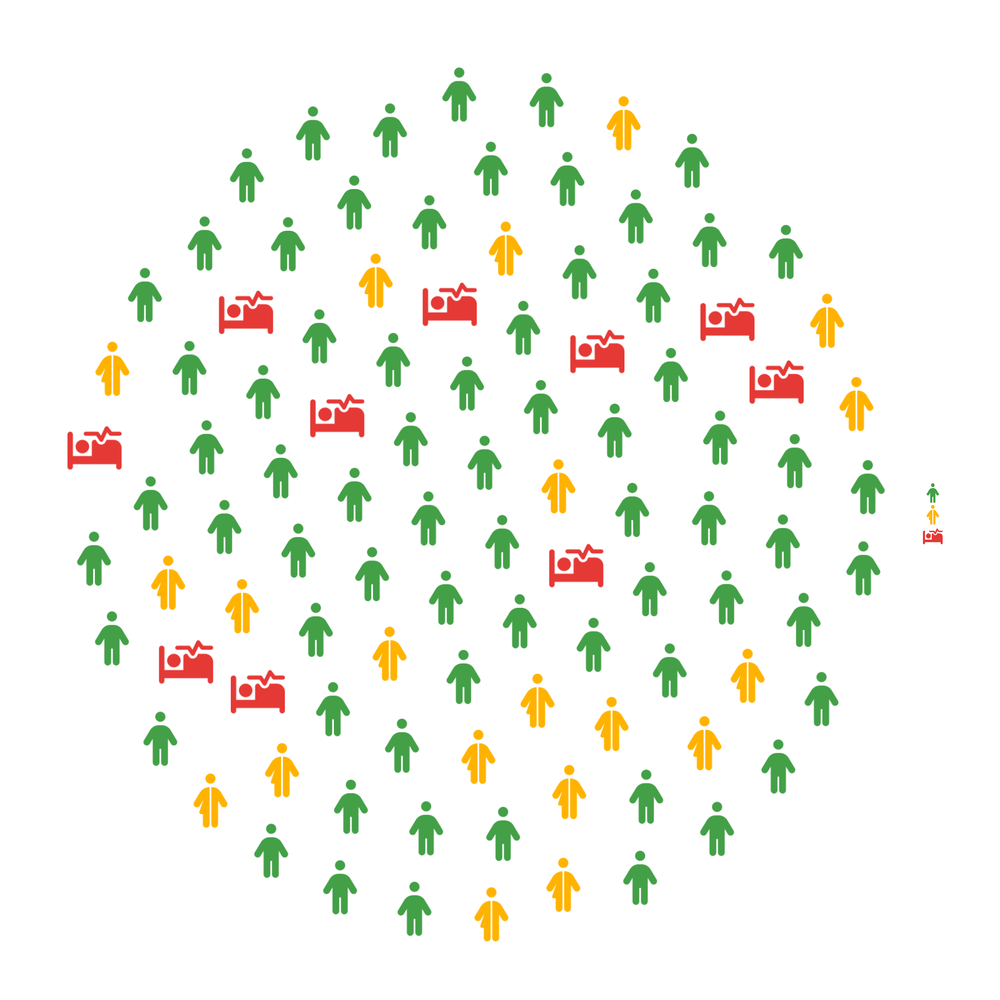
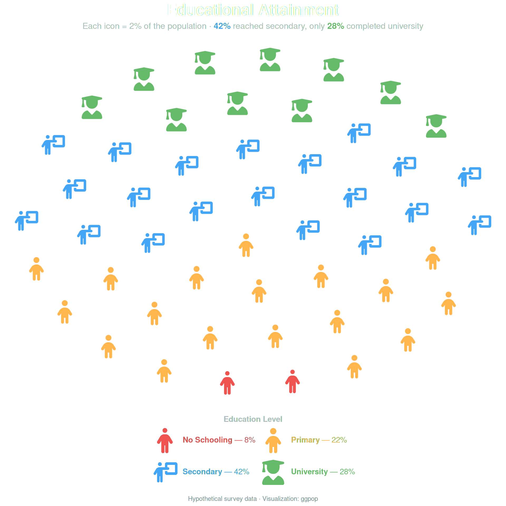
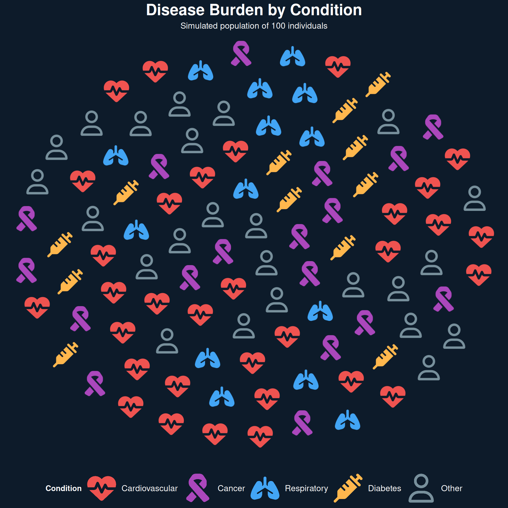
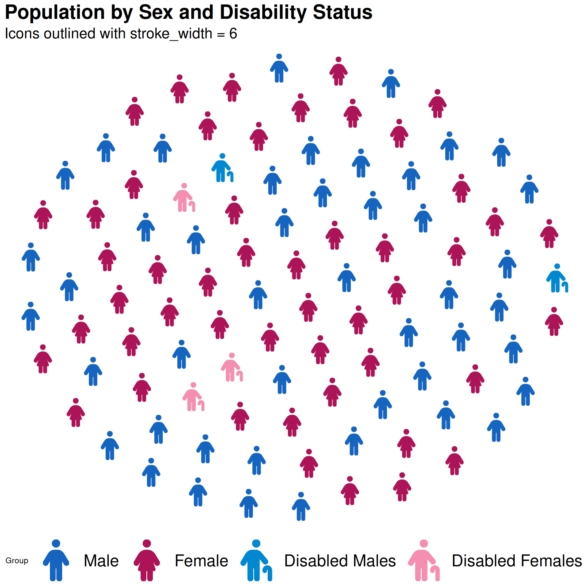

# geom_pop() Examples

------------------------------------------------------------------------

## Example 1: World Population by Continent

Out of every 100 people on Earth, how many come from each continent?
Each icon uses a distinct symbol and color per continent, and the legend
shows the exact count.

Show the code

``` r
library(ggpop)
library(ggplot2)
library(dplyr)

df_world <- data.frame(
  continent = c("Asia", "Africa", "Europe", "Latin America", "North America", "Oceania"),
  n         = c(4753079000, 1441090000, 748000000, 662000000, 376000000, 45000000)
)

df_world_proc <- process_data(
  data        = df_world,
  group_var   = continent,
  sum_var     = n,
  sample_size = 500
) %>%
  mutate(icon = case_when(
    type == "Asia"          ~ "torii-gate",
    type == "Africa"        ~ "sun",
    type == "Europe"        ~ "landmark",
    type == "Latin America" ~ "pepper-hot",
    type == "North America" ~ "mountain-sun",
    type == "Oceania"       ~ "fish"
  ))

df_world_proc$type <- factor(df_world_proc$type,
  levels = c("Asia", "Africa", "Europe",
             "Latin America", "North America", "Oceania"))

# Build legend labels showing exact icon count per continent
df_counts <- df_world_proc %>%
  group_by(type) %>%
  summarise(n_icons = n(), .groups = "drop") %>%
  mutate(label = paste0(type, " \u00b7 ", n_icons, " persons"))

v_labels <- setNames(df_counts$label, as.character(df_counts$type))

ggplot(data = df_world_proc,
    aes(icon = icon, color = type)) +
  geom_pop(size         = 1,
            dpi          = 100,
            legend_icons = TRUE,
            arrange      = TRUE) +
  scale_color_manual(
    values = c(
      "Asia"          = "#E64A19",
      "Africa"        = "#F9A825",
      "Europe"        = "#1565C0",
      "Latin America" = "#00897B",
      "North America" = "#2E7D32",
      "Oceania"       = "#0277BD"
    ),
    labels = v_labels
  ) +
  theme_pop(base_size = 25) +
  scale_legend_icon(size = 8) +
  theme(plot.background   = element_blank(),
        panel.background  = element_blank(),
        legend.background = element_blank(),
        legend.key        = element_blank(),
        legend.position = "bottom", plot.title = element_text(color = "white"),
        plot.subtitle = element_text(color = "white"),
        legend.text = element_text(color = "white"),
        legend.title = element_text(color = "white")) +
  labs(
    title    = "World Population by Continent (2024)",
    subtitle = "Each icon represents ~1% of the global population  \u00b7  Sample of 500",
    color    = "Continent"
  )
```

    Downloading dataset...



------------------------------------------------------------------------

## Example 2: Population by Sex

A simple two-group population chart using Mexico’s 2024 population data.

Show the code

``` r
library(ggpop)
library(ggplot2)
library(dplyr)

df_sex <- data.frame(
  sex = c("male", "female"),
  n   = c(63459580, 67401427)
)

df_sex_proc <- process_data(
  data        = df_sex,
  group_var   = sex,
  sum_var     = n,
  sample_size = 100
) %>%
  mutate(icon = case_when(
    type == "male"   ~ "male",
    type == "female" ~ "female"
  ))

ggplot() +
  geom_pop(
    data         = df_sex_proc,
    aes(icon = icon, color = type),
    size         = 2,
    dpi          = 100,
    legend_icons = TRUE
  ) +
  scale_color_manual(values = c("male" = "#1E88E5", "female" = "#D81B60")) +
  scale_legend_icon(size = 5) +
  theme_pop() +
  labs(
    title    = "Mexico Population by Sex (2024)",
    subtitle = "Each icon represents ~1% of the total population",
    color    = "Sex"
  )
```



------------------------------------------------------------------------

## Example 3: Health Status

A three-group chart showing a simulated patient population broken down
by health status.

Show the code

``` r
library(ggpop)
library(ggplot2)
library(dplyr)

df_health <- data.frame(
  status = c(rep("Healthy", 70), rep("At Risk", 20), rep("Ill", 10)),
  icon   = c(rep("person", 70), rep("person-half-dress", 20), rep("bed-pulse", 10))
)

df_health$status <- factor(df_health$status,
  levels = c("Healthy", "At Risk", "Ill"))

ggplot() +
  geom_pop(
    data         = df_health,
    aes(icon = icon, color = status),
    size         = 2,
    dpi          = 100,
    legend_icons = TRUE
  ) +
  scale_color_manual(values = c(
    "Healthy"  = "#43A047",
    "At Risk"  = "#FFB300",
    "Ill"      = "#E53935"
  )) +
  scale_legend_icon(size = 5) +
  theme_pop() +
  labs(
    title    = "Simulated Patient Population (n = 100)",
    subtitle = "Each icon represents one patient",
    color    = "Status"
  )
```



------------------------------------------------------------------------

## Example 4: Education Levels

Population chart showing education attainment across four levels.

Show the code

``` r
library(ggpop)
library(ggplot2)
library(dplyr)
library(ggtext)

df_edu <- data.frame(
  level = c("No Schooling", "Primary", "Secondary", "University"),
  n     = c(8, 22, 42, 28)
)

df_edu_proc <- process_data(
  data        = df_edu,
  group_var   = level,
  sum_var     = n,
  sample_size = 50
) %>%
  mutate(icon = case_when(
    type == "No Schooling" ~ "person",
    type == "Primary"      ~ "child",
    type == "Secondary"    ~ "person-chalkboard",
    type == "University"   ~ "user-graduate",
    TRUE ~ "user"
  ))

df_edu_proc$type <- factor(df_edu_proc$type,
  levels = c("No Schooling", "Primary", "Secondary", "University"))

pal <- c(
  "No Schooling" = "#EF5350",
  "Primary"      = "#FFB74D",
  "Secondary"    = "#42A5F5",
  "University"   = "#66BB6A"
)

# Annotation data for % labels below the grid
df_labels <- data.frame(
  type    = factor(c("No Schooling", "Primary", "Secondary", "University"),
                   levels = c("No Schooling", "Primary", "Secondary", "University")),
  pct     = c("8%", "22%", "42%", "28%"),
  color   = unname(pal)
)

ggplot() +
  geom_pop(
    data         = df_edu_proc,
    aes(icon = icon, color = type),
    size         = 2.2,
    dpi          = 100,
    legend_icons = TRUE,
    arrange      = TRUE
  ) +
  scale_color_manual(values = pal,
    labels = c(
      "No Schooling" = "<span style='color:#EF5350'>**No Schooling** — 8%</span>",
      "Primary"      = "<span style='color:#FFB74D'>**Primary** — 22%</span>",
      "Secondary"    = "<span style='color:#42A5F5'>**Secondary** — 42%</span>",
      "University"   = "<span style='color:#66BB6A'>**University** — 28%</span>"
    )
  ) +
  guides(color = guide_legend(
    ncol           = 2,
    byrow          = TRUE,
    title.position = "top",
    title.hjust    = 0.5,
    label.theme    = element_markdown(size = 11)
  )) +
    theme_pop() +
  theme(
    plot.title       = element_markdown(
      size   = 22, face = "bold", hjust = 0.5,
      color  = "white", margin = margin(b = 6)
    ),
    plot.subtitle    = element_markdown(
      size      = 12, hjust = 0.5, color = "#B0BEC5",
      lineheight = 1.4, margin = margin(b = 18)
    ),
    plot.caption     = element_markdown(
      size  = 9, color = "#78909C", hjust = 0.5,
      margin = margin(t = 14)
    ),
    legend.position  = "bottom",
    legend.title     = element_text(color = "#B0BEC5", size = 11,
                                    face = "bold"),
    legend.margin    = margin(t = 12),
    legend.spacing.x = unit(8, "pt")
  ) +
    theme_transp +
scale_legend_icon(size = 7) +
labs(
  title    = "Educational Attainment",
  subtitle = "Each icon = 2% of the population &nbsp;·&nbsp;
              <span style='color:#42A5F5'>**42%**</span> reached secondary,
              only <span style='color:#66BB6A'>**28%**</span> completed university",
  caption  = "Hypothetical survey data · Visualization: ggpop",
  color    = "Education Level"
)
```



------------------------------------------------------------------------

## Example 5: Disease Burden with Dark Theme

A dark-themed chart showing disease categories in a simulated
population.

Show the code

``` r
library(ggpop)
library(ggplot2)
library(dplyr)

df_disease <- data.frame(
  condition = c(rep("Cardiovascular", 32), rep("Cancer", 18),
                rep("Respiratory", 14), rep("Diabetes", 12),
                rep("Other", 24)),
  icon      = c(rep("heart-pulse", 32), rep("ribbon", 18),
                rep("lungs", 14), rep("syringe", 12),
                rep("user", 24))
)

df_disease$condition <- factor(df_disease$condition,
  levels = c("Cardiovascular", "Cancer", "Respiratory", "Diabetes", "Other"))

ggplot() +
  geom_pop(
    data         = df_disease,
    aes(icon = icon, color = condition),
    size         = 2,
    dpi          = 100,
    legend_icons = TRUE
  ) +
  scale_color_manual(values = c(
    "Cardiovascular" = "#EF5350",
    "Cancer"         = "#AB47BC",
    "Respiratory"    = "#42A5F5",
    "Diabetes"       = "#FFB74D",
    "Other"          = "#78909C"
  )) +
  theme_pop_dark(bg_color = "#0D1B2A", text_color = "white") +
  labs(
    title    = "Disease Burden by Condition",
    subtitle = "Simulated population of 100 individuals",
    color    = "Condition"
  ) +
  scale_legend_icon(size = 8) +
  theme(
    plot.title       = element_markdown(size = 22, face = "bold", hjust = 0.5),
    plot.subtitle    = element_markdown(size = 12, hjust = 0.5, lineheight = 1.4),
    legend.position  = "bottom",
    legend.title     = element_text(size = 11, face = "bold"),
    legend.text      = element_text(size = 12),
    legend.margin    = margin(t = 12),
    legend.spacing.x = unit(8, "pt")
  )
```



------------------------------------------------------------------------

## Example 6: Disability Status with Stroke

Using `stroke_width` to outline icons for better visibility and
`arrange = TRUE` to group icons by type.

Show the code

``` r
library(ggpop)
library(ggplot2)
library(dplyr)


df_disability <- data.frame(
  sex      = c("Male", "Female", "Disabled Males", "Disabled Females"),
  n        = c(46, 44, 5, 5)
)

df_disability_proc <- process_data(
  data        = df_disability,
  group_var   = sex,
  sum_var     = n,
  sample_size = 100
) %>%
  mutate(icon = case_when(
    type == "Male"             ~ "male",
    type == "Female"           ~ "female",
    type == "Disabled Males"   ~ "person-cane",
    type == "Disabled Females" ~ "person-cane"
  ))


#Add levels to show first Male, Female, then Disabled

df_disability_proc$type <- factor(df_disability_proc$type, 
  levels = c("Male", "Female", "Disabled Males", "Disabled Females"))

ggplot(data = df_disability_proc,
    aes(icon = icon, color = type)) +
  geom_pop(size         = 2,
           dpi          = 100,
           arrange      = TRUE,
           legend_icons = TRUE,
           stroke_width = 6) +
  scale_color_manual(
    values = c(
      "Male"             = "#1565C0",
      "Female"           = "#AD1457",
      "Disabled Males"   = "#0288D1",
      "Disabled Females" = "#F48FB1"
    )
  ) +
  theme_pop(legend_position = "bottom") +
  theme(legend.text = element_text(size = 20)) +
  scale_legend_icon(size = 10) +
  labs(
    title    = "Population by Sex and Disability Status",
    subtitle = "Icons outlined with stroke_width = 6",
    color    = "Group"
  )
```



------------------------------------------------------------------------

## `facet_wrap()` — Transportation Methods Across US Cities

Using `facet_wrap(~ group)`, this chart breaks down the daily commute
mix across major US cities. Each panel shows one city’s full
distribution of transportation modes — car, bus, train, bicycle,
motorcycle, walking, and ride-share — with each icon representing
approximately 400 commuters. The dark background and per-mode color
coding make it easy to compare cities at a glance.

Show the code

``` r
# Example: Transportation Methods Across Cities with 7 Icon Groups
library(ggplot2)
library(dplyr)

# 1. Create sample data for transportation methods across different countries
df_transport <- data.frame(
  country = rep(c("🇺🇸 United States", "🇩🇪 Germany", "🇳🇱 Netherlands",
                  "🇯🇵 Japan", "🇲🇽 Mexico"), each = 7),
  method  = rep(c("car", "bus", "train", "bicycle",
                  "motorcycle", "walking", "taxi"), 5),
            # United States (car-dominant, low walking)
  value = c(70000, 15000, 12000,  6000,  8000,  5000,  9000,
            # Germany (balanced multimodal)
            35000, 20000, 25000, 15000,  4000, 22000,  4000,
            # Netherlands (bike + walking high)
            20000, 12000, 18000, 35000,  3000, 25000,  2000,
            # Japan (transit + walking high)
            15000, 18000, 40000,  5000,  2000, 30000,  3000,
            # Mexico (walking high; mixed modes)
            30000, 20000, 18000,  4000,  5000, 35000,  3000))

# 2. Process the data for each country
df_transport_prop <- process_data(
  data           = df_transport,
  group_var      = method,
  sum_var        = value,
  sample_size    = 150,
  high_group_var = "country"
)

# 3. Assign Font Awesome icons to transportation methods
df_transport_prop <- df_transport_prop %>%
  mutate(icon = case_when(
    type == "car"        ~ "car",
    type == "bus"        ~ "bus",
    type == "train"      ~ "train",
    type == "bicycle"    ~ "bicycle",
    type == "motorcycle" ~ "motorcycle",
    type == "walking"    ~ "person-walking",
    type == "taxi"       ~ "taxi"
  ))

# 4. Plot with facet_wrap + legend placed inside bottom-right
ggplot(data = df_transport_prop,
    aes(icon = icon, group = type, color = type)) +
  geom_pop(size = 1.5, arrange = TRUE) +
  facet_wrap(~ group, ncol = 2) +
  theme_void(base_size = 26) +
  labs(title    = "Primary Transportation Methods Across Countries",
       subtitle = "\nDistribution of daily commuters by transportation type",
       caption = paste(
      strwrap(
        "Each panel displays a proportional sample (150 icons).
        Each icon represents roughly 750–840 commuters, varying by country.",
        width = 35), collapse = "\n")) +
  theme(
    legend.position = c(0.9, 0.05),
    legend.justification = c(1, 0),
    legend.direction = "horizontal",
    legend.box = "horizontal",
    strip.text = element_text(size = 30, color = "#D4AF38"),
    legend.text = element_text(color = "#D4AF38", size = 15),
    plot.title    = element_text(hjust = 0.5, face = "bold", color = "#D4AF38"),
    plot.subtitle = element_text(hjust = 0.5, color = "#D4AF38", size = 18,
                                 margin = margin(b = 50)),
    plot.caption = element_text(
      hjust = .85,
      vjust = 10,
      size = 18,
      color = "#D4AF38"
    ),
    legend.title = element_text(
      color = "#D4AF38",
      size  = 18,
      face  = "bold",
      margin = margin(b = 10)
    ),
    legend.box.spacing = unit(4, "pt")
  ) +
  scale_color_manual(
    name = "Transportation mode",
    values = c(
      "car"        = "#E53935",
      "bus"        = "#FB8C00",
      "train"      = "#43A047",
      "bicycle"    = "#00ACC1",
      "motorcycle" = "#8E24AA",
      "walking"    = "#FDD835",
      "taxi"       = "#FFB300"
    ),
    labels = c(
      "car"        = "Car",
      "bus"        = "Bus",
      "train"      = "Train/Subway",
      "bicycle"    = "Bicycle",
      "motorcycle" = "Motorcycle",
      "walking"    = "Walking",
      "taxi"       = "Taxi/Ride-share")) +
  guides(
    color = guide_legend(
      ncol = 2,
      byrow = TRUE,
      title.position = "top",
      title.hjust = 0.5)) +
  scale_legend_icon(size = 10)
```


Example Plot facet

------------------------------------------------------------------------

## `facet_geo()` — Gun Violence Across US States

Combining
[`geom_pop()`](https://jurjoroa.github.io/ggpop/reference/geom_pop.md)
with the `geofacet` package places each state’s panel in its actual
geographic position on the US map. Here, skull icons represent gun
deaths per 100,000 people (2023 CDC data), with each icon equal to 2,000
people. The layout immediately reveals regional patterns that a standard
bar chart would hide — Mississippi sits at nearly 8× the rate of
Massachusetts, and the South and rural West cluster visually as the
hardest-hit regions.

Note: According to issue \#488 from geofacet package

“You may want to install ggplot2 v3.5.2 until it is fixed so the plot
can work. Note that this is the case for all grids, not the US states
grid alone (so if possible, please update the issue title).”.

``` r
devtools::install_version(package = "ggplot2",
                          version = "3.5.2",
                          repos = "http://cran.us.r-project.org")
```

Show the code

``` r
library(sf); library(dplyr); library(geofacet)

url <- "https://raw.githubusercontent.com/holtzy/D3-graph-gallery/7a5e5e1b1009312506ebd873d7858fa424c14b68/DATA/us_states_hexgrid.geojson.json"

states_in_hex <- read_sf(url) %>%
  mutate(google_name = gsub(" \\(United States\\)", "", google_name)) %>%
  st_drop_geometry() %>%
  transmute(state = iso3166_2) %>%
  distinct()

df_rates <- states_in_hex %>%
  mutate(gun_death_rate_per_100k = case_when(
    state == "AL" ~ 25.6, state == "AK" ~ 23.5, state == "AZ" ~ 18.5, state == "AR" ~ 21.9,
    state == "CA" ~  8.0, state == "CO" ~ 16.6, state == "CT" ~  6.2, state == "DE" ~ 12.0,
    state == "FL" ~ 13.7, state == "GA" ~ 18.6, state == "HI" ~  4.9, state == "ID" ~ 17.9,
    state == "IL" ~ 13.5, state == "IN" ~ 18.3, state == "IA" ~ 10.5, state == "KS" ~ 16.3,
    state == "KY" ~ 18.4, state == "LA" ~ 28.3, state == "ME" ~ 14.0, state == "MD" ~ 12.3,
    state == "MA" ~  3.7, state == "MI" ~ 13.9, state == "MN" ~  8.9, state == "MS" ~ 29.4,
    state == "MO" ~ 21.4, state == "MT" ~ 21.5, state == "NE" ~ 10.6, state == "NV" ~ 18.4,
    state == "NH" ~  9.6, state == "NJ" ~  4.6, state == "NM" ~ 25.3, state == "NY" ~  4.7,
    state == "NC" ~ 16.4, state == "ND" ~ 12.8, state == "OH" ~ 15.0, state == "OK" ~ 19.9,
    state == "OR" ~ 14.2, state == "PA" ~ 13.6, state == "RI" ~  4.8, state == "SC" ~ 19.1,
    state == "SD" ~ 12.3, state == "TN" ~ 22.0, state == "TX" ~ 14.9, state == "UT" ~ 14.8,
    state == "VT" ~ 12.0, state == "VA" ~ 13.8, state == "WA" ~ 13.0, state == "WV" ~ 16.8,
    state == "WI" ~ 12.7, state == "WY" ~ 21.5, state == "DC" ~ 28.5,
    TRUE ~ 13.7
  )) %>%
  mutate(deaths_count = round(gun_death_rate_per_100k))

df_people <- df_rates %>%
  group_by(state, deaths_count, gun_death_rate_per_100k) %>%
  reframe(
    icon_id = 1:100,
    status  = if_else(icon_id <= unique(deaths_count), "gun death", "no gun death")
  )

df_hex_prop <- process_data(
  data = df_people, group_var = status, sum_var = NULL,
  sample_size = 50, high_group_var = "state"
) %>%
  mutate(icon = if_else(type == "gun death", "skull", "person")) %>%
  rename(code = group)

ggplot(df_hex_prop, aes(icon = icon, group = type, color = type)) +
  geom_pop(size = 3.5, arrange = TRUE, facet = "code") +
  geofacet::facet_geo(~ code, grid = "us_state_grid3", label = "name") +
  scale_color_manual(
    values = c("gun death" = "#FF1744", "no gun death" = "#42A5F5"),
    labels = c("Gun death (each skull = 2,000 people)", "No gun death")
  ) +
  scale_legend_icon(size = 6) +
  theme_void(base_size = 14) +
  labs(
    title    = "GUN VIOLENCE ACROSS AMERICA",
    subtitle = "Each icon represents 2,000 people • Skulls show gun deaths per 100,000 population\nMississippi has nearly 8× the gun death rate of Massachusetts",
    caption  = "Data: CDC/Violence Policy Center, 2023 (age-adjusted rates: homicide, suicide, accidents)\nHighest: Mississippi (29.4 per 100k = ~15 skulls) • Lowest: Massachusetts (3.7 per 100k = ~2 skulls) • National Average: 13.7 per 100k"
  ) +
  theme(
    plot.background  = element_blank(), panel.background = element_blank(),
    legend.position  = "bottom",       legend.title     = element_blank(),
    legend.background = element_blank(), legend.key      = element_blank(),
    legend.text      = element_text(color = "#D4AF37", size = 16, face = "bold"),
    legend.margin    = margin(t = 15, b = 5),
    strip.text       = element_text(size = 12, color = "#D4AF37", margin = margin(b = 4)),
    plot.title       = element_text(hjust = 0.5, face = "bold", size = 24, color = "#FF1744",
                                    margin = margin(b = 10), family = "sans"),
    plot.subtitle    = element_text(hjust = 0.5, size = 13, lineheight = 1.3,
                                    color = "#D4AF37", margin = margin(b = 15)),
    plot.caption     = element_text(hjust = 0.5, size = 9.5, color = "#D4AF37",
                                    lineheight = 1.4, margin = margin(t = 15)),
    plot.margin      = margin(t = 40, r = 40, b = 40, l = 40)
  )
```


Example Plot geofacet
