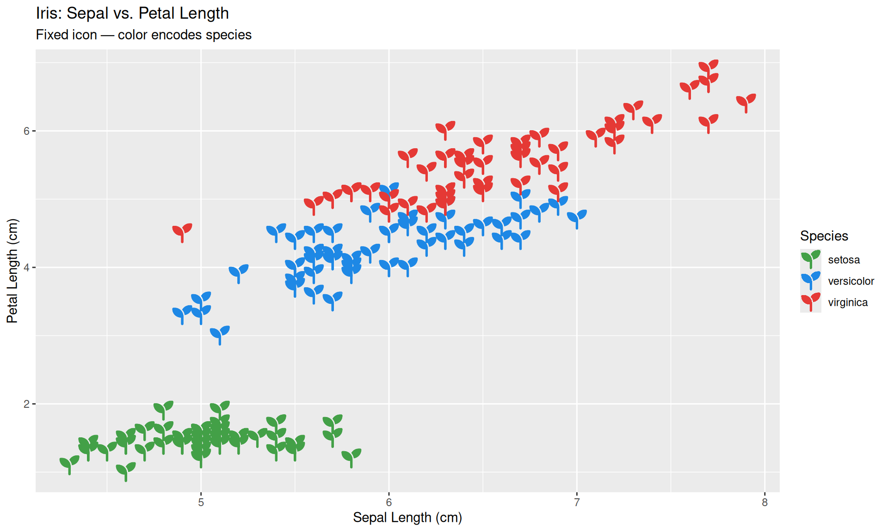
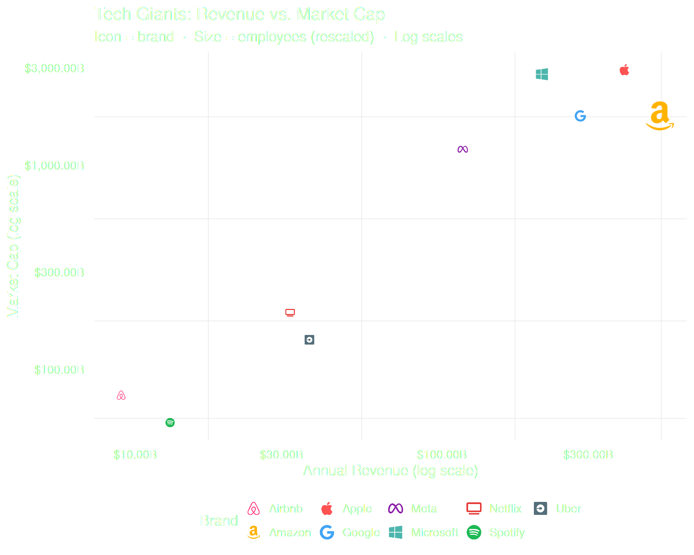
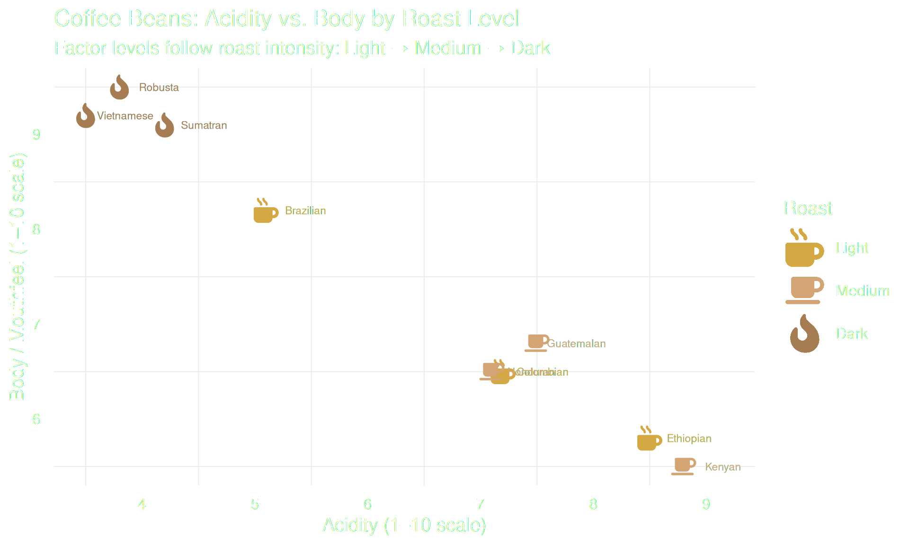
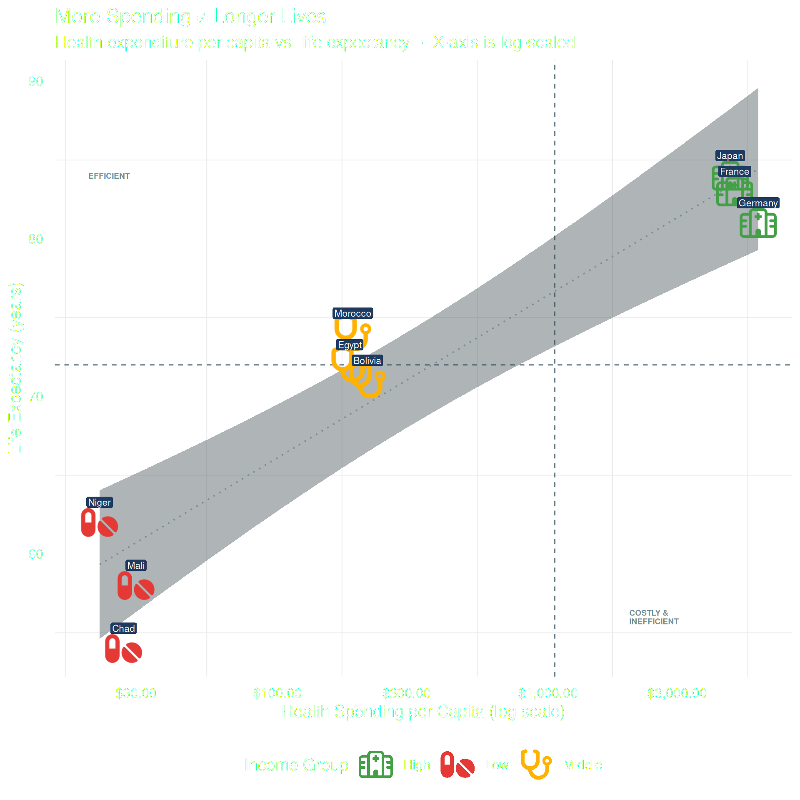

# Icon Scatter Plots with geom_icon_point()

## What is `geom_icon_point()`?

  

[`geom_icon_point()`](https://jurjoroa.github.io/ggpop/reference/geom_icon_point.md)
is the scatter plot cousin of
[`geom_pop()`](https://jurjoroa.github.io/ggpop/reference/geom_pop.md).
It works exactly like
[`ggplot2::geom_point()`](https://ggplot2.tidyverse.org/reference/geom_point.html)
— but replaces dots with Font Awesome icons. No data preprocessing is
required: just supply any data frame with `x` and `y` variables and let
the icons do the talking.

  

------------------------------------------------------------------------

## 1. Basic Usage — A Fixed Icon

  

The simplest use case: a single icon for all points, with `color`
carrying the grouping information. Use the `icon` parameter (not
[`aes()`](https://ggplot2.tidyverse.org/reference/aes.html)) to fix one
icon across all observations.

``` r
ggplot(iris, aes(x = Sepal.Length, y = Petal.Length, color = Species)) +
  geom_icon_point(icon = "seedling", size = 1.5, dpi = 100) +
  scale_color_manual(values = c(
    "setosa"     = "#43A047",
    "versicolor" = "#1E88E5",
    "virginica"  = "#E53935"
  )) +
  theme(base_size = 15) +
  labs(
    title    = "Iris: Sepal vs. Petal Length",
    subtitle = "Fixed icon — color encodes species",
    x        = "Sepal Length (cm)",
    y        = "Petal Length (cm)",
    color    = "Species"
  )
```



  

------------------------------------------------------------------------

## 2. Mapping Icons to Categories

  

[`geom_icon_point()`](https://jurjoroa.github.io/ggpop/reference/geom_icon_point.md)
shines when each category gets its own icon. Map `icon` inside
[`aes()`](https://ggplot2.tidyverse.org/reference/aes.html) to a column
in your data — each group then carries its own visual identity.

``` r
# Search the icons you want to use with fa_icons() and note their names:
fa_icons(query = "apple")
fa_icons(query = "drumstick")
fa_icons(query = "cheese")

# Create a data frame with an 'icon' column that matches your categories:
df_food <- data.frame(
  food     = c("Apple", "Carrot", "Orange", "Chicken", "Beef", "Salmon",
               "Milk", "Cheese", "Yogurt"),
  calories = c(52, 41, 47, 165, 250, 208, 61, 402, 59),
  protein  = c(0.3, 1.1, 0.9, 31, 26, 20, 3.2, 25, 10),
  group    = c(rep("Fruit & Veg", 3), rep("Meat & Fish", 3), rep("Dairy", 3)),
  icon     = c("apple-whole", "carrot", "lemon",
               "drumstick-bite", "bacon", "fish",
               "bottle-water", "cheese", "jar")
)

# Set factor levels to control legend order and icon assignment
df_food$group <- factor(df_food$group,
  levels = c("Fruit & Veg", "Dairy", "Meat & Fish"))


ggplot(df_food, aes(x = calories, y = protein, icon = icon, color = group)) +
  geom_icon_point(size = 2, dpi = 100) +
  scale_color_manual(values = c(
    "Fruit & Veg"  = "#43A047",
    "Dairy"        = "#1E88E5",
    "Meat & Fish"  = "#E53935"
  )) +
  theme(base_size = 15) +
  labs(
    title    = "Calories vs. Protein by Food",
    subtitle = "Each icon represents a specific food; color reflects the group",
    x        = "Calories (per 100g)",
    y        = "Protein (g per 100g)",
    color    = "Group"
  )
```


  

------------------------------------------------------------------------

## 3. Size Mapping

  

Map a continuous variable to `size` inside
[`aes()`](https://ggplot2.tidyverse.org/reference/aes.html) to add a
third dimension of information. Use
[`scales::rescale()`](https://scales.r-lib.org/reference/rescale.html)
to keep icon sizes in a readable range — raw values that are too large
or too small make icons unreadable.

``` r
# Search the icons you want to use with fa_icons() and note their names:
fa_icons(query = "apple")
fa_icons(query = "spotify")


df_brand <- data.frame(
  brand      = c("Apple", "Google", "Microsoft", "Meta", "Amazon",
                 "Netflix", "Spotify", "Uber", "Airbnb"),
  revenue    = c(394, 283, 212, 117, 514, 32, 13, 37, 9),
  market_cap = c(2950, 1750, 2800, 1200, 1750, 190, 55, 140, 75),
  employees  = c(160, 180, 220, 86, 1540, 13, 9, 32, 6),
  icon       = c("apple", "google", "windows", "meta", "amazon",
                 "tv", "spotify", "uber", "airbnb")
)

# Rescale employees to a readable icon size range
df_brand$size_scaled <- scales::rescale(df_brand$employees, to = c(0.8, 2.5))


ggplot(df_brand, aes(x = revenue, y = market_cap,
                     icon = icon, color = brand, size = size_scaled)) +
  geom_icon_point(dpi = 100) +
  scale_x_log10(labels = scales::dollar_format(suffix = "B")) +
  scale_y_log10(labels = scales::dollar_format(suffix = "B")) +
  scale_color_manual(values = c(
    "Apple"     = "#FF5252", "Google"    = "#42A5F5",
    "Microsoft" = "#4DB6AC", "Meta"      = "#8E24AA",
    "Amazon"    = "#FFB300", "Netflix"   = "#E53935",
    "Spotify"   = "#1DB954", "Uber"      = "#546E7A",
    "Airbnb"    = "#FF4081"
  )) +
  scale_size_continuous(range = c(1, 3), labels = scales::comma) +
  theme_minimal(base_size = 15) +
  theme(legend.position = "bottom") +
  labs(
    title    = "Tech Giants: Revenue vs. Market Cap",
    subtitle = "Icon = brand  ·  Size = employees (rescaled)  ·  Log scales",
    x        = "Annual Revenue (log scale)",
    y        = "Market Cap (log scale)",
    color    = "Brand",
    size     = "Employees"
  )
```



  

------------------------------------------------------------------------

## 4. Factor Ordering

  

When `color` is mapped to a factor, the legend follows **factor level
order**.
[`geom_icon_point()`](https://jurjoroa.github.io/ggpop/reference/geom_icon_point.md)
automatically assigns icons to legend entries in the same order — so
setting factor levels is all you need for a correctly ordered legend.

``` r
# Search the icons you want to use with fa_icons() and note their names:
fa_icons(query = "mug")
fa_icons(query = "fire")

df_coffee <- data.frame(
  bean    = c("Colombian", "Ethiopian", "Brazilian",
              "Kenyan", "Guatemalan", "Honduran",
              "Sumatran", "Robusta", "Vietnamese"),
  acidity = c(7.2, 8.5, 5.1, 8.8, 7.5, 7.1, 4.2, 3.8, 3.5),
  body    = c(6.5, 5.8, 8.2, 5.5, 6.8, 6.5, 9.1, 9.5, 9.2),
  roast   = c(rep("Light", 3), rep("Medium", 3), rep("Dark", 3)),
  icon    = c(rep("mug-hot", 3), rep("coffee", 3), rep("fire-flame-curved", 3))
)

# Factor level order controls both legend order AND icon assignment
df_coffee$roast <- factor(df_coffee$roast, levels = c("Light", "Medium", "Dark"))

ggplot(df_coffee, aes(x = acidity, y = body, icon = icon, color = roast)) +
  geom_icon_point(size = 2, dpi = 100) +
  scale_color_manual(values = c(
    "Light"  = "#D4A843",
    "Medium" = "#D4A574",
    "Dark"   = "#A67C52"
  )) +
  theme_minimal(base_size = 15) +
  scale_legend_icon(size = 6) +
  labs(
    title    = "Coffee Beans: Acidity vs. Body by Roast Level",
    subtitle = "Factor levels follow roast intensity: Light \u2192 Medium \u2192 Dark",
    x        = "Acidity (1\u201310 scale)",
    y        = "Body / Mouthfeel (1\u201310 scale)",
    color    = "Roast"
  )
```



> **Tip:** Always set factor levels explicitly with
> `factor(..., levels = ...)` before plotting. This guarantees that the
> icon in the legend matches the correct group, regardless of data row
> order.

  

------------------------------------------------------------------------

## 5. Combining with Other Geoms

  

[`geom_icon_point()`](https://jurjoroa.github.io/ggpop/reference/geom_icon_point.md)
is fully compatible with all standard ggplot2 geoms. Here we combine it
with
[`geom_smooth()`](https://ggplot2.tidyverse.org/reference/geom_smooth.html),
[`geom_vline()`](https://ggplot2.tidyverse.org/reference/geom_abline.html),
[`geom_hline()`](https://ggplot2.tidyverse.org/reference/geom_abline.html),
[`geom_label()`](https://ggplot2.tidyverse.org/reference/geom_text.html),
and
[`annotate()`](https://ggplot2.tidyverse.org/reference/annotate.html) to
build a fully annotated analytical chart.

``` r
df_health <- data.frame(
  country    = c("Chad", "Mali", "Niger", "Bolivia", "Egypt", "Morocco",
                 "Germany", "France", "Japan"),
  spend      = c(27, 30, 22, 215, 185, 190, 5986, 4902, 4717),
  life_exp   = c(54, 58, 62, 71, 72, 74, 81, 83, 84),
  income     = c(rep("Low", 3), rep("Middle", 3), rep("High", 3)),
  icon       = c(rep("pills", 3), rep("stethoscope", 3), rep("hospital", 3))
)

ggplot(df_health, aes(x = spend, y = life_exp,
                      icon = icon, color = income)) +
  # Reference lines: world averages
  geom_vline(xintercept = 1060, linetype = "dashed",
             color = "#546E7A", linewidth = 0.5) +
  geom_hline(yintercept = 72.0, linetype = "dashed",
             color = "#546E7A", linewidth = 0.5) +
  # Trend line across all groups
  geom_smooth(aes(group = 1), method = "lm", se = TRUE,
              color = "#78909C", fill = "#37474F",
              linewidth = 0.7, linetype = "dotted", alpha = 0.4) +
  # Icons
  geom_icon_point(size = 2, dpi = 100) +
  # Country labels
  geom_label(aes(label = country), color = "white",
             fill = "#1E3A5F", label.size = 0,
             label.padding = unit(0.15, "lines"),
             vjust = -1.3, size = 3) +
  # Quadrant annotations
  annotate("text", x = 20, y = 84, label = "EFFICIENT",
           color = "#78909C", size = 2.5, hjust = 0, fontface = "bold") +
  annotate("text", x = 2000, y = 56, label = "COSTLY &\nINEFFICIENT",
           color = "#78909C", size = 2.5, hjust = 0,
           fontface = "bold", lineheight = 0.9) +
  scale_x_log10(labels = scales::dollar_format()) +
  scale_color_manual(values = c(
    "Low"    = "#E53935",
    "Middle" = "#FFB300",
    "High"   = "#43A047"
  )) +
  theme_minimal(base_size = 15) +
  theme(legend.position = "bottom") +
  scale_legend_icon(size = 6) +
  labs(
    title    = "More Spending \u2260 Longer Lives",
    subtitle = "Health expenditure per capita vs. life expectancy  \u00b7  X-axis is log-scaled",
    x        = "Health Spending per Capita (log scale)",
    y        = "Life Expectancy (years)",
    color    = "Income Group"
  )
```



  

------------------------------------------------------------------------

## Summary

  

| Feature         | How                                                                                        |
|:----------------|:-------------------------------------------------------------------------------------------|
| Fixed icon      | `geom_icon_point(icon = "circle")`                                                         |
| Mapped icons    | `aes(icon = icon_column)`                                                                  |
| Size mapping    | `aes(size = var)` + [`scales::rescale()`](https://scales.r-lib.org/reference/rescale.html) |
| Factor ordering | `factor(..., levels = ...)` before plotting                                                |
| Combine geoms   | Add any ggplot2 geom before or after                                                       |
