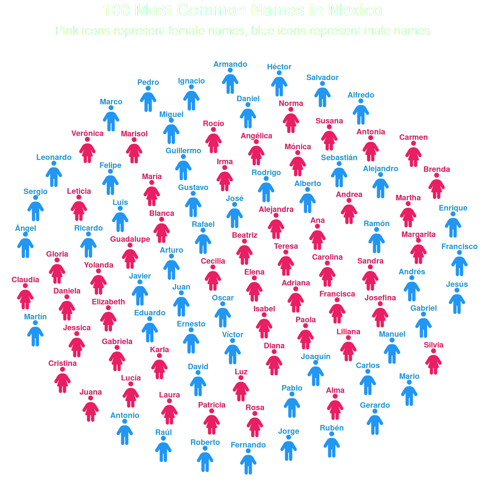

# Getting Started with ggpop

## What is ggpop?

  

`ggpop` is a `ggplot2` extension for creating **icon-based population
charts**. Instead of bars or dots, each observation is represented by a
Font Awesome icon — making your data immediately human and intuitive.

This vignette walks you through the core workflow using
[`geom_pop()`](https://jurjoroa.github.io/ggpop/reference/geom_pop.md),
the main function for building proportional population grids.

  

------------------------------------------------------------------------

## Installation

  

``` r
# From CRAN
install.packages("ggpop")

# Development version from GitHub
remotes::install_github("jurjoroa/ggpop")
```

  

------------------------------------------------------------------------

## The `geom_pop()` Workflow

  

[`geom_pop()`](https://jurjoroa.github.io/ggpop/reference/geom_pop.md)
follows a simple three-step workflow:

1.  **Prepare your data** — either use
    [`process_data()`](https://jurjoroa.github.io/ggpop/reference/process_data.md)
    or bring your own data frame (one row per icon, max 1,000)
2.  **Assign icons** — map a Font Awesome icon name to each group
3.  **Plot** — pass the data to
    [`ggplot()`](https://ggplot2.tidyverse.org/reference/ggplot.html)
    and add
    [`geom_pop()`](https://jurjoroa.github.io/ggpop/reference/geom_pop.md)

  

------------------------------------------------------------------------

## Step 1: Your Data

  

We start with a simple data frame containing population counts by sex.
This mirrors the kind of data you’d typically bring to
[`geom_pop()`](https://jurjoroa.github.io/ggpop/reference/geom_pop.md).

``` r
library(ggpop)
library(ggplot2)
library(dplyr)

df_pop_mx <- data.frame(
  sex     = c("male", "female"),
  n       = c(63459580, 67401427),
  country = "Mexico"
)

df_pop_mx
```

         sex        n country
    1   male 63459580  Mexico
    2 female 67401427  Mexico

  

------------------------------------------------------------------------

## Step 2: Process the Data

  

[`process_data()`](https://jurjoroa.github.io/ggpop/reference/process_data.md)
converts raw population counts into a sampled data frame where each row
represents one icon. It calculates group proportions and allocates icons
accordingly.

``` r
df_processed <- process_data(
  data        = df_pop_mx,
  group_var   = sex,
  sum_var     = n,
  sample_size = 100
)

head(df_processed)
```

        type        n      prop
    1 female 67401427 0.5150612
    2 female 67401427 0.5150612
    3   male 63459580 0.4849388
    4   male 63459580 0.4849388
    5 female 67401427 0.5150612
    6   male 63459580 0.4849388

> **Note:**
> [`process_data()`](https://jurjoroa.github.io/ggpop/reference/process_data.md)
> is optional. If your data already has one row per icon (up to 1,000
> rows), you can pass it directly to
> [`geom_pop()`](https://jurjoroa.github.io/ggpop/reference/geom_pop.md).

  

------------------------------------------------------------------------

## Step 3: Assign Icons

  

Add an `icon` column to your processed data. Icon names come from Font
Awesome — use any of the 2,000+ free icons.

``` r
fa_icons(query = "person")
```

We selected the `male` and `female` icons for our population chart. You
can choose any icons that fit your data and story!

``` r
df_processed <- df_processed %>%
  mutate(icon = case_when(
    type == "male"   ~ "male",
    type == "female" ~ "female"
  ))
```

  

------------------------------------------------------------------------

## Step 4: Plot

  

Pass the data to
[`ggplot()`](https://ggplot2.tidyverse.org/reference/ggplot.html) and
add
[`geom_pop()`](https://jurjoroa.github.io/ggpop/reference/geom_pop.md).
Map `icon` and `color` to your grouping variable.

``` r
ggplot() +
  geom_pop(
    data = df_processed,
    aes(icon = icon, color = type),
    size = 2,
    dpi  = 100
  ) +
  scale_color_manual(values = c("male" = "#1E88E5", "female" = "#D81B60")) +
  theme_pop(base_size=15) +
  theme(plot.title = element_text(color = "white"),
        plot.subtitle = element_text(color = "white"),
        legend.text = element_text(color = "white"),
        legend.title = element_text(color = "white"),
        legend.position = "bottom") +
  labs(
    title    = "Mexico Population by Sex (2024)",
    subtitle = "Each icon represents ~1% of the total population",
    color    = "Sex"
  )
```


  

------------------------------------------------------------------------

## Scaling legend icons

  

Use
[`scale_legend_icon()`](https://jurjoroa.github.io/ggpop/reference/scale_legend_icon.md)
to control the legend icon size. You can also turn off legend icons with
`legend_icons = FALSE` in
[`geom_pop()`](https://jurjoroa.github.io/ggpop/reference/geom_pop.md)
if you prefer a text-only legend with dots

``` r
ggplot(data = df_processed, aes(icon = icon, color = type)) +
  geom_pop(size = 2, dpi = 100, legend_icons = TRUE) +
  scale_color_manual(values = c("male" = "#1E88E5", "female" = "#D81B60")) +
  theme_pop(base_size=15) +
  theme(plot.title = element_text(color = "white"),
        plot.subtitle = element_text(color = "white"),
        legend.text = element_text(color = "white"),
        legend.title = element_text(color = "white"),
        legend.position = "bottom") +
  scale_legend_icon(size = 10) +
  labs(title    = "Mexico Population by Sex (2024)",
       subtitle = "Each icon represents ~1% of the total population",
       color    = "Sex")
```


  

------------------------------------------------------------------------

## Using Your Own Data

  

You don’t need
[`process_data()`](https://jurjoroa.github.io/ggpop/reference/process_data.md).
As long as the dataframe doesn’t have more than 1,000 rows, it works.
You can also do a facet or use `cowplot` so you can have more panes. Any
data frame with one row per icon works directly:

``` r
fa_icons(query = "bed")
```

We created a simple data frame with 100 rows, representing a population
of patients with three health statuses: “Healthy”, “At Risk”, and “Ill”.
Each status is mapped to a different icon.

``` r
# Our own data frame with one row per icon
df_simple <- data.frame(
  group = c(rep("Healthy", 70), rep("At Risk", 20), rep("Ill", 10)),
  icon  = c(rep("person", 70), rep("person-half-dress", 20), rep("bed-pulse", 10))
)

# Set factor levels to control legend order
df_simple$group <- factor(df_simple$group, levels = c("Healthy", "At Risk", "Ill"))

ggplot(data = df_simple, aes(icon = icon, color = group)) +
  geom_pop(size = 2, dpi = 100, legend_icons = TRUE) +
  scale_color_manual(values = c(
    "Healthy"  = "#43A047",
    "At Risk"  = "#FFB300",
    "Ill"      = "#E53935"
  )) +
  theme_pop(base_size = 15) +
  theme(plot.title = element_text(color = "white"),
        plot.subtitle = element_text(color = "white"),
        legend.text = element_text(color = "white"),
        legend.title = element_text(color = "white"),
        legend.position = "bottom") +
  scale_legend_icon(size = 8) +
  labs( title    = "Simulated Patient Population (n = 100)",
        subtitle = "Each icon represents one patient",
        color    = "Status")
```


  

------------------------------------------------------------------------

## Use geom_text() as a label

  

[`geom_pop()`](https://jurjoroa.github.io/ggpop/reference/geom_pop.md)
exposes its internally computed icon coordinates to downstream layers.
This means you can add
[`geom_text()`](https://ggplot2.tidyverse.org/reference/geom_text.html)
— or any ggplot2 geom — **without specifying `x` or `y`**: they are
inherited automatically from the icon grid.

This is useful when you want labels to float over the icons instead of
relying on a legend. Set `show.legend = FALSE` in
[`geom_pop()`](https://jurjoroa.github.io/ggpop/reference/geom_pop.md).

``` r
df_labeled <- data.frame(
  name = c(
    # Female names (50)
    "María", "Guadalupe", "Juana", "Margarita", "Francisca",
    "Teresa", "Rosa", "Antonia", "Ana", "Isabel",
    "Carmen", "Josefina", "Laura", "Verónica", "Patricia",
    "Leticia", "Silvia", "Elizabeth", "Adriana", "Martha",
    "Elena", "Gabriela", "Alejandra", "Gloria", "Claudia",
    "Lucía", "Beatriz", "Daniela", "Mónica", "Rocío",
    "Alma", "Karla", "Yolanda", "Diana", "Sandra",
    "Cecilia", "Paola", "Norma", "Angélica", "Irma",
    "Liliana", "Brenda", "Jessica", "Susana", "Blanca",
    "Marisol", "Carolina", "Luz", "Cristina", "Andrea",
    # Male names (50)
    "José", "Juan", "Luis", "Miguel", "Carlos",
    "Francisco", "Antonio", "Jesús", "Pedro", "Manuel",
    "Alejandro", "Jorge", "Rafael", "Roberto", "Fernando",
    "Daniel", "Ricardo", "Javier", "Alberto", "Sergio",
    "Raúl", "Enrique", "Guillermo", "Oscar", "Gerardo",
    "Arturo", "Héctor", "Eduardo", "Armando", "David",
    "Víctor", "Pablo", "Ángel", "Ramón", "Andrés",
    "Mario", "Salvador", "Ignacio", "Gustavo", "Alfredo",
    "Rubén", "Marco", "Rodrigo", "Joaquín", "Martín",
    "Gabriel", "Felipe", "Ernesto", "Leonardo", "Sebastián"
  ),
  gender = c(rep("Female", 50), rep("Male", 50)),
  icon = c(rep("person-dress", 50), rep("person", 50))
)

df_labeled$gender <- factor(df_labeled$gender,
                            levels = c("Female", "Male"))

ggplot(data = df_labeled, aes(icon = icon, color = gender)) +
  geom_pop(size = 2, dpi = 100, show.legend = FALSE, ncol = 10) +
  geom_text(
    aes(label = name),
    nudge_y       = 0.08,
    size          = 4,
    fontface      = "bold",
    check_overlap = TRUE
  ) +
  scale_color_manual(values = c(
    "Female" = "#E91E63",
    "Male"   = "#2196F3"
  )) +
  theme_pop(base_size = 20) +
  theme(
    plot.title    = element_text(color = "white", hjust = .5),
    plot.subtitle = element_text(color = "white", hjust = .5),
    legend.position = "none"
  ) +
  labs(
    title    = "100 Most Common Names in Mexico",
    subtitle = "Pink icons represent female names, blue icons represent male names"
  )
```



  

------------------------------------------------------------------------

## Next Steps

  

- **[`geom_icon_point()`](https://jurjoroa.github.io/ggpop/reference/geom_icon_point.md)**
  — use icons as scatter plot points on any x/y data
- **Faceting** — split your population chart by group using
  [`facet_wrap()`](https://ggplot2.tidyverse.org/reference/facet_wrap.html)
  or `geofacet`
- **Themes** — explore
  [`theme_pop()`](https://jurjoroa.github.io/ggpop/reference/theme_pop.md)
  and customize with standard ggplot2 theme options
