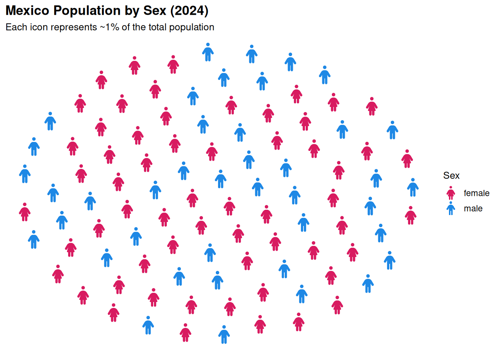
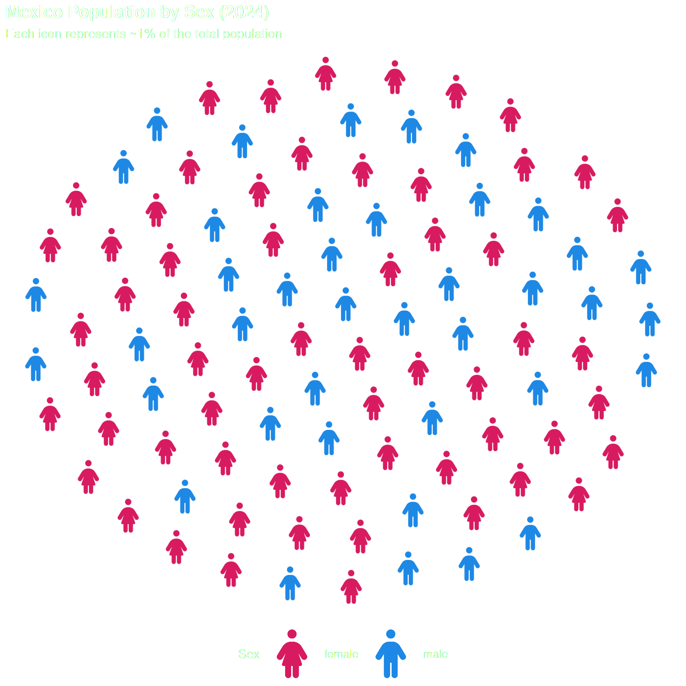
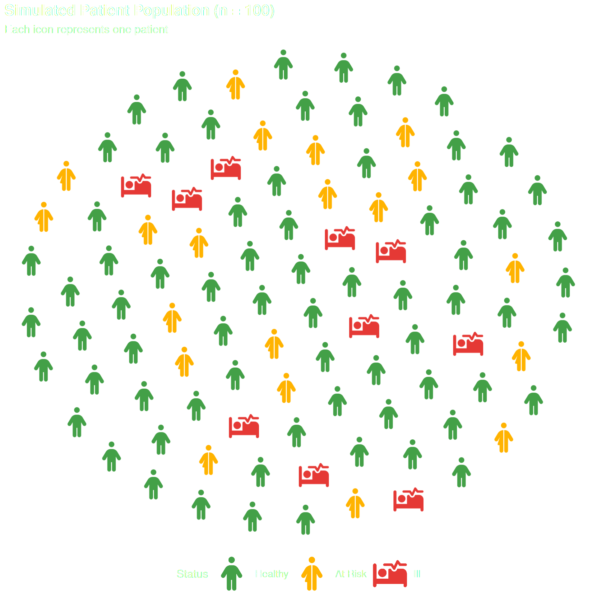

# Getting Started with ggpop

## What is ggpop?

`ggpop` is a `ggplot2` extension for creating **icon-based population
charts**. Instead of bars or dots, each observation is represented by a
Font Awesome icon — making your data immediately human and intuitive.

This vignette walks you through the core workflow using
[`geom_pop()`](https://jurjoroa.github.io/ggpop/reference/geom_pop.md),
the main function for building proportional population grids.

------------------------------------------------------------------------

## Installation

``` r
# From CRAN
install.packages("ggpop")

# Development version from GitHub
remotes::install_github("jurjoroa/ggpop")
```

------------------------------------------------------------------------

## The `geom_pop()` Workflow

[`geom_pop()`](https://jurjoroa.github.io/ggpop/reference/geom_pop.md)
follows a simple three-step workflow:

1.  **Prepare your data** — either use
    [`process_data()`](https://jurjoroa.github.io/ggpop/reference/process_data.md)
    or bring your own data frame (one row per icon, max 1,000)
2.  **Assign icons** — map a Font Awesome icon name to each group
3.  **Plot** — pass the data to
    [`ggplot()`](https://ggplot2.tidyverse.org/reference/ggplot.html)
    and add
    [`geom_pop()`](https://jurjoroa.github.io/ggpop/reference/geom_pop.md)

------------------------------------------------------------------------

## Step 1: Your Data

We start with a simple data frame containing population counts by sex.
This mirrors the kind of data you’d typically bring to
[`geom_pop()`](https://jurjoroa.github.io/ggpop/reference/geom_pop.md).

``` r
library(ggpop)
library(ggplot2)
library(dplyr)
#> 
#> Attaching package: 'dplyr'
#> The following objects are masked from 'package:stats':
#> 
#>     filter, lag
#> The following objects are masked from 'package:base':
#> 
#>     intersect, setdiff, setequal, union

df_pop_mx <- data.frame(
  sex     = c("male", "female"),
  n       = c(63459580, 67401427),
  country = "Mexico"
)

df_pop_mx
#>      sex        n country
#> 1   male 63459580  Mexico
#> 2 female 67401427  Mexico
```

------------------------------------------------------------------------

## Step 2: Process the Data

[`process_data()`](https://jurjoroa.github.io/ggpop/reference/process_data.md)
converts raw population counts into a sampled data frame where each row
represents one icon. It calculates group proportions and allocates icons
accordingly.

``` r
df_processed <- process_data(
  data        = df_pop_mx,
  group_var   = sex,
  sum_var     = n,
  sample_size = 100
)

head(df_processed)
#>     type        n      prop
#> 1 female 67401427 0.5150612
#> 2   male 63459580 0.4849388
#> 3 female 67401427 0.5150612
#> 4 female 67401427 0.5150612
#> 5 female 67401427 0.5150612
#> 6 female 67401427 0.5150612
```

> **Note:**
> [`process_data()`](https://jurjoroa.github.io/ggpop/reference/process_data.md)
> is optional. If your data already has one row per icon (up to 1,000
> rows), you can pass it directly to
> [`geom_pop()`](https://jurjoroa.github.io/ggpop/reference/geom_pop.md).

------------------------------------------------------------------------

## Step 3: Assign Icons

Add an `icon` column to your processed data. Icon names come from Font
Awesome — use any of the 2,000+ free icons.

``` r
df_processed <- df_processed %>%
  mutate(icon = case_when(
    type == "male"   ~ "male",
    type == "female" ~ "female"
  ))
```

------------------------------------------------------------------------

## Step 4: Plot

Pass the data to
[`ggplot()`](https://ggplot2.tidyverse.org/reference/ggplot.html) and
add
[`geom_pop()`](https://jurjoroa.github.io/ggpop/reference/geom_pop.md).
Map `icon` and `color` to your grouping variable.

``` r
ggplot() +
  geom_pop(
    data = df_processed,
    aes(icon = icon, color = type),
    size = 2,
    dpi  = 100
  ) +
  scale_color_manual(values = c("male" = "#1E88E5", "female" = "#D81B60")) +
  theme_pop() +
  labs(
    title    = "Mexico Population by Sex (2024)",
    subtitle = "Each icon represents ~1% of the total population",
    color    = "Sex"
  )
```



------------------------------------------------------------------------

## Adding a Legend with Icons

Set `legend_icons = TRUE` inside
[`geom_pop()`](https://jurjoroa.github.io/ggpop/reference/geom_pop.md)
and use
[`scale_legend_icon()`](https://jurjoroa.github.io/ggpop/reference/scale_legend_icon.md)
to control the legend icon size.

``` r
ggplot() +
  geom_pop(
    data         = df_processed,
    aes(icon = icon, color = type),
    size         = 2,
    dpi          = 100,
    legend_icons = TRUE
  ) +
  scale_color_manual(values = c("male" = "#1E88E5", "female" = "#D81B60")) +
  scale_legend_icon(size = 5) +
  theme_pop() +
  labs(
    title    = "Mexico Population by Sex (2024)",
    subtitle = "Each icon represents ~1% of the total population",
    color    = "Sex"
  )
```



------------------------------------------------------------------------

## Using Your Own Data

You don’t need
[`process_data()`](https://jurjoroa.github.io/ggpop/reference/process_data.md).
Any data frame with one row per icon works directly:

``` r
df_simple <- data.frame(
  group = c(rep("Healthy", 70), rep("At Risk", 20), rep("Ill", 10)),
  icon  = c(rep("person", 70), rep("person-half-dress", 20), rep("bed-pulse", 10))
)

df_simple$group <- factor(df_simple$group, levels = c("Healthy", "At Risk", "Ill"))

ggplot() +
  geom_pop(
    data         = df_simple,
    aes(icon = icon, color = group),
    size         = 2,
    dpi          = 100,
    legend_icons = TRUE
  ) +
  scale_color_manual(values = c(
    "Healthy"  = "#43A047",
    "At Risk"  = "#FFB300",
    "Ill"      = "#E53935"
  )) +
  scale_legend_icon(size = 5) +
  theme_pop() +
  labs(
    title    = "Simulated Patient Population (n = 100)",
    subtitle = "Each icon represents one patient",
    color    = "Status"
  )
#> Warning: Facet / grouping caution.
#>   
#> ! Why you are seeing this warning:
#>   - The data contains multiple groups in data$group
#>   (often created by `process_data(high_group_var = ...)`)
#>   - If the plot is not faceted, icons from different groups may overlap
#>   
#> ℹ Recommended patterns:
#>   - Facet in ggplot2:
#>   `ggplot() + geom_pop(..., facet = group) + facet_wrap(~ group)`
#>   
#>   - Alternative layout:
#>   Create one plot per subgroup and combine with cowplot or patchwork
#>   
#> ℹ If you want one pooled circle:
#>   - Re-run `process_data()` without `high_group_var`
```



------------------------------------------------------------------------

## Next Steps

- **[`geom_icon_point()`](https://jurjoroa.github.io/ggpop/reference/geom_icon_point.md)**
  — use icons as scatter plot points on any x/y data
- **Faceting** — split your population chart by group using
  [`facet_wrap()`](https://ggplot2.tidyverse.org/reference/facet_wrap.html)
  or `geofacet`
- **Themes** — explore
  [`theme_pop()`](https://jurjoroa.github.io/ggpop/reference/theme_pop.md)
  and customize with standard ggplot2 theme options

Visit the [ggpop website](https://jurjoroa.github.io/ggpop/) for the
full function reference and more examples.
