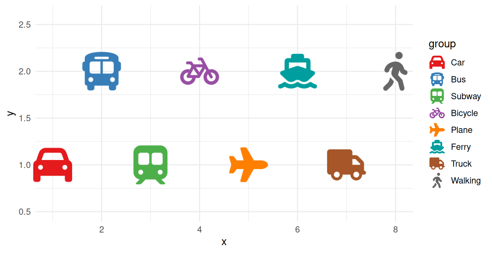
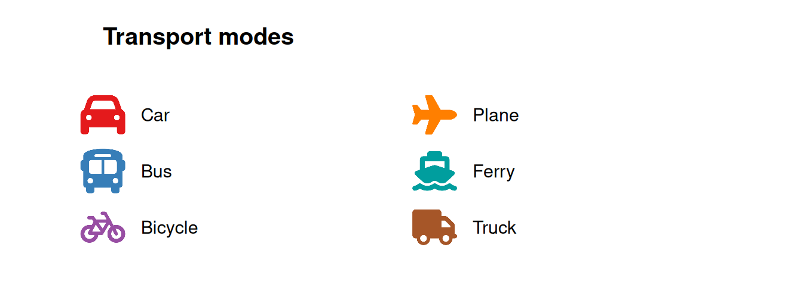
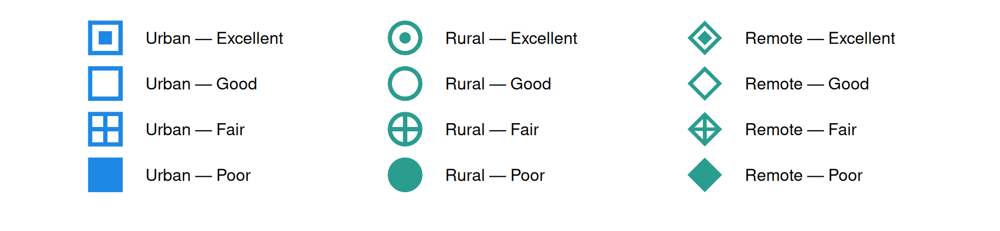

# Icon Legends: Native Guides and Standalone Composites

ggpop gives you two ways to build a legend, and picking the right one
keeps your code short:

1.  **Native icon legends** - for a legend keyed to your plot’s data.
    ggplot2 builds it for you; you only switch the keys to icons. This
    is what you want almost every time.
2.  **Standalone composite legends** - for a legend that is really a
    small annotated figure, decoupled from any plot (multiple grouped
    columns, mixed symbology, fixed pixel dimensions). ggplot2’s guide
    system cannot express these, so
    [`marker_legend()`](https://jurjoroa.github.io/ggpop/reference/marker_legend.md)
    draws them for you.

## The common case: native icon legends

Map an aesthetic, set `legend_icons = TRUE`, and let ggplot2 do the
rest. The icon keys are drawn by ggpop’s custom key glyph and recoloured
to match each group;
[`scale_legend_icon()`](https://jurjoroa.github.io/ggpop/reference/scale_legend_icon.md)
sizes them.

Show the code

``` r

df_modes <- data.frame(
  x     = c(1, 2, 3, 4, 5, 6, 7, 8),
  y     = c(1, 2, 1, 2, 1, 2, 1, 2),
  group = c("Car", "Bus", "Subway", "Bicycle", "Plane", "Ferry", "Truck", "Walking"),
  icon  = c("car", "bus", "train-subway", "bicycle", "plane", "ship", "truck", "person-walking"),
  stringsAsFactors = FALSE
)
df_modes$group <- factor(df_modes$group, levels = df_modes$group)

col_map <- c(
  Car = "#E41A1C", Bus = "#377EB8", Subway = "#4DAF4A", Bicycle = "#984EA3",
  Plane = "#FF7F00", Ferry = "#009E9E", Truck = "#A65628", Walking = "#666666"
)

ggplot(df_modes, aes(x = x, y = y, icon = icon, colour = group)) +
  geom_icon_point(size = 6, dpi = 120, legend_icons = TRUE) +
  scale_colour_manual(values = col_map) +
  coord_cartesian(ylim = c(0.5, 2.6), clip = "off") +
  scale_legend_icon(size = 6) +
  theme_minimal()
```



Figure 1: A native icon legend - ggplot2 builds the guide, ggpop draws
the keys.

> **Tip**
>
> For any legend tied to your data, stop here. The native path stays in
> sync with your scales automatically and needs no manual layout. Reach
> for
> [`marker_legend()`](https://jurjoroa.github.io/ggpop/reference/marker_legend.md)
> only when you need a standalone composite that ggplot2 guides cannot
> produce.

One ordering rule:
[`scale_legend_icon()`](https://jurjoroa.github.io/ggpop/reference/scale_legend_icon.md)
must come **after** any
[`theme()`](https://ggplot2.tidyverse.org/reference/theme.html) call,
because a later
[`theme()`](https://ggplot2.tidyverse.org/reference/theme.html) resets
the legend key size.

## Markers beyond Font Awesome

The `icon` aesthetic accepts more than Font Awesome names. ggpop ships a
set of bundled markers, and you can register a folder of your own `.svg`
files. List what is available with
[`ggpop_markers()`](https://jurjoroa.github.io/ggpop/reference/ggpop_markers.md):

``` r

ggpop_markers()$bundled
```

     [1] "circle-cross"   "circle-hollow"  "circle-inset"   "circle-solid"
     [5] "diamond-cross"  "diamond-hollow" "diamond-inset"  "diamond-solid"
     [9] "plus-bold"      "square-cross"   "square-hollow"  "square-inset"
    [13] "square-solid"   "triangle-down" 

These names work anywhere an icon is expected - in the geoms above and
in the composite legends below. To use your own SVGs, pass a folder via
`icon_path` (or set `options(ggpop.icon_path = "path/to/svgs")`) and
reference each file by its bare name.

## Standalone composite legends with `marker_legend()`

When a legend needs multiple grouped columns, mixed symbology, and a
fixed size - the kind of figure often exported as a standalone image -
ggplot2’s guide system falls short.
[`marker_legend()`](https://jurjoroa.github.io/ggpop/reference/marker_legend.md)
takes a tidy data frame of `icon` + `label` (+ optional per-row `colour`
and `column`) and lays it out for you.

### A Font Awesome composite

No bundled markers required - any icon source works, including mixed
sources in one legend.

Show the code

``` r

df_legend <- data.frame(
  column = c(1, 1, 1, 2, 2, 2),
  icon   = c("car", "bus", "bicycle", "plane", "ship", "truck"),
  label  = c("Car", "Bus", "Bicycle", "Plane", "Ferry", "Truck"),
  colour = c("#E41A1C", "#377EB8", "#984EA3", "#FF7F00", "#009E9E", "#A65628"),
  stringsAsFactors = FALSE
)

marker_legend(
  df_legend,
  title = "Transport modes",
  marker_size = 5, label_size = 4, col_spacing = 14, label_gap = 1.6
)
```



Figure 2: A two-column composite legend built entirely from Font Awesome
icons.

### Multi-column composite legend

This is the use case
[`marker_legend()`](https://jurjoroa.github.io/ggpop/reference/marker_legend.md)
exists for: a multi-column legend that encodes two semantic dimensions
simultaneously — here, region type (colour) and indicator domain
(column) — using bundled markers to distinguish subcategories.

Show the code

``` r

blue <- "#1E88E5"
teal <- "#2A9D8F"

df_legend <- rbind(
  data.frame(
    column = 1, colour = blue,
    icon  = c("square-inset", "square-hollow", "square-cross", "square-solid"),
    label = c("Urban — Excellent", "Urban — Good",
              "Urban — Fair",     "Urban — Poor")
  ),
  data.frame(
    column = 2, colour = teal,
    icon  = c("circle-inset", "circle-hollow", "circle-cross", "circle-solid"),
    label = c("Rural — Excellent", "Rural — Good",
              "Rural — Fair",     "Rural — Poor")
  ),
  data.frame(
    column = 3, colour = teal,
    icon  = c("diamond-inset", "diamond-hollow", "diamond-cross", "diamond-solid"),
    label = c("Remote — Excellent", "Remote — Good",
              "Remote — Fair",      "Remote — Poor")
  ),
  stringsAsFactors = FALSE
)

marker_legend(
  df_legend,
  marker_size = 5, label_size = 4, dpi = 200,
  col_spacing = 3, row_spacing = 0.8, label_gap = 0.4
) +
  coord_cartesian(xlim = c(-0.6, 8.5), ylim = c(-3.2, 0.48), clip = "off")
```



Figure 3: A standalone composite legend encoding region type and health
indicator domain.

> **Note**
>
> [`marker_legend()`](https://jurjoroa.github.io/ggpop/reference/marker_legend.md)
> returns a plain `ggplot`. Add
> [`ggplot2::annotate()`](https://ggplot2.tidyverse.org/reference/annotate.html)
> layers for extra symbols or labels, then export at exact pixel
> dimensions with
> `ggplot2::ggsave(width = W / 300, height = H / 300, dpi = 300)`.
