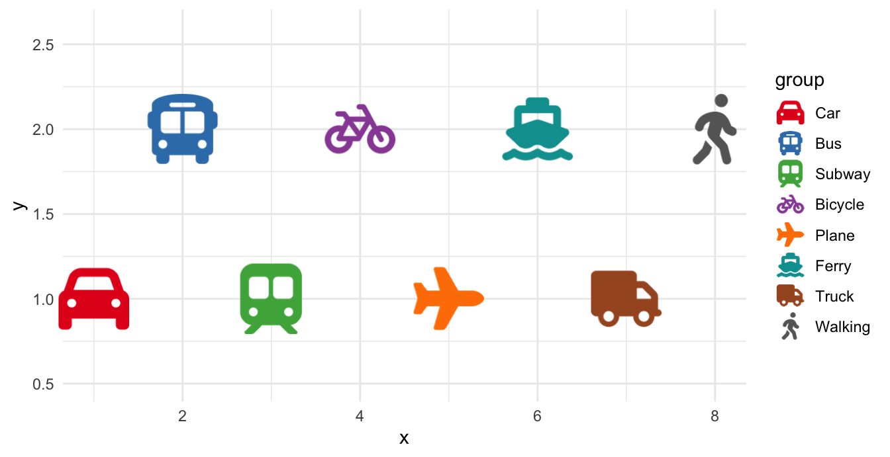
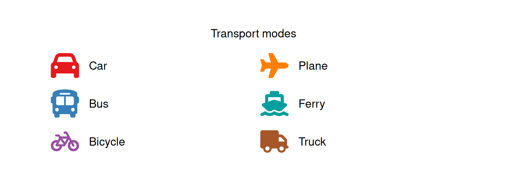
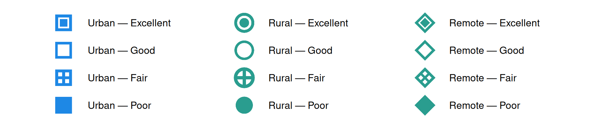
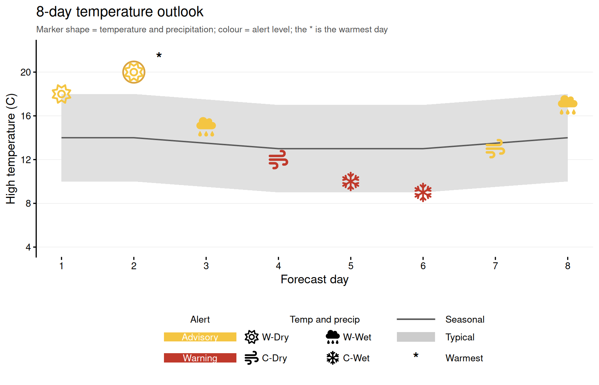

# Icon Legends: Native Guides and Standalone Composites

ggpop gives you two ways to build a legend, and picking the right one
keeps your code short:

1.  **Native icon legends** - for a legend keyed to your plot’s data.
    ggplot2 builds it for you; you only switch the keys to icons. This
    is what you want almost every time.
2.  **Standalone composite legends** - for a legend that is really a
    small annotated figure, decoupled from any plot (multiple grouped
    columns, mixed symbology, fixed pixel dimensions). ggplot2’s guide
    system cannot express these, so
    [`marker_legend()`](https://jurjoroa.github.io/ggpop/reference/marker_legend.md)
    draws them for you.

## The common case: native icon legends

Map an aesthetic, set `legend_icons = TRUE`, and let ggplot2 do the
rest. The icon keys are drawn by ggpop’s custom key glyph and recoloured
to match each group;
[`scale_legend_icon()`](https://jurjoroa.github.io/ggpop/reference/scale_legend_icon.md)
sizes them.

Show the code

``` r

df_modes <- data.frame(
  x     = c(1, 2, 3, 4, 5, 6, 7, 8),
  y     = c(1, 2, 1, 2, 1, 2, 1, 2),
  group = c("Car", "Bus", "Subway", "Bicycle", "Plane", "Ferry", "Truck", "Walking"),
  icon  = c("car", "bus", "train-subway", "bicycle", "plane", "ship", "truck", "person-walking"),
  stringsAsFactors = FALSE
)
df_modes$group <- factor(df_modes$group, levels = df_modes$group)

col_map <- c(
  Car = "#E41A1C", Bus = "#377EB8", Subway = "#4DAF4A", Bicycle = "#984EA3",
  Plane = "#FF7F00", Ferry = "#009E9E", Truck = "#A65628", Walking = "#666666"
)

ggplot(df_modes, aes(x = x, y = y, icon = icon, colour = group)) +
  geom_icon_point(size = 6, dpi = 120, legend_icons = TRUE) +
  scale_colour_manual(values = col_map) +
  coord_cartesian(ylim = c(0.5, 2.6), clip = "off") +
  scale_legend_icon(size = 6) +
  theme_minimal()
```



Figure 1: A native icon legend - ggplot2 builds the guide, ggpop draws
the keys.

> **Tip**
>
> For any legend tied to your data, stop here. The native path stays in
> sync with your scales automatically and needs no manual layout. Reach
> for
> [`marker_legend()`](https://jurjoroa.github.io/ggpop/reference/marker_legend.md)
> only when you need a standalone composite that ggplot2 guides cannot
> produce.

One ordering rule:
[`scale_legend_icon()`](https://jurjoroa.github.io/ggpop/reference/scale_legend_icon.md)
must come **after** any
[`theme()`](https://ggplot2.tidyverse.org/reference/theme.html) call,
because a later
[`theme()`](https://ggplot2.tidyverse.org/reference/theme.html) resets
the legend key size.

## Markers beyond Font Awesome

The `icon` aesthetic accepts more than Font Awesome names. ggpop ships a
set of bundled markers, and you can register a folder of your own `.svg`
files. List what is available with
[`ggpop_markers()`](https://jurjoroa.github.io/ggpop/reference/ggpop_markers.md):

``` r

ggpop_markers()$bundled
```

     [1] "circle-cross"        "circle-hollow"       "circle-inset"
     [4] "circle-solid"        "diamond-cross"       "diamond-hollow"
     [7] "diamond-inset"       "diamond-solid"       "plus-bold"
    [10] "plus-hollow"         "square-cross"        "square-hollow"
    [13] "square-inset"        "square-solid"        "triangle-down"
    [16] "triangle-down-inset"

These names work anywhere an icon is expected - in the geoms above and
in the composite legends below. To use your own SVGs, pass a folder via
`icon_path` (or set `options(ggpop.icon_path = "path/to/svgs")`) and
reference each file by its bare name.

## Standalone composite legends with `marker_legend()`

When a legend needs multiple grouped columns, mixed symbology, and a
fixed size - the kind of figure often exported as a standalone image -
ggplot2’s guide system falls short.
[`marker_legend()`](https://jurjoroa.github.io/ggpop/reference/marker_legend.md)
takes a tidy data frame of `icon` + `label` (+ optional per-row `colour`
and `column`) and lays it out for you.

### A Font Awesome composite

No bundled markers required - any icon source works, including mixed
sources in one legend.

Show the code

``` r

df_legend <- data.frame(
  column = c(1, 1, 1, 2, 2, 2),
  icon   = c("car", "bus", "bicycle", "plane", "ship", "truck"),
  label  = c("Car", "Bus", "Bike", "Plane", "Ferry", "Truck"),
  colour = c("#E41A1C", "#377EB8", "#984EA3", "#FF7F00", "#009E9E", "#A65628"),
  stringsAsFactors = FALSE
)

# Keep col_spacing and label_gap small: marker_legend()'s coordinate range
# grows with col_spacing, so a large value spreads the columns apart and leaves
# a wide empty margin. Small values pack the two columns close and keep each
# icon tight to its label.
marker_legend(
  df_legend,
  title = "Transport modes",
  marker_size = 5, label_size = 4, col_spacing = 0.6, label_gap = 0.15
)
```



Figure 2: A two-column composite legend built entirely from Font Awesome
icons.

### Multi-column composite legend

This is the use case
[`marker_legend()`](https://jurjoroa.github.io/ggpop/reference/marker_legend.md)
exists for: a multi-column legend that encodes two semantic dimensions
simultaneously — here, region type (colour) and indicator domain
(column) — using bundled markers to distinguish subcategories.

Show the code

``` r

blue <- "#1E88E5"
teal <- "#2A9D8F"

df_legend <- rbind(
  data.frame(
    column = 1, colour = blue,
    icon  = c("square-inset", "square-hollow", "square-cross", "square-solid"),
    label = c("Urban — Excellent", "Urban — Good",
              "Urban — Fair",     "Urban — Poor")
  ),
  data.frame(
    column = 2, colour = teal,
    icon  = c("circle-inset", "circle-hollow", "circle-cross", "circle-solid"),
    label = c("Rural — Excellent", "Rural — Good",
              "Rural — Fair",     "Rural — Poor")
  ),
  data.frame(
    column = 3, colour = teal,
    icon  = c("diamond-inset", "diamond-hollow", "diamond-cross", "diamond-solid"),
    label = c("Remote — Excellent", "Remote — Good",
              "Remote — Fair",      "Remote — Poor")
  ),
  stringsAsFactors = FALSE
)

marker_legend(
  df_legend,
  marker_size = 5, label_size = 4, dpi = 200,
  col_spacing = 3, row_spacing = 0.8, label_gap = 0.4
) +
  coord_cartesian(xlim = c(-0.6, 8.5), ylim = c(-3.2, 0.48), clip = "off")
```



Figure 3: A standalone composite legend encoding region type and health
indicator domain.

> **Note**
>
> [`marker_legend()`](https://jurjoroa.github.io/ggpop/reference/marker_legend.md)
> returns a plain `ggplot`. Add
> [`ggplot2::annotate()`](https://ggplot2.tidyverse.org/reference/annotate.html)
> layers for extra symbols or labels, then export at exact pixel
> dimensions with
> `ggplot2::ggsave(width = W / 300, height = H / 300, dpi = 300)`.

## Composite legends built from a data frame: `legend_canvas()`

[`marker_legend()`](https://jurjoroa.github.io/ggpop/reference/marker_legend.md)
above lays out one flat list of icon + label rows. Some legends need
more structure than that - an icon grid crossed by two dimensions, a
block of colour tiles for a grouping variable, and a small key for extra
symbols (a trend line, a shaded band, a flagged point) - all in one
figure.
[`legend_canvas()`](https://jurjoroa.github.io/ggpop/reference/legend_canvas.md)
builds exactly that from a single tidy data frame, `df_legend`, where a
`type` column tells it what to draw:

| `type`   | Renders as                    | Lives in                            |
|:---------|:------------------------------|:------------------------------------|
| `icon`   | An icon marker at `row`/`col` | `grid_section`                      |
| `swatch` | A filled rectangle            | `group_section` or `symbol_section` |
| `line`   | A short line segment          | `symbol_section`                    |
| `point`  | A bold glyph (default `"*"`)  | `symbol_section`                    |

`icon`-typed rows always render as icons no matter what `type` says -
the value is a bookkeeping label there, not a switch.
`swatch`/`line`/`point` are the only values
[`key_legend()`](https://jurjoroa.github.io/ggpop/reference/key_legend.md)
actually dispatches on, and that dispatch is the only place a new type
could be added.

### Deriving the icon grid from data with `icon_grid()`

If your icon-grid combinations already exist in a data frame - say, one
row per temperature / precipitation combination -
[`icon_grid()`](https://jurjoroa.github.io/ggpop/reference/icon_grid.md)
derives the unique `row`/`col` positions for you instead of typing them
by hand. Factor columns keep a deliberate row/col order; unordered
columns sort automatically. Each combination gets a Font Awesome weather
icon, so the grid reads as a legend of conditions rather than abstract
shapes.

``` r

df_cond <- data.frame(
  temp   = factor(c("Warm", "Warm", "Cold", "Cold"), levels = c("Warm", "Cold")),
  precip = factor(c("Dry", "Wet", "Dry", "Wet"), levels = c("Dry", "Wet")),
  icon   = c("sun", "cloud-rain", "wind", "snowflake"),
  stringsAsFactors = FALSE
)
df_cond$cell_label <- paste0(
  substr(df_cond$temp, 1, 1), "-", df_cond$precip
)

df_grid <- icon_grid(
  df_cond, icon = "icon", label = "cell_label",
  row = "temp", col = "precip"
)
df_grid
```

      section type label color       icon row col
    1    grid icon W-Dry  <NA>        sun   1   1
    2    grid icon W-Wet  <NA> cloud-rain   1   2
    3    grid icon C-Dry  <NA>       wind   2   1
    4    grid icon C-Wet  <NA>  snowflake   2   2

### Assembling grid + group + symbol sections

Combine that grid with a colour-tile group (`group_section`) and a small
symbol key (`symbol_section`) by
[`rbind()`](https://rdrr.io/r/base/cbind.html)-ing three data frames
that share `section`/`type`/`label`/`color` columns:

Show the code

``` r

alert_col <- c(Advisory = "#F4C542", Warning = "#C0392B")

df_legend <- rbind(
  df_grid,
  data.frame(
    section = "alert", type = "swatch",
    label = names(alert_col), color = unname(alert_col),
    icon = NA, row = NA, col = NA
  ),
  data.frame(
    section = "mark", type = c("line", "swatch", "point"),
    label   = c("Seasonal", "Typical", "Warmest"),
    color   = c("grey35", "grey80", "black"),
    icon = NA, row = NA, col = NA
  )
)

legend_canvas(
  df_legend,
  grid_title       = "Temp and precip",
  group_section    = "alert", group_title = "Alert", group_width = 0.85, group_gap = 0.18,
  symbol_section   = "mark", symbol_right_gap = 0.75, symbol_key_width = 0.45,
  col_spacing = 0.95, row_spacing = 1.2, label_gap = 0.12,
  marker_size = 5, label_size = 3.6, dpi = 150,
  x_margin = c(1.6, 1.6)
)
```


Figure 4: A grid + group + symbol composite legend built from one
df_legend data frame.

> **Tip**
>
> `group_title` lets the displayed heading differ from the `section`
> value used to match rows - keep `section` values plain and lowercase
> (`"alert"`) while the on-plot title stays capitalised (`"Alert"`).
> `grid_section` and `grid_title` work the same way for the icon grid.

Column spacing has to leave room for your longest label in that column
before the next section starts - if sections start overlapping, widen
`col_spacing`, `group_width`, or `symbol_right_gap` rather than
shortening labels first.

## One call for the whole thing: `legend_composite()`

[`legend_canvas()`](https://jurjoroa.github.io/ggpop/reference/legend_canvas.md)
gives you every knob, but for the standard grid + group + symbol legend
you end up repeating the same spacing, sizing, and centring numbers on
every figure.
[`legend_composite()`](https://jurjoroa.github.io/ggpop/reference/legend_composite.md)
is the opinionated wrapper: hand it the same `df_legend` and the
physical strip size, and it applies a fixed proportion ladder
([`legend_ratios()`](https://jurjoroa.github.io/ggpop/reference/legend_ratios.md)),
centres the content, and fits a tight border with
[`legend_box()`](https://jurjoroa.github.io/ggpop/reference/legend_box.md) -
the whole legend from one call.

Show the code

``` r

legend_composite(
  df_legend,
  width = 11, height = 1.7,
  grid_title     = "Temp and precip",
  group_section  = "alert", group_title = "Alert",
  symbol_section = "mark",
  ratios = modifyList(legend_ratios(), list(col_spacing = 1.5, symbol_right_gap = 1.4))
)
```


Figure 5: The same three-section df_legend, rendered in one
legend_composite() call with a fitted border.

Instead of hand-setting `col_spacing`, `group_width`, `marker_size`,
`label_size`, and the rest, you give
[`legend_composite()`](https://jurjoroa.github.io/ggpop/reference/legend_composite.md)
the physical `width`/`height` and it derives every length from three
base sizes and the ratio ladder. You usually touch nothing but the
titles; when a section needs more room - here the two-column grid’s
title and the wide symbol labels - override a single rung with
`ratios = modifyList(legend_ratios(), ...)`.

### The same proportions at any figure width

The base sizes are calibrated for a `base_width`-inch strip (default 27)
and multiplied by `width / base_width`, so passing your actual `width`
reproduces the identical legend at that physical size - no per-figure
retuning. Halve the width and text, markers, spacing, and border all
scale together. Set `base_width = width` to opt out and size in absolute
units instead.

> **Tip**
>
> Keep sparse legends compact - do not stretch them. `content_range`
> sets how much horizontal room the content is centred in. A dense
> legend (many columns, long labels) fills a wide strip on its own; a
> sparse one should stay compact. Leave `content_range` at its default
> rather than shrinking it to force the content to fill the width - the
> colour swatches are drawn in data coordinates, so a small
> `content_range` stretches them into wide banners while the fixed-size
> icons stay put.
> [`legend_composite()`](https://jurjoroa.github.io/ggpop/reference/legend_composite.md)
> warns when the swatches get that lopsided so you catch it early.

The grid’s `icon` column resolves per row, so one grid can mix Font
Awesome names, bundled ggpop markers, and your own `.svg` files in a
single legend - see [Custom SVG
icons](https://jurjoroa.github.io/ggpop/articles/custom-svg-icons.md).

## Stacking a plot and its legend with `legend_strip()`

A composite legend earns its keep only when the plot uses every key it
advertises. Here the forecast draws each day with
[`geom_icon_point()`](https://jurjoroa.github.io/ggpop/reference/geom_icon_point.md) -
marker shape for the temperature/precipitation condition, colour for the
alert level - over a seasonal-average line, a typical-range band, and a
flagged warmest day: exactly the sections the legend describes. To pin
that legend under the plot in one exported figure - rather than a
standalone panel - add it with `legend_strip(strip_plot, height)`:

Show the code

``` r

icon_map <- c(
  "Warm.Dry" = "sun",
  "Warm.Wet" = "cloud-rain",
  "Cold.Dry" = "wind",
  "Cold.Wet" = "snowflake"
)

df_fc <- data.frame(
  day      = 1:8,
  temp     = c(18, 20, 15, 12, 10, 9, 13, 17),
  temp_cat = c("Warm", "Warm", "Warm", "Cold", "Cold", "Cold", "Cold", "Warm"),
  precip   = c("Dry", "Dry", "Wet", "Dry", "Wet", "Wet", "Dry", "Wet"),
  alert    = c("Advisory", "Advisory", "Advisory", "Warning",
               "Warning", "Warning", "Advisory", "Advisory"),
  avg      = c(14, 14, 13.5, 13, 13, 13, 13.5, 14),
  stringsAsFactors = FALSE
)
df_fc$icon <- icon_map[paste(df_fc$temp_cat, df_fc$precip, sep = ".")]

# the warmest day in the outlook is flagged as the pick
warmest <- df_fc[which.max(df_fc$temp), ]

p_main <- ggplot(df_fc, aes(x = day, y = temp)) +
  geom_ribbon(aes(ymin = avg - 4, ymax = avg + 4), fill = "grey88") +
  geom_line(aes(y = avg), colour = "grey35", linewidth = 0.7) +
  # a soft ring highlights the warmest day so the * is unambiguous
  geom_point(data = warmest, shape = 21, size = 10, colour = "#D9A441",
             fill = NA, stroke = 1.3) +
  geom_icon_point(
    aes(icon = icon, colour = alert),
    size = 3, dpi = 150, legend_icons = FALSE, show.legend = FALSE
  ) +
  annotate("text", x = warmest$day + 0.35, y = warmest$temp + 1.3, label = "*",
           size = 6, fontface = "bold") +
  scale_colour_manual(values = alert_col, guide = "none") +
  scale_x_continuous("Forecast day", breaks = 1:8) +
  scale_y_continuous("High temperature (C)", limits = c(4, 22), breaks = seq(4, 20, 4)) +
  labs(
    title = "8-day temperature outlook",
    subtitle = "Marker shape = temperature and precipitation; colour = alert level; the * is the warmest day"
  ) +
  theme_classic(base_size = 13) +
  theme(
    axis.line.x = element_blank(),
    plot.subtitle = element_text(size = 9.5, colour = "grey30"),
    panel.grid.major.y = element_line(colour = "grey93", linewidth = 0.3)
  )

p_legend <- legend_canvas(
  df_legend,
  grid_title       = "Temp and precip",
  group_section    = "alert", group_title = "Alert", group_width = 0.85, group_gap = 0.18,
  symbol_section   = "mark", symbol_right_gap = 0.75, symbol_key_width = 0.45,
  col_spacing = 0.95, row_spacing = 1.2, label_gap = 0.12,
  marker_size = 5, label_size = 3.6, dpi = 150,
  x_margin = c(1.6, 1.6)
)

p_main + legend_strip(p_legend, height = 1.4)
```



Figure 6: An icon forecast answering a real question - marker shape
shows the temperature/precipitation condition, colour shows the alert
level - with its legend_canvas() legend stacked below, so every legend
key is something you read off the plot.

> **Tip**
>
> `height` is a physical size in inches, independent of the main plot’s
> own aspect ratio - set it once and `ggsave(width =, height =)` on the
> combined figure exactly like any other `ggplot`. Dropping
> [`theme_classic()`](https://ggplot2.tidyverse.org/reference/ggtheme.html)’s
> bottom `axis.line` (as above) avoids a redundant rule sitting right
> above the legend - keep the left axis line, drop only `axis.line.x`.
