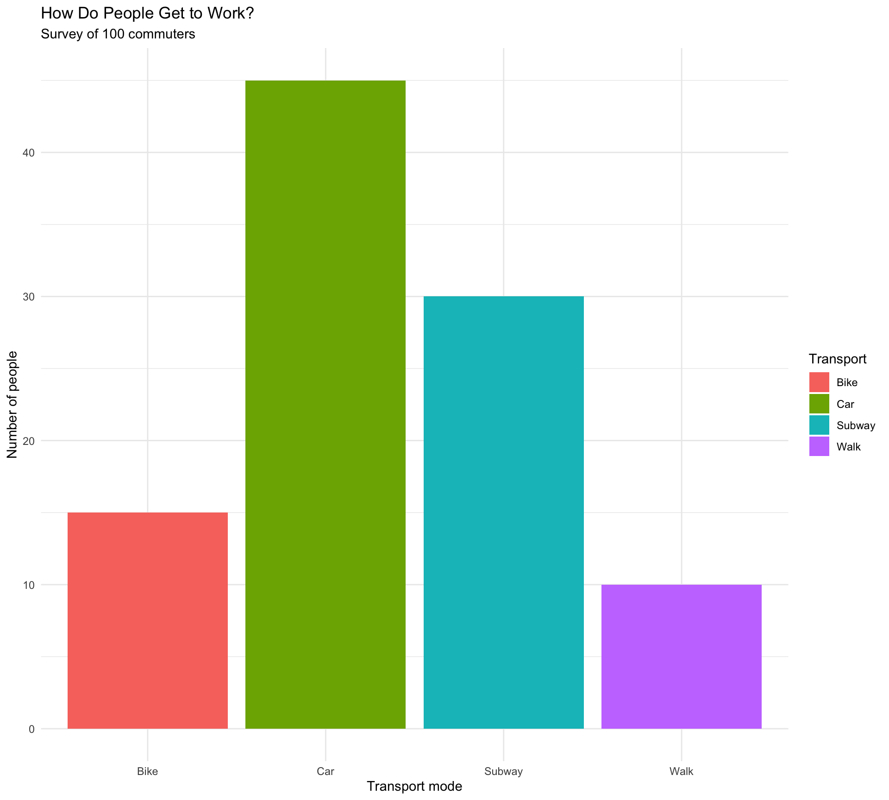
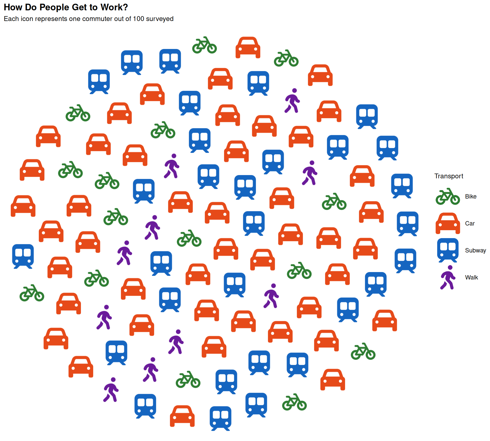
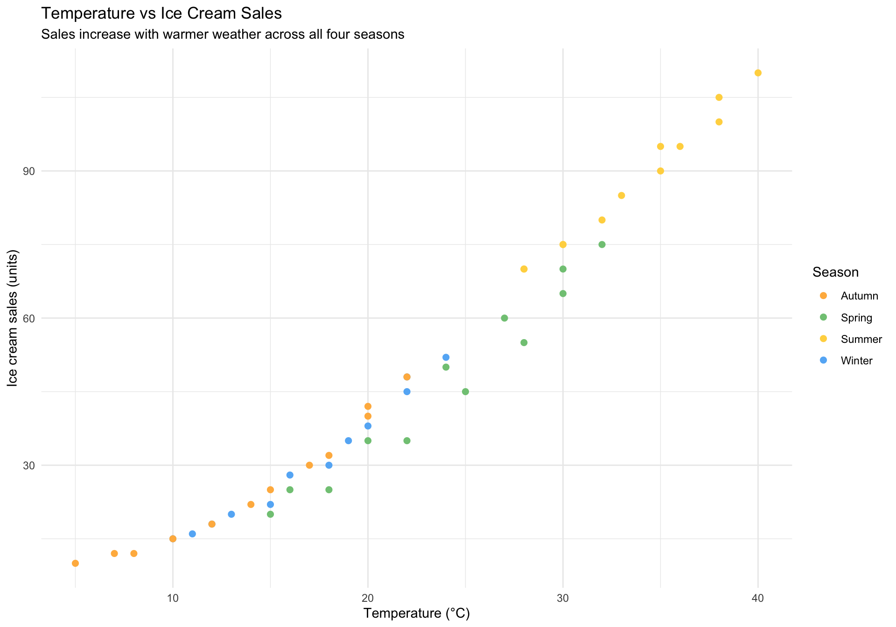
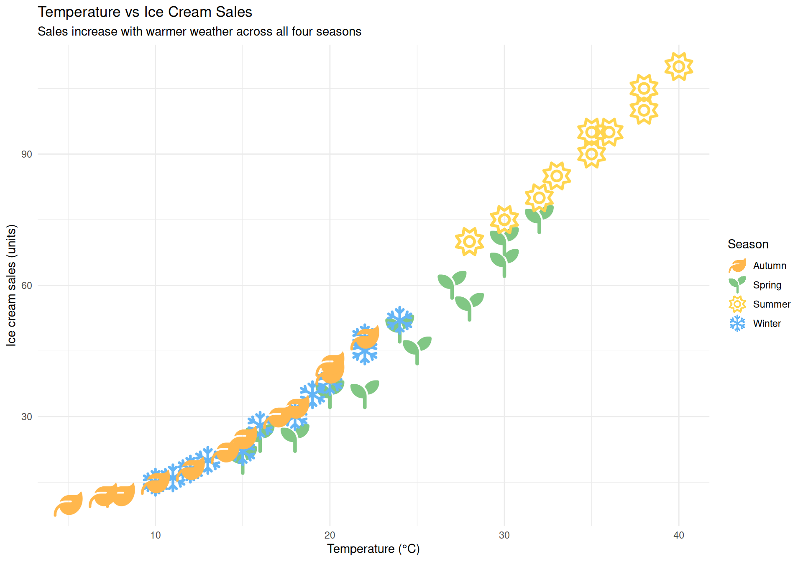

# New to R? Start Here

A guide for complete beginners. No math or programming experience
required — just follow along.

  

------------------------------------------------------------------------

## What is R?

R is a free programming language designed for working with data. Think
of it as a very powerful calculator that can also draw charts, run
statistics, and handle millions of rows of information.

Why R works for beginners:

- It’s **free** and runs on Windows, Mac, and Linux
- It has thousands of **packages** (ready-made tools built by other
  people)
- A large community — your questions are likely already answered online
- It’s used by scientists, journalists, economists, and data analysts
  around the world

  

------------------------------------------------------------------------

## Step 0 — Install R and RStudio

Before anything else, you need two free programs:

1.  **R** — the language itself. Download from
    [cran.r-project.org](https://cran.r-project.org/)
2.  **RStudio** — a friendly interface for writing R code. Download from
    [posit.co/download/rstudio-desktop](https://posit.co/download/rstudio-desktop/)

Install R, then RStudio. The **Console** (bottom-left) is where you type
commands.

> **Think of it like this**
>
> R is the engine. RStudio is the car. You drive the car, not the engine
> directly.

  

------------------------------------------------------------------------

## Step 1 — Your first commands

Click inside the Console and type the following. Press **Enter** after
each line.

``` r

# R can be used as a calculator
2 + 2
10 * 5
100 / 4
```

    [1] 4

    [1] 50

    [1] 25

The `#` symbol starts a **comment** — R ignores anything after it.

  

### Saving values with `<-`

Instead of re-typing numbers every time, you can save them into a
**variable** using the arrow `<-`:

``` r

my_number <- 42
my_name   <- "Jorge"

my_number
```

    [1] 42

``` r

my_name
```

    [1] "Jorge"

Now `my_number` holds the value `42`. You can use it anywhere:

``` r

my_number * 2
```

    [1] 84

> **Naming variables**
>
> Use descriptive names with underscores: `population_2024`,
> `total_cats`. Avoid spaces and special characters. R is
> case-sensitive: `MyData` and `mydata` are different things.

  

------------------------------------------------------------------------

## Step 2 — Understanding data frames

In R, data lives in **data frames** — think of them as spreadsheets with
rows and columns. Each column is a variable (like “city” or
“population”), and each row is one observation.

Here’s how to create a simple data frame:

``` r

df_cities <- data.frame(
  city       = c("Paris", "Tokyo", "Cairo", "Lagos"),
  population = c(2161000, 13960000, 22183000, 15387639)
)

df_cities
```

       city population
    1 Paris    2161000
    2 Tokyo   13960000
    3 Cairo   22183000
    4 Lagos   15387639

[`data.frame()`](https://rdrr.io/r/base/data.frame.html) creates a
table. [`c()`](https://rdrr.io/r/base/c.html) combines values into a
column. Commas separate columns.

You can access a single column using `$`:

``` r

df_cities$city
```

    [1] "Paris" "Tokyo" "Cairo" "Lagos"

``` r

df_cities$population
```

    [1]  2161000 13960000 22183000 15387639

  

------------------------------------------------------------------------

## Step 3 — Installing packages

R’s power comes from **packages** — collections of extra functions.
Install once, load every session.

``` r

# Install packages (do this once)
install.packages("ggplot2")
install.packages("ggpop")

# Load packages (do this every time you open RStudio)
library(ggplot2)
library(ggpop)
```

> **The difference between install and library**
>
> [`install.packages()`](https://rdrr.io/r/utils/install.packages.html)
> downloads once. [`library()`](https://rdrr.io/r/base/library.html)
> loads per session.

  

------------------------------------------------------------------------

## Step 4 — Your first chart with ggplot2

First, a simple ggplot2 chart to understand the structure:

We’ll use data about how people in a city get to work. Imagine we
surveyed 100 commuters:

``` r

df_transport <- data.frame(
  transport = c("Car", "Subway", "Bike", "Walk"),
  count     = c(45, 30, 15, 10)
)

df_transport
```

      transport count
    1       Car    45
    2    Subway    30
    3      Bike    15
    4      Walk    10

Now let’s make a bar chart:

``` r

library(ggplot2)

ggplot(data = df_transport, aes(x = transport, y = count, fill = transport)) +
  geom_bar(stat = "identity") +
  labs(
    title    = "How Do People Get to Work?",
    subtitle = "Survey of 100 commuters",
    x        = "Transport mode",
    y        = "Number of people",
    fill     = "Transport"
  ) +
  theme_minimal()
```



Let’s read the code line by line:

| Code | What it does |
|:---|:---|
| `ggplot(data = ..., aes(...))` | Creates the canvas and maps columns to visual properties |
| `aes(x = transport, y = count, fill = transport)` | `x` = horizontal axis, `y` = bar height, `fill` = bar color |
| `geom_bar(stat = "identity")` | Draws the bars (use `"identity"` when your data already has the counts) |
| `labs(...)` | Adds titles and axis labels |
| [`theme_minimal()`](https://ggplot2.tidyverse.org/reference/ggtheme.html) | Applies a clean, minimal style |

ggplot2 builds charts by layering pieces with `+`.

  

------------------------------------------------------------------------

## Step 5 — Upgrade to ggpop

`ggpop` replaces bars with icons — each person becomes visible. Let’s
recreate this:

First, we build a data frame with **one row per person** (instead of one
row per group):

``` r

df_commuters <- data.frame(
  transport = c(
    rep("Car",    45),
    rep("Subway", 30),
    rep("Bike",   15),
    rep("Walk",   10)
  ),
  icon = c(
    rep("car",            45),
    rep("train-subway",   30),
    rep("bicycle",        15),
    rep("person-walking", 10)
  )
)
```

`rep("Car", 45)` creates 45 rows — one per commuter. `icon` holds the
Font Awesome name.

Now the chart:

``` r

library(ggpop)

ggplot(data = df_commuters, aes(icon = icon, color = transport)) +
  geom_pop(size = 2, dpi  = 100, legend_icons = TRUE) +
  scale_color_manual(values = c(
    "Car"    = "#E64A19",
    "Subway" = "#1565C0",
    "Bike"   = "#2E7D32",
    "Walk"   = "#6A1B9A"
  )) +
  theme_pop() +
  scale_legend_icon(size = 7) +
  labs(
    title    = "How Do People Get to Work?",
    subtitle = "Each icon represents one commuter out of 100 surveyed",
    color    = "Transport"
  )
```



Same structure as ggplot2, but each data point is visible as an icon.

> **Finding icon names**
>
> Use
> [`fa_icons()`](https://jurjoroa.github.io/ggpop/reference/fa_icons.md)
> to search the library of 2,000+ free icons:
>
> ``` r
>
> fa_icons(query = "person")
> fa_icons(query = "car")
> fa_icons(query = "heart")
> ```

  

------------------------------------------------------------------------

## Step 6 — Scatter plots with icons using `geom_icon_point()`

[`geom_icon_point()`](https://jurjoroa.github.io/ggpop/reference/geom_icon_point.md)
places icons on a scatter plot — one per data point, no grid.

Let’s use a dataset about sleep and performance. We surveyed students on
how many hours they slept and their exam score, grouped by their
preferred study method:

``` r

df_weather <- data.frame(
  temperature = c(15, 18, 22, 25, 28, 30, 32, 30, 27, 24, 20, 16,
                  10, 12, 15, 18, 20, 22, 24, 22, 19, 16, 13, 11,
                  5, 8, 12, 15, 18, 20, 22, 20, 17, 14, 10, 7,
                  28, 30, 32, 35, 36, 38, 40, 38, 35, 33, 30, 28),
  ice_cream_sales = c(20, 25, 35, 45, 55, 65, 75, 70, 60, 50, 35, 25,
                      15, 18, 22, 30, 38, 45, 52, 48, 35, 28, 20, 16,
                      10, 12, 18, 25, 32, 40, 48, 42, 30, 22, 15, 12,
                      70, 75, 80, 90, 95, 100, 110, 105, 95, 85, 75, 70),
  season      = c(
    rep("Spring", 12),
    rep("Winter", 12),
    rep("Autumn", 12),
    rep("Summer", 12)
  ),
  icon        = c(
    rep("seedling", 12),
    rep("snowflake", 12),
    rep("leaf", 12),
    rep("sun", 12)
  )
)
```

Now plot it with
[`geom_point()`](https://ggplot2.tidyverse.org/reference/geom_point.html):

``` r

ggplot(
  data = df_weather,
  aes(x = temperature, y = ice_cream_sales, icon = icon, color = season)
) +
  geom_point(size = 2) +
  scale_color_manual(values = c(
    "Spring" = "#81C784",
    "Summer" = "#FFD54F",
    "Autumn" = "#FFB74D",
    "Winter" = "#64B5F6"
  )) +
  scale_legend_icon(size = 9) +
  labs(
    title    = "Temperature vs Ice Cream Sales",
    subtitle = "Sales increase with warmer weather across all four seasons",
    x        = "Temperature (°C)",
    y        = "Ice cream sales (units)",
    color    = "Season"
  ) +
  theme_minimal()
```



Now with
[`geom_icon_point()`](https://jurjoroa.github.io/ggpop/reference/geom_icon_point.md):

``` r

ggplot(
  data = df_weather,
  aes(x = temperature, y = ice_cream_sales, icon = icon, color = season)
) +
  geom_icon_point(size = 2, dpi = 100) +
  scale_color_manual(values = c(
    "Spring" = "#81C784",
    "Summer" = "#FFD54F",
    "Autumn" = "#FFB74D",
    "Winter" = "#64B5F6"
  )) +
  scale_legend_icon(size = 9) +
  labs(
    title    = "Temperature vs Ice Cream Sales",
    subtitle = "Sales increase with warmer weather across all four seasons",
    x        = "Temperature (°C)",
    y        = "Ice cream sales (units)",
    color    = "Season"
  ) +
  theme_minimal()
```



  

------------------------------------------------------------------------

## Where to go from here

You went from zero to four real charts in R. Here’s what to explore
next:

| Topic | Where to look |
|:---|:---|
| More [`geom_pop()`](https://jurjoroa.github.io/ggpop/reference/geom_pop.md) examples | [Getting Started](https://jurjoroa.github.io/ggpop/articles/getting-started.md) vignette |
| Icon search | [Font Awesome Icons](https://jurjoroa.github.io/ggpop/articles/fa-icons.md) vignette |
| More [`geom_icon_point()`](https://jurjoroa.github.io/ggpop/reference/geom_icon_point.md) examples | [geom_icon_point()](https://jurjoroa.github.io/ggpop/articles/geom-icon-point.md) vignette |
| Colors & themes | [Themes & Customization](https://jurjoroa.github.io/ggpop/articles/themes-customization.md) vignette |
| Common pitfalls | [Tips & Best Practices](https://jurjoroa.github.io/ggpop/articles/tips.md) vignette |

> **Keep learning R**
>
> The best way to learn is to work with data you care about. Find a
> dataset about something you’re interested in — sports, music, health,
> economics — and try to visualize it.
>
> When stuck, copy the error into a search engine — the R community is
> helpful.
