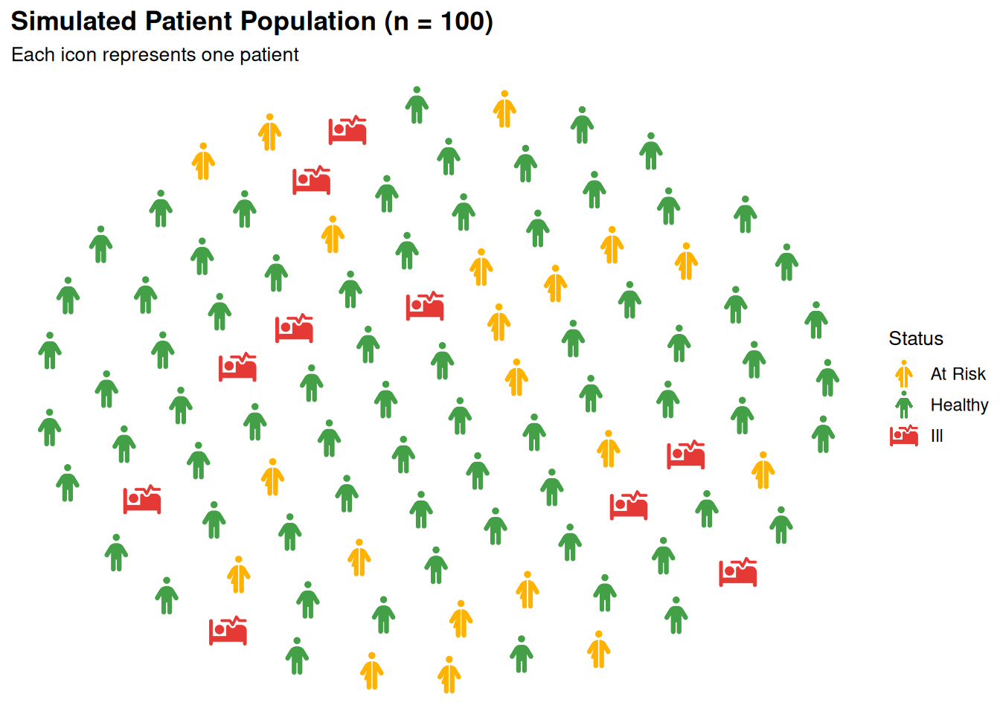

# Preparing Data with process_data()

## What is `process_data()`?

  

[`process_data()`](https://jurjoroa.github.io/ggpop/reference/process_data.md)
converts raw population counts into a sampled data frame (one row per
icon) ready for
[`geom_pop()`](https://jurjoroa.github.io/ggpop/reference/geom_pop.md).

It handles:

- Calculating group proportions from raw counts
- Proportionally allocating a fixed sample size across groups
- Supporting hierarchical grouping via `high_group_var`

``` r
library(ggpop)
library(ggplot2)
library(dplyr)
```

  

------------------------------------------------------------------------

## Basic Usage

  

Required: `data`, `group_var`, `sum_var`. `sample_size` sets icon count
(max 1,000).

``` r
df_sex <- data.frame(
  sex = c("male", "female"),
  n   = c(63459580, 67401427)
)

df_sex_proc <- process_data(
  data        = df_sex,
  group_var   = sex,
  sum_var     = n,
  sample_size = 100
)

head(df_sex_proc)
```

        type        n      prop
    1 female 67401427 0.5150612
    2 female 67401427 0.5150612
    3 female 67401427 0.5150612
    4 female 67401427 0.5150612
    5 female 67401427 0.5150612
    6   male 63459580 0.4849388

The output contains:

- **type**: group label (from `group_var`)
- **n**: total count for that group
- **prop**: proportion of the total
- One row per sampled icon

  

------------------------------------------------------------------------

## Understanding Proportions

  

With `sample_size = 100`, a group with 48% of the population gets ~48
icons.

``` r
df_sex_proc %>%
  group_by(type) %>%
  summarise(
    icons      = n(),
    proportion = round(mean(prop) * 100, 1)
  )
```

    # A tibble: 2 × 3
      type   icons proportion
      <chr>  <int>      <dbl>
    1 female    67       51.5
    2 male      33       48.5

  

------------------------------------------------------------------------

## Multiple Groups

  

Works with any number of groups — not just two.

``` r
df_regions <- data.frame(
  region = c("North", "South", "East", "West"),
  n      = c(12000, 8000, 15000, 5000)
)

df_regions_processed <- process_data(
  data        = df_regions,
  group_var   = region,
  sum_var     = n,
  sample_size = 100
)

df_regions_processed %>%
  group_by(type) %>%
  summarise(icons = n())
```

    # A tibble: 4 × 2
      type  icons
      <chr> <int>
    1 East     36
    2 North    30
    3 South    21
    4 West     13

  

------------------------------------------------------------------------

## Hierarchical Grouping with `high_group_var`

  

Use `high_group_var` to nest groups under a parent category for faceted
plots.

``` r
df_health <- data.frame(
  region    = c("North", "South", "East", "West",
                "North", "South", "East", "West"),
  status    = c(rep("Healthy", 4), rep("At Risk", 4)),
  n         = c(8000, 6000, 9000, 4000,
                4000, 2000, 6000, 1000)
)

df_health_processed <- process_data(
  data           = df_health,
  group_var      = status,
  sum_var        = n,
  high_group_var = "region",
  sample_size    = 100
)

df_health_processed %>%
  group_by(group, type) %>%
  summarise(icons = n(), .groups = "drop")
```

    # A tibble: 8 × 3
      group type    icons
      <chr> <chr>   <int>
    1 East  At Risk    33
    2 East  Healthy    67
    3 North At Risk    35
    4 North Healthy    65
    5 South At Risk    17
    6 South Healthy    83
    7 West  At Risk    17
    8 West  Healthy    83

  

------------------------------------------------------------------------

## Skipping `process_data()`

  

Optional — pass data directly to
[`geom_pop()`](https://jurjoroa.github.io/ggpop/reference/geom_pop.md)
if it already has one row per icon (max 1,000 rows per plot or facet).

``` r
df_direct <- data.frame(
  activity = c(
    rep("Walking",  35),
    rep("Running",  25),
    rep("Hiking",   20),
    rep("Cycling",  15),
    rep("Swimming",  5)
  ),
  icon = c(
    rep("person-walking",  35),
    rep("person-running",  25),
    rep("person-hiking",   20),
    rep("person-biking",   15),
    rep("person-swimming",  5)
  )
)

# Pass directly — no process_data() needed
ggplot() +
  geom_pop(
    data = df_direct,
    aes(icon = icon, color = activity),
    size = 2, dpi = 100, legend_icons = TRUE, arrange = TRUE
  ) +
  scale_color_manual(values = c(
    "Walking"  = "#5C6BC0",
    "Running"  = "#E53935",
    "Hiking"   = "#43A047",
    "Cycling"  = "#FFB300",
    "Swimming" = "#039BE5"
  )) +
  theme_pop() +
  theme(plot.title = element_text(color = "white"),
        plot.subtitle = element_text(color = "white"),
        legend.text = element_text(color = "white"),
        legend.title = element_text(color = "white"),
        legend.position = "bottom") +
  scale_legend_icon(size = 8) +
  labs(
    title    = "Physical Activity Distribution (n = 100)",
    subtitle = "Each icon represents one survey participant",
    color    = "Activity"
  )
```



  

------------------------------------------------------------------------

## Summary

  

| Parameter        | Description                             |
|:-----------------|:----------------------------------------|
| `data`           | Input data frame with group counts      |
| `group_var`      | Column to group by (unquoted)           |
| `sum_var`        | Column with population counts           |
| `sample_size`    | Number of icons to generate (max 1,000) |
| `high_group_var` | Optional parent grouping for faceting   |
