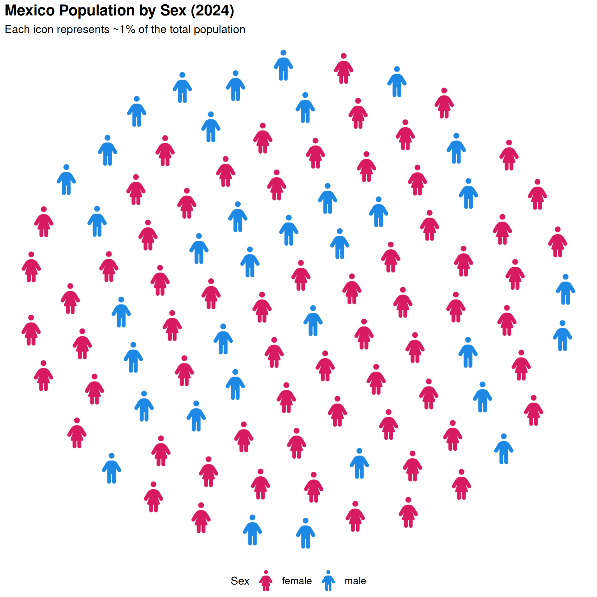
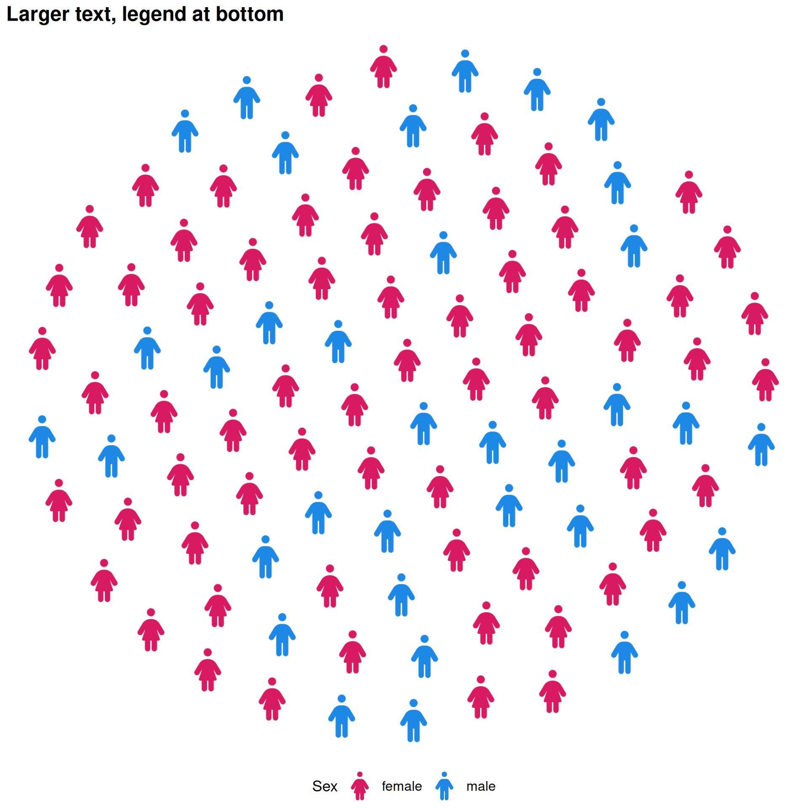
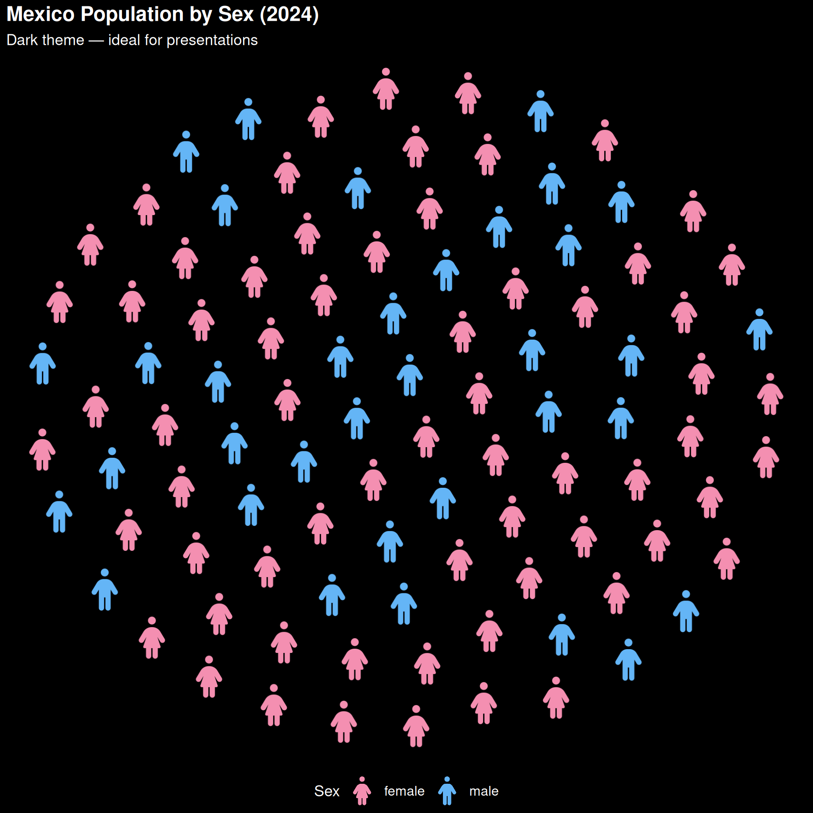
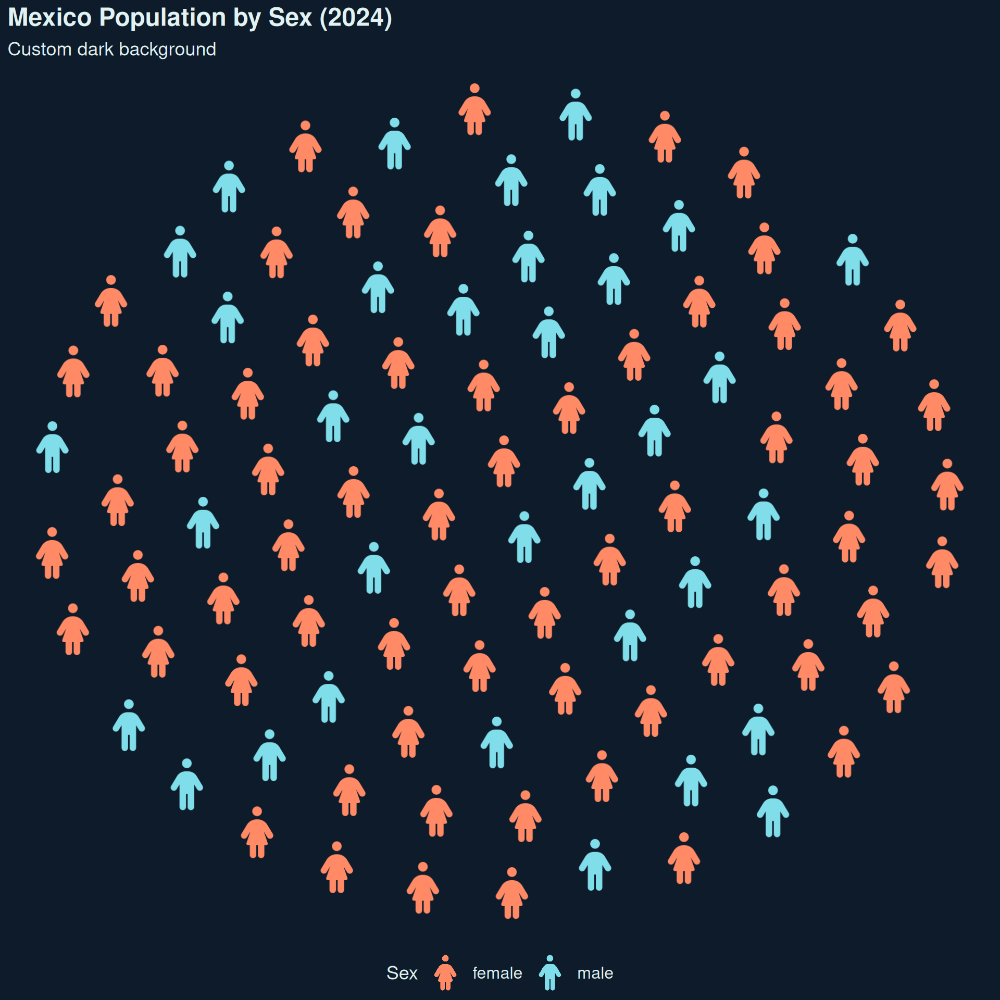
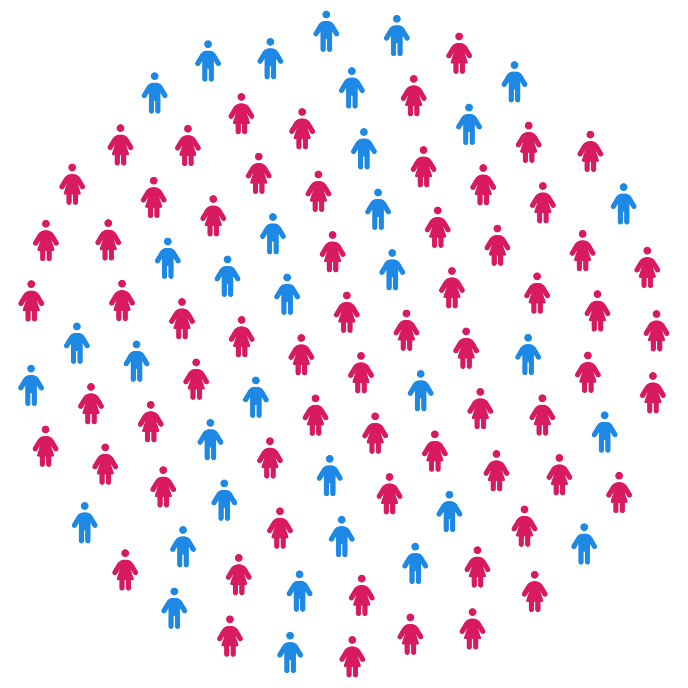
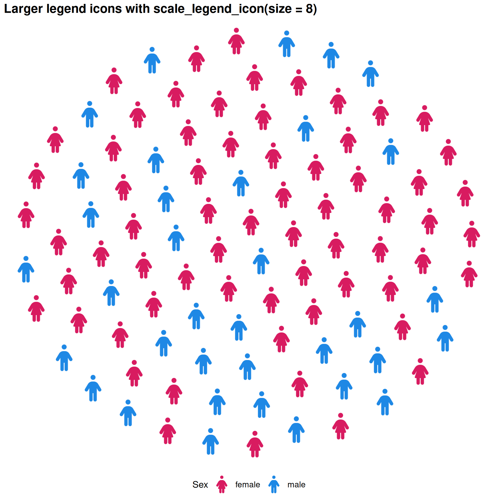
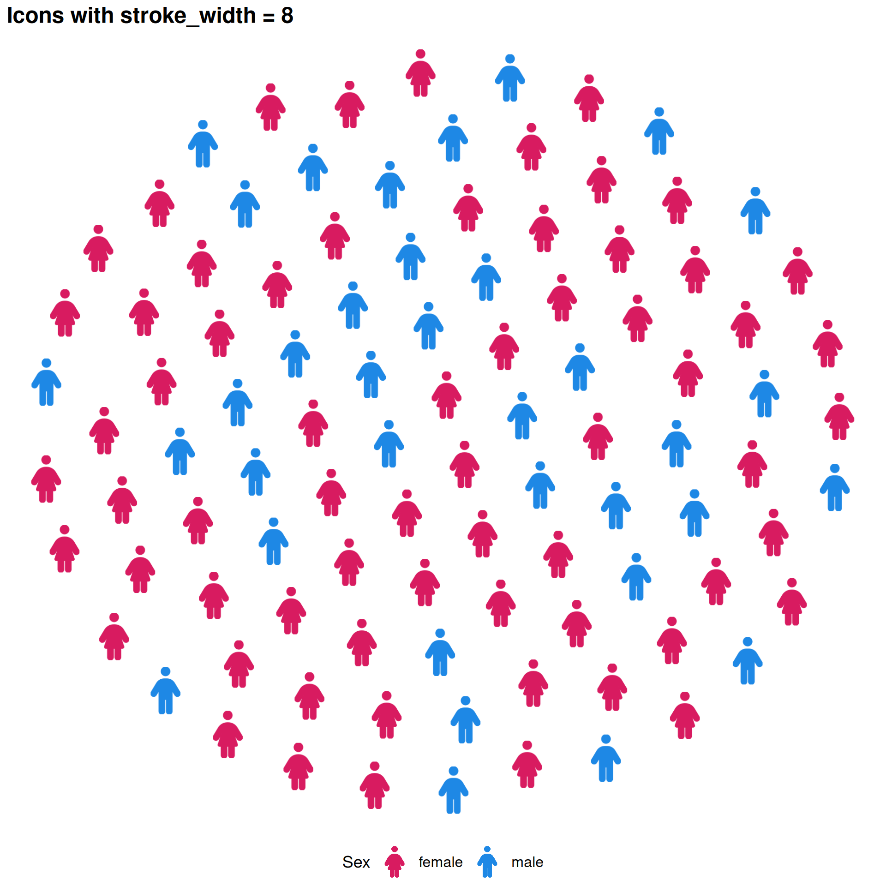
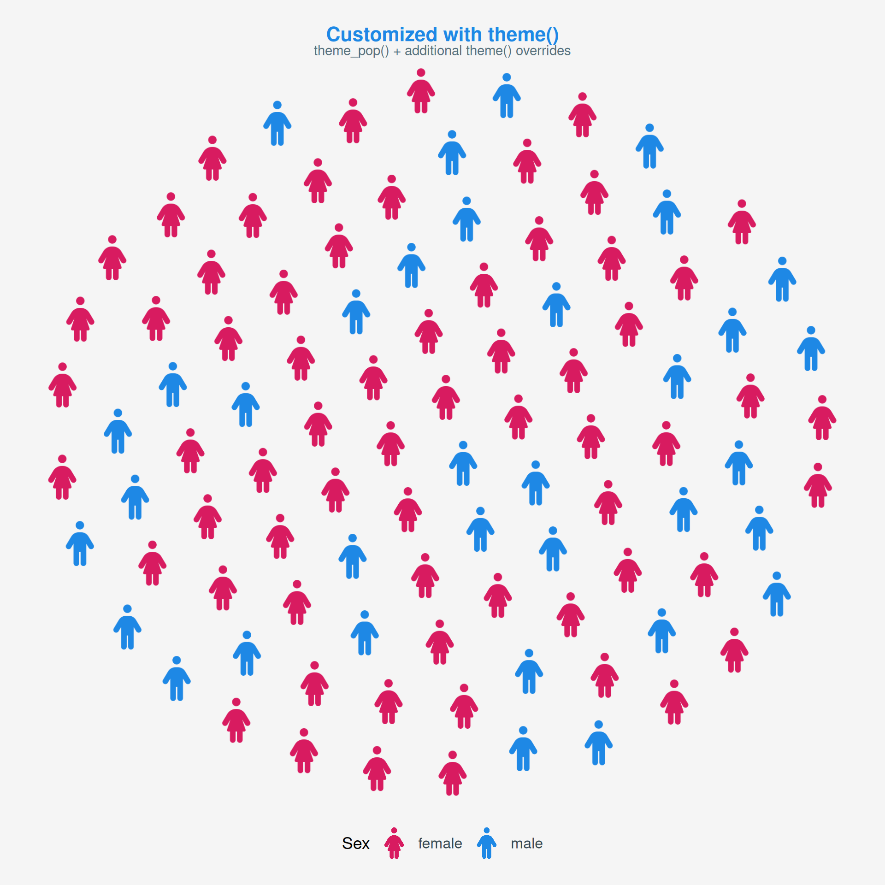

# Themes & Customization

## Themes Overview

  

`ggpop` ships with three built-in themes, all optimized for icon-based
charts:

| Theme                                                                                    | Description                        |
|:-----------------------------------------------------------------------------------------|:-----------------------------------|
| [`theme_pop()`](https://jurjoroa.github.io/ggpop/reference/theme_pop.md)                 | Default — clean, minimal, no axes  |
| [`theme_pop_dark()`](https://jurjoroa.github.io/ggpop/reference/theme_pop_dark.md)       | Dark background variant            |
| [`theme_pop_minimal()`](https://jurjoroa.github.io/ggpop/reference/theme_pop_minimal.md) | Ultra-minimal, no legend or titles |

  

------------------------------------------------------------------------

## `theme_pop()`

  

The default theme. Removes axes and gridlines, keeping the focus on the
icons. All standard ggplot2
[`theme()`](https://ggplot2.tidyverse.org/reference/theme.html)
arguments can be added on top.

``` r
ggplot() +
  geom_pop(
    data         = df_sex_proc,
    aes(icon = icon, color = type),
    size         = 2,
    dpi          = 100,
    legend_icons = TRUE
  ) +
  scale_color_manual(values = c("male" = "#1E88E5", "female" = "#D81B60")) +
  theme_pop(base_size = 15) +
  theme(legend.position = "bottom") +
  scale_legend_icon(size = 5) +
  labs(
    title    = "Mexico Population by Sex (2024)",
    subtitle = "Each icon represents ~1% of the total population",
    color    = "Sex"
  )
```



### Parameters

- **`base_size`**: controls font size throughout (default: `11`)
- **`legend_position`**: `"right"`, `"bottom"`, `"left"`, `"top"`, or
  `"none"`
- **`plot_margin`**: single number or
  [`margin()`](https://ggplot2.tidyverse.org/reference/element.html)
  object

``` r
ggplot() +
  geom_pop(
    data         = df_sex_proc,
    aes(icon = icon, color = type),
    size         = 2,
    dpi          = 100,
    legend_icons = TRUE
  ) +
  scale_color_manual(values = c("male" = "#1E88E5", "female" = "#D81B60")) +
  theme_pop(base_size = 15) +
  theme(legend.position = "bottom") +
  scale_legend_icon(size = 5) +
  labs(
    title = "Larger text, legend at bottom",
    color = "Sex"
  )
```



  

------------------------------------------------------------------------

## `theme_pop_dark()`

  

A dark variant built on top of
[`theme_pop()`](https://jurjoroa.github.io/ggpop/reference/theme_pop.md).
Accepts `bg_color` and `text_color` for full control.

``` r
ggplot() +
  geom_pop(
    data         = df_sex_proc,
    aes(icon = icon, color = type),
    size         = 2,
    dpi          = 100,
    legend_icons = TRUE
  ) +
  scale_color_manual(values = c("male" = "#64B5F6", "female" = "#F48FB1")) +
  theme_pop_dark(base_size = 15) +
  theme(legend.position = "bottom") +
  scale_legend_icon(size = 5) +
  labs(
    title    = "Mexico Population by Sex (2024)",
    subtitle = "Dark theme — ideal for presentations",
    color    = "Sex"
  )
```



Custom background and text colors:

``` r
ggplot() +
  geom_pop(
    data         = df_sex_proc,
    aes(icon = icon, color = type),
    size         = 2,
    dpi          = 100,
    legend_icons = TRUE
  ) +
  scale_color_manual(values = c("male" = "#80DEEA", "female" = "#FF8A65")) +
  theme_pop_dark(base_size = 15, bg_color = "#0D1B2A", text_color = "#E0F2F1") +
  theme(legend.position = "bottom") +
  scale_legend_icon(size = 5) +
  labs(
    title    = "Mexico Population by Sex (2024)",
    subtitle = "Custom dark background",
    color    = "Sex"
  )
```



  

------------------------------------------------------------------------

## `theme_pop_minimal()`

  

Strips everything — no title, no legend, no margins. Best for embedding
icon arrays inside dashboards or documents.

``` r
ggplot() +
  geom_pop(
    data = df_sex_proc,
    aes(icon = icon, color = type),
    size = 2,
    dpi  = 100
  ) +
  scale_color_manual(values = c("male" = "#1E88E5", "female" = "#D81B60")) +
  theme_pop_minimal(base_size = 15)
```



  

------------------------------------------------------------------------

## `scale_legend_icon()`

  

Controls the size of icons in the legend. Use it alongside
`legend_icons = TRUE` in
[`geom_pop()`](https://jurjoroa.github.io/ggpop/reference/geom_pop.md)
or
[`geom_icon_point()`](https://jurjoroa.github.io/ggpop/reference/geom_icon_point.md).

``` r
ggplot() +
  geom_pop(
    data         = df_sex_proc,
    aes(icon = icon, color = type),
    size         = 2,
    dpi          = 100,
    legend_icons = TRUE
  ) +
  scale_color_manual(values = c("male" = "#1E88E5", "female" = "#D81B60")) +
  theme_pop(base_size = 15) +
  theme(legend.position = "bottom") +
  scale_legend_icon(size = 5) +
  labs(title = "Larger legend icons with scale_legend_icon(size = 8)", color = "Sex")
```



  

------------------------------------------------------------------------

## `stroke_width` — Icon Outlines

  

Add an outline to icons with `stroke_width`. Higher values produce a
thicker border, useful for light icons on light backgrounds.

``` r
ggplot() +
  geom_pop(
    data         = df_sex_proc,
    aes(icon = icon, color = type),
    size         = 2,
    dpi          = 100,
    legend_icons = TRUE,
    stroke_width = 8
  ) +
  scale_color_manual(values = c("male" = "#1E88E5", "female" = "#D81B60")) +
  theme_pop(base_size = 15) +
  theme(legend.position = "bottom") +
  scale_legend_icon(size = 5) +
  labs(title = "Icons with stroke_width = 8", color = "Sex")
```



  

------------------------------------------------------------------------

## Combining with ggplot2 `theme()`

  

[`theme_pop()`](https://jurjoroa.github.io/ggpop/reference/theme_pop.md)
is a standard ggplot2 theme — add any
[`theme()`](https://ggplot2.tidyverse.org/reference/theme.html) call on
top to override specific elements.

``` r
ggplot() +
  geom_pop(
    data         = df_sex_proc,
    aes(icon = icon, color = type),
    size         = 2,
    dpi          = 100,
    legend_icons = TRUE
  ) +
  scale_color_manual(values = c("male" = "#1E88E5", "female" = "#D81B60")) +
  theme_pop_minimal(base_size=15) +
  theme(
    plot.background  = element_rect(fill = "#F5F5F5", color = NA),
    plot.title       = element_text(color = "#1E88E5", face = "bold", size = 16),
    plot.subtitle    = element_text(color = "#546E7A"),
    legend.text      = element_text(color = "#37474F"),
    legend.position = "bottom",
    plot.margin      = margin(20, 20, 20, 20)
  ) +
  scale_legend_icon(size = 5) +
  labs(
    title    = "Customized with theme()",
    subtitle = "theme_pop() + additional theme() overrides",
    color    = "Sex"
  )
```



  

------------------------------------------------------------------------

## Summary

  

| Function                                                                                 | Purpose                                                                                                                                                                               |
|:-----------------------------------------------------------------------------------------|:--------------------------------------------------------------------------------------------------------------------------------------------------------------------------------------|
| [`theme_pop()`](https://jurjoroa.github.io/ggpop/reference/theme_pop.md)                 | Default clean theme for icon charts                                                                                                                                                   |
| [`theme_pop_dark()`](https://jurjoroa.github.io/ggpop/reference/theme_pop_dark.md)       | Dark background variant                                                                                                                                                               |
| [`theme_pop_minimal()`](https://jurjoroa.github.io/ggpop/reference/theme_pop_minimal.md) | No legend, no titles, no margins                                                                                                                                                      |
| `scale_legend_icon(size)`                                                                | Control legend icon size                                                                                                                                                              |
| `stroke_width`                                                                           | Add outline to icons in [`geom_pop()`](https://jurjoroa.github.io/ggpop/reference/geom_pop.md) / [`geom_icon_point()`](https://jurjoroa.github.io/ggpop/reference/geom_icon_point.md) |

Visit the [ggpop website](https://jurjoroa.github.io/ggpop/) for the
full function reference.
