# Tips & Best Practices

Essential rules and conventions for using `ggpop`, with working
examples.

  

------------------------------------------------------------------------

## Tip 1 — Use valid Font Awesome icon names

The `icon` column must contain valid Font Awesome names. Use
[`fa_icons()`](https://jurjoroa.github.io/ggpop/reference/fa_icons.md)
to search.

> **How to find valid icon names**
>
> ``` r
>
> # Search by keyword
> fa_icons(query = "person")
> fa_icons(query = "car")
> fa_icons(query = "heart")
> ```

``` r

df_tip1 <- data.frame(
  transport = rep(c("Car", "Bicycle", "Plane"), each = 10),
  icon      = rep(c("car", "bicycle", "plane"), each = 10),
  stringsAsFactors = FALSE
)

ggplot() +
  geom_pop(
    data = df_tip1,
    aes(icon = icon, color = transport),
    size = 3, dpi = 100, legend_icons = TRUE
  ) +
  scale_color_manual(values = c(
    "Car"     = "#E64A19",
    "Bicycle" = "#2E7D32",
    "Plane"   = "#1565C0"
  )) +
  theme_pop() +
  theme(plot.title = element_text(color = "white"),
        plot.subtitle = element_text(color = "white"),
        legend.text = element_text(color = "white"),
        legend.title = element_text(color = "white"),
        legend.position = "bottom") +
  scale_legend_icon(size = 8) +
  labs(title = "Tip 1: Valid FA icon names", color = "Transport")
```

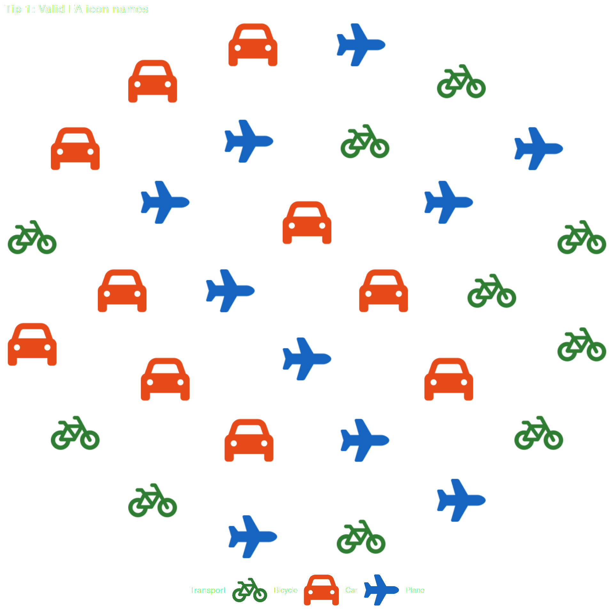

  

------------------------------------------------------------------------

## Tip 2 — Avoid reserved column names

`ggpop` uses several internal column names during layout computation. If
your data already contains any of these names, the geom will throw an
error:

| Reserved name       | Purpose                      |
|:--------------------|:-----------------------------|
| `x1`                | Computed x position          |
| `y1`                | Computed y position          |
| `pos`               | Icon position index          |
| `image`             | PNG path (internal)          |
| `coord_size`        | Coordinate scaling           |
| `icon_size`         | Icon rendering size          |
| `icon_stroke_width` | Stroke scaling               |
| `alpha`             | Icon transparency (internal) |

**Rename any conflicting columns before calling
[`geom_pop()`](https://jurjoroa.github.io/ggpop/reference/geom_pop.md)
or
[`geom_icon_point()`](https://jurjoroa.github.io/ggpop/reference/geom_icon_point.md).**

``` r

# Safe column names — no conflict with internal reserved names
df_tip2 <- data.frame(
  sex      = rep(c("Male", "Female"), each = 20),
  icon     = rep(c("mars", "venus"), each = 20),
  age_grp  = rep(c("Adult", "Child"), times = 20),  # safe name
  stringsAsFactors = FALSE
)

ggplot() +
  geom_pop(
    data = df_tip2,
    aes(icon = icon, color = sex),
    size = 3, dpi = 100, legend_icons = TRUE
  ) +
  scale_color_manual(values = c("Male" = "#1565C0", "Female" = "#C62828")) +
  theme_pop() +
  theme(plot.title = element_text(color = "white"),
        plot.subtitle = element_text(color = "white"),
        legend.text = element_text(color = "white"),
        legend.title = element_text(color = "white"),
        legend.position = "bottom") +
  scale_legend_icon(size = 8) +
  labs(title = "Tip 2: Safe column names", color = "Sex")
```

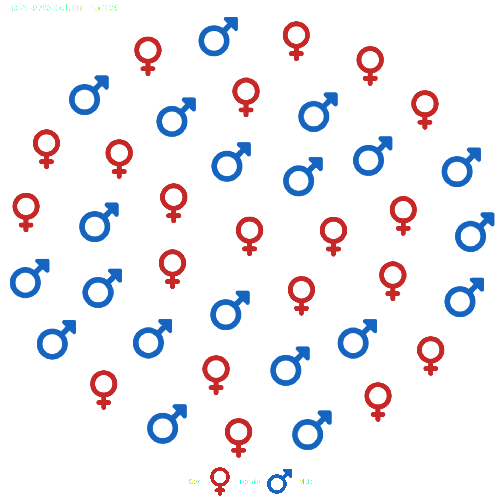

  

------------------------------------------------------------------------

## Tip 3 — Use `color`, not `fill`

[`geom_pop()`](https://jurjoroa.github.io/ggpop/reference/geom_pop.md)
renders icons as raster images. This means:

- `fill` is **not supported** → hard error
- **`color`** is the correct aesthetic for icon color
- **`alpha`** is supported — either as a fixed parameter
  (`geom_pop(alpha = 0.5)`) or mapped via `aes(alpha = col)`, but
  **`alpha` is a reserved column name** — rename your column first
  (e.g. `opacity`)

> **What NOT to do**
>
> ``` r
>
> # fill will error in geom_pop():
> aes(icon = icon, group = sex, fill = sex)   # Error
> ```

``` r

df_tip3 <- data.frame(
  region = rep(c("North", "South", "East", "West"), each = 15),
  icon   = rep(c("compass", "arrow-down", "arrow-right", "arrow-left"), each = 15),
  stringsAsFactors = FALSE
)

ggplot() +
  geom_pop(
    data = df_tip3,
    aes(icon = icon, color = region,  alpha = 0.5),                       # fixed alpha ✓ — works as a 
    size = 3, dpi = 100, legend_icons = TRUE
  ) +
  scale_color_manual(values = c(
    "North" = "#00897B", "South" = "#E64A19",
    "East"  = "#7B1FA2", "West"  = "#F9A825"
  )) +
  theme_pop() +
  scale_legend_icon(size = 8) +
  theme(plot.title = element_text(color = "white"),
        plot.subtitle = element_text(color = "white"),
        legend.text = element_text(color = "white"),
        legend.title = element_text(color = "white"),
        legend.position = "bottom") +
  labs(title = "Tip 3: Use color, not fill", color = "Region")
```

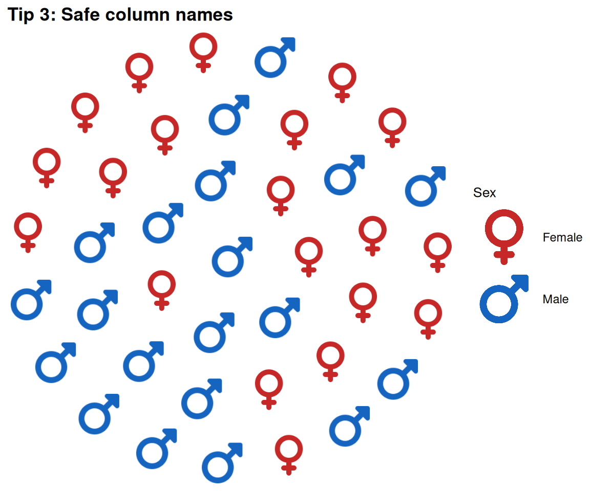

  

------------------------------------------------------------------------

## Tip 4 — Keep your total icon count at or below 1,000

Max **1,000 icons** per facet panel — exceeding this raises an error.
Use `process_data(sample_size = ...)` to stay within limits.

``` r

df_tip4_raw <- data.frame(
  group = c("Group A", "Group B", "Group C"),
  n     = c(4500000, 3200000, 2100000)
)

# process_data samples down to sample_size icons total
df_tip4 <- process_data(
  data        = df_tip4_raw,
  group_var   = group,
  sum_var     = n,
  sample_size = 100          # stays well under the 1,000 limit
) %>%
  mutate(icon = case_when(
    type == "Group A" ~ "circle",
    type == "Group B" ~ "square",
    type == "Group C" ~ "triangle-exclamation"
  ))

ggplot() +
  geom_pop(
    data = df_tip4,
    aes(icon = icon, color = type),
    size = 2, dpi = 100, legend_icons = TRUE
  ) +
  scale_color_manual(values = c(
    "Group A" = "#1565C0",
    "Group B" = "#2E7D32",
    "Group C" = "#E64A19"
  )) +
  theme_pop() +
  theme(plot.title = element_text(color = "white"),
        plot.subtitle = element_text(color = "white"),
        legend.text = element_text(color = "white"),
        legend.title = element_text(color = "white"),
        legend.position = "bottom") +
  scale_legend_icon(size = 8) +
  labs(
    title    = "Tip 4: Use process_data() to control icon count",
    subtitle = "sample_size = 100 — well under the 1,000-icon limit",
    color    = "Group"
  )
```

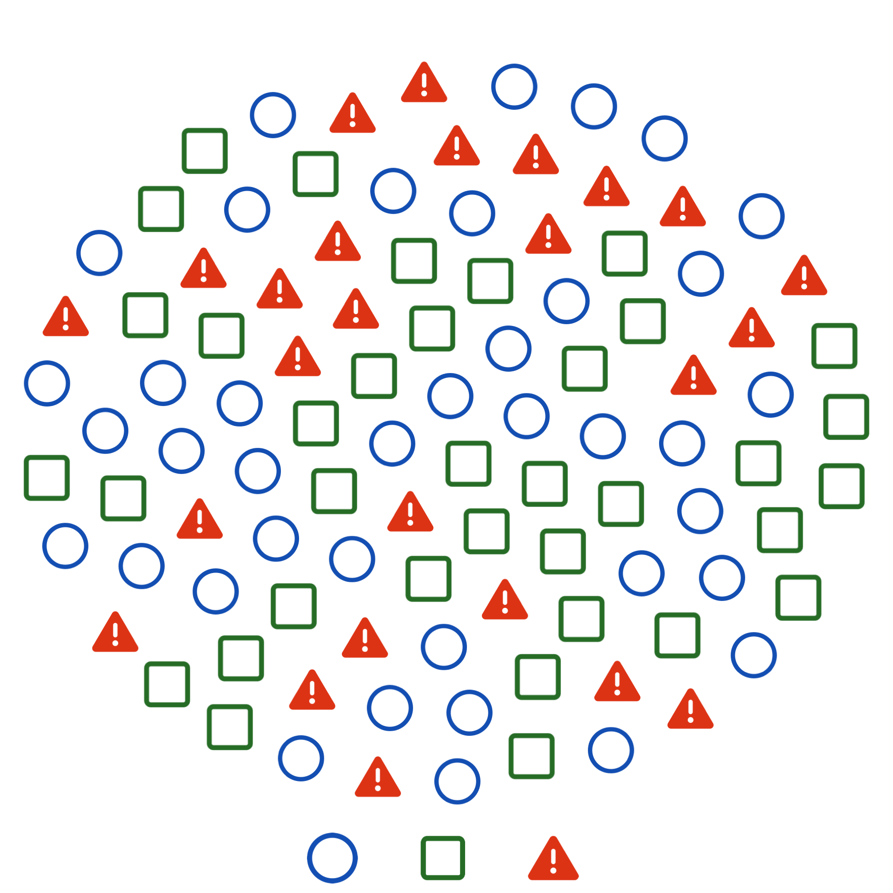

  

------------------------------------------------------------------------

## Tip 5 — Don’t map `x` or `y` in `geom_pop()`

Don’t map `x` or `y` in
[`aes()`](https://ggplot2.tidyverse.org/reference/aes.html) — ggpop
computes positions internally and will warn if you do.

> **This will warn (and x/y are silently ignored)**
>
> ``` r
>
> geom_pop(data = df, aes(icon = icon, group = sex, x = sex, y = sex))
> ```

``` r

df_tip5 <- data.frame(
  type = rep(c("Urban", "Rural"), each = 25),
  icon = rep(c("building", "tree"), each = 25),
  stringsAsFactors = FALSE
)

# Correct: no x or y in aes() — geom_pop() handles layout automatically
ggplot() +
  geom_pop(
    data = df_tip5,
    aes(icon = icon, color = type),
    size = 3, dpi = 100, legend_icons = TRUE
  ) +
  scale_color_manual(values = c("Urban" = "#5C6BC0", "Rural" = "#388E3C")) +
  theme_pop() +
  theme(plot.title = element_text(color = "white"),
        plot.subtitle = element_text(color = "white"),
        legend.text = element_text(color = "white"),
        legend.title = element_text(color = "white"),
        legend.position = "bottom") +
  scale_legend_icon(size = 8) +
  labs(title = "Tip 5: No x/y mapping needed in geom_pop()", color = "Area")
```

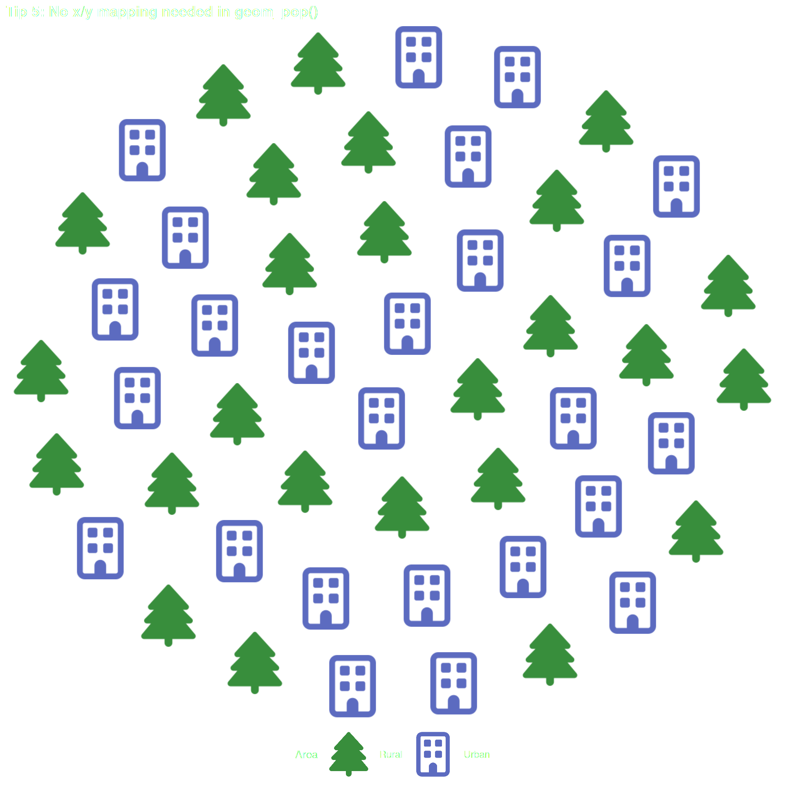

  

------------------------------------------------------------------------

## Tip 6 — One icon per legend group when using `legend_icons = TRUE`

Each `color` group must map to exactly one icon name when
`legend_icons = TRUE`.

``` r

# Each group maps to exactly one icon — clean legend
df_tip6 <- data.frame(
  species = rep(c("Birds", "Fish", "Trees"), each = 20),
  icon    = rep(c("dove", "fish", "tree"), each = 20),
  stringsAsFactors = FALSE
)

ggplot() +
  geom_pop(
    data = df_tip6,
    aes(icon = icon, color = species),
    size = 3, dpi = 100,
    legend_icons = TRUE            # one icon per group ✓ — no warning
  ) +
  scale_color_manual(values = c(
    "Birds" = "#0277BD",
    "Fish"  = "#00897B",
    "Trees" = "#2E7D32"
  )) +
  theme_pop() +
  theme(plot.title = element_text(color = "white"),
        plot.subtitle = element_text(color = "white"),
        legend.text = element_text(color = "white"),
        legend.title = element_text(color = "white"),
        legend.position = "bottom") +
  scale_legend_icon(size = 8) +
  labs(title = "Tip 6: One icon per legend group", color = "Species")
```

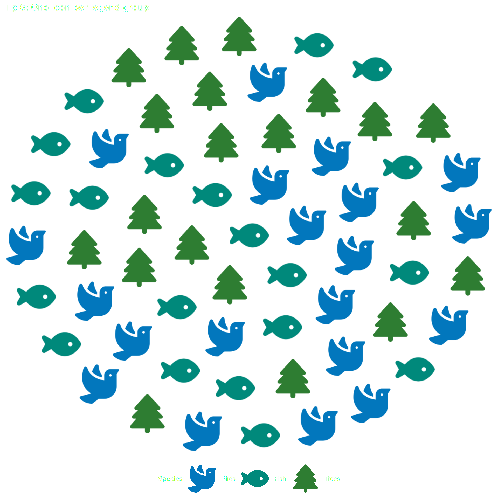

  

------------------------------------------------------------------------

## Tip 7 — `scale_legend_icon()` must come after all theme calls

All [`theme()`](https://ggplot2.tidyverse.org/reference/theme.html) and
`theme_*()` calls must come **before**
[`scale_legend_icon()`](https://jurjoroa.github.io/ggpop/reference/scale_legend_icon.md)
— a theme call after it resets the key size.

> **Wrong order — theme() after scale_legend_icon() resets key size**
>
> ``` r
>
> ggplot(...) +
>   geom_pop(...) +
>   scale_legend_icon(size = 10) +   # ← scale_legend_icon first
>   theme_pop()                       # ← then theme — WRONG
> ```

``` r

df_tip7 <- data.frame(
  status = rep(c("Active", "Inactive"), each = 25),
  icon   = rep(c("circle-check", "circle-xmark"), each = 25),
  stringsAsFactors = FALSE
)

# Correct order: theme calls BEFORE scale_legend_icon()
ggplot(data = df_tip7,
    aes(icon = icon, color = status)) +
  geom_pop(size = 3, dpi = 100, legend_icons = TRUE) +
  scale_color_manual(values = c("Active" = "#2E7D32", "Inactive" = "#C62828")) +
  theme_pop() +                     # theme first
  theme(legend.position = "bottom") +
  theme(plot.title = element_text(color = "white"),
        plot.subtitle = element_text(color = "white"),
        legend.text = element_text(color = "white"),
        legend.title = element_text(color = "white"),
        legend.position = "bottom") +
  scale_legend_icon(size = 10) +    # scale_legend_icon last
  labs(
    title    = "Tip 7: Correct layer order",
    subtitle = "theme calls → scale_legend_icon()",
    color    = "Status"
  )
```

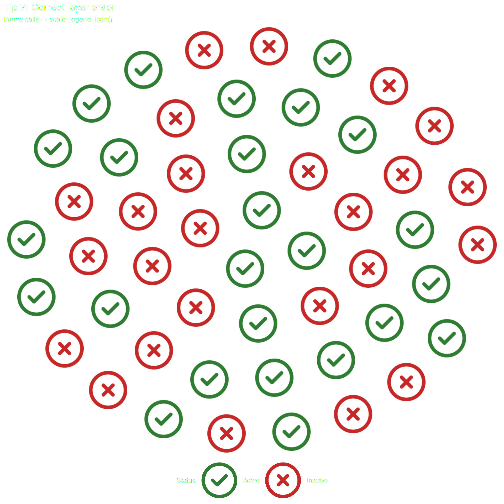

  

------------------------------------------------------------------------

## Tip 8 — Use `process_data()` to convert count data

If your data has one row per group with a count column, use
[`process_data()`](https://jurjoroa.github.io/ggpop/reference/process_data.md)
to expand it to one row per icon.

``` r

# Your raw count data
df_counts_raw <- data.frame(
  education = c("No degree", "High school", "Bachelor's", "Graduate"),
  population = c(12500000, 38000000, 45000000, 18000000)
)

# Expand to one row per icon
df_edu <- process_data(
  data        = df_counts_raw,
  group_var   = education,
  sum_var     = population,
  sample_size = 100
) %>%
  mutate(icon = case_when(
    type == "No degree"   ~ "xmark",
    type == "High school" ~ "school",
    type == "Bachelor's"  ~ "graduation-cap",
    type == "Graduate"    ~ "user-graduate"
  ))

df_edu$type <- factor(df_edu$type,
  levels = c("No degree", "High school", "Bachelor's", "Graduate"))

ggplot(data = df_edu, aes(icon = icon, color = type)) +
  geom_pop(size = 2, dpi = 100, legend_icons = TRUE, arrange = TRUE) +
  scale_color_manual(values = c(
    "No degree"   = "#B71C1C",
    "High school" = "#E65100",
    "Bachelor's"  = "#1565C0",
    "Graduate"    = "#1B5E20"
  )) +
  theme_pop() +
  theme(plot.title = element_text(color = "white"),
        plot.subtitle = element_text(color = "white"),
        legend.text = element_text(color = "white"),
        legend.title = element_text(color = "white"),
        legend.position = "bottom") +
  scale_legend_icon(size = 6) +
  labs(
    title    = "Tip 8: Use process_data() for count-based data",
    subtitle = "Each icon ≈ 1% of the total population sample",
    color    = "Education"
  )
```

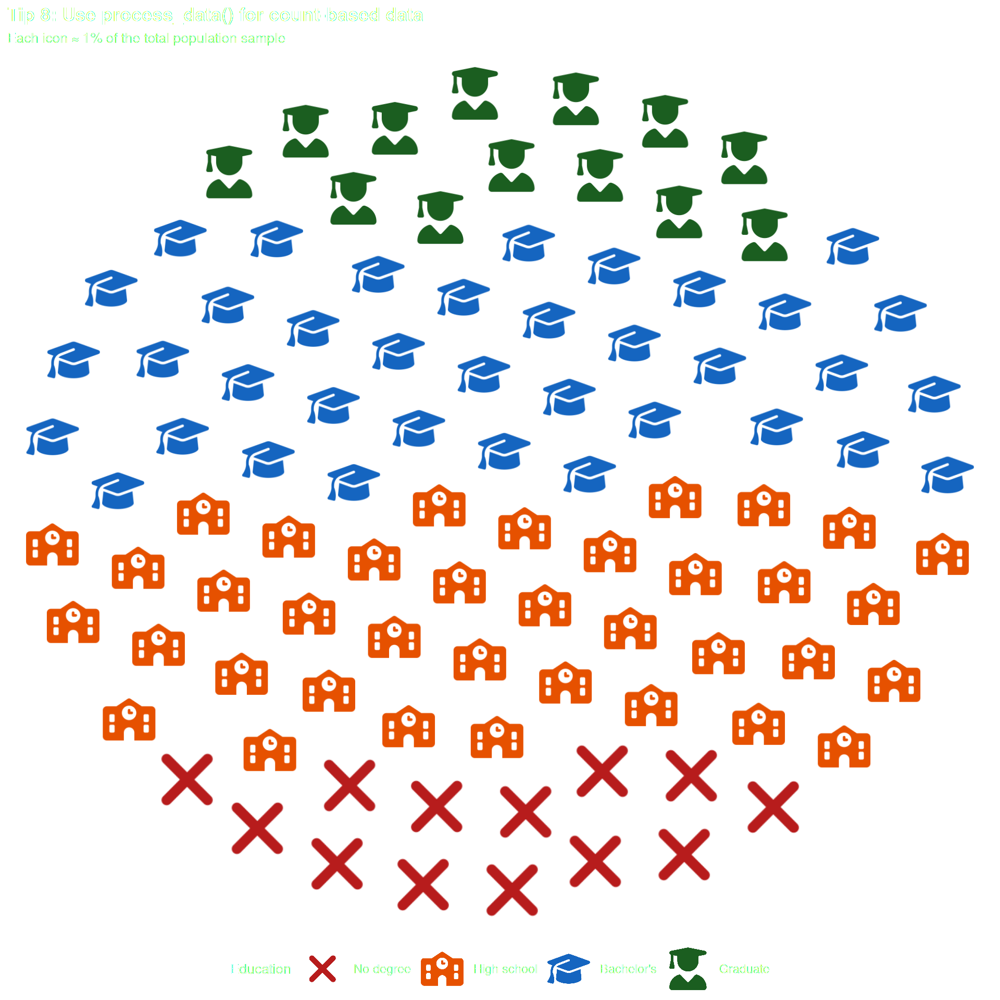

  

------------------------------------------------------------------------

## Tip 9 — Use `seed` for reproducible charts

Pass `seed` to
[`geom_pop()`](https://jurjoroa.github.io/ggpop/reference/geom_pop.md)
for a reproducible layout — useful in papers, dashboards, or automated
pipelines.

> **Why this matters**
>
> If you are including a chart in a paper, dashboard, or automated
> report, you want the output to be **identical every time** the code
> runs. A fixed seed guarantees that.

``` r

df_tip9_raw <- data.frame(
  source     = c("Coal", "Natural Gas", "Nuclear", "Renewables"),
  generation = c(800000, 1600000, 700000, 900000)
)

df_tip9 <- process_data(
  data        = df_tip9_raw,
  group_var   = source,
  sum_var     = generation,
  sample_size = 100
) %>%
  mutate(icon = case_when(
    type == "Coal"        ~ "industry",
    type == "Natural Gas" ~ "fire",
    type == "Nuclear"     ~ "atom",
    type == "Renewables"  ~ "sun"
  ))

ggplot(data = df_tip9, aes(icon = icon, color = type)) +
  geom_pop(size = 2, dpi = 100, seed = 42) +
  scale_color_manual(values = c(
    "Coal"        = "#B0BEC5",
    "Natural Gas" = "#FFB74D",
    "Nuclear"     = "#CE93D8",
    "Renewables"  = "#4DB6AC"
  )) +
  theme_pop() +
  theme(plot.title = element_text(color = "white"),
        plot.subtitle = element_text(color = "white"),
        legend.text = element_text(color = "white"),
        legend.title = element_text(color = "white"),
        legend.position = "bottom") +
  scale_legend_icon(size = 8) +
  labs(
    title    = "U.S. Electricity Generation by Source",
    subtitle = "Each icon represents ~1% of total generation — layout fixed with seed = 42",
    color    = "Energy source"
  )
```

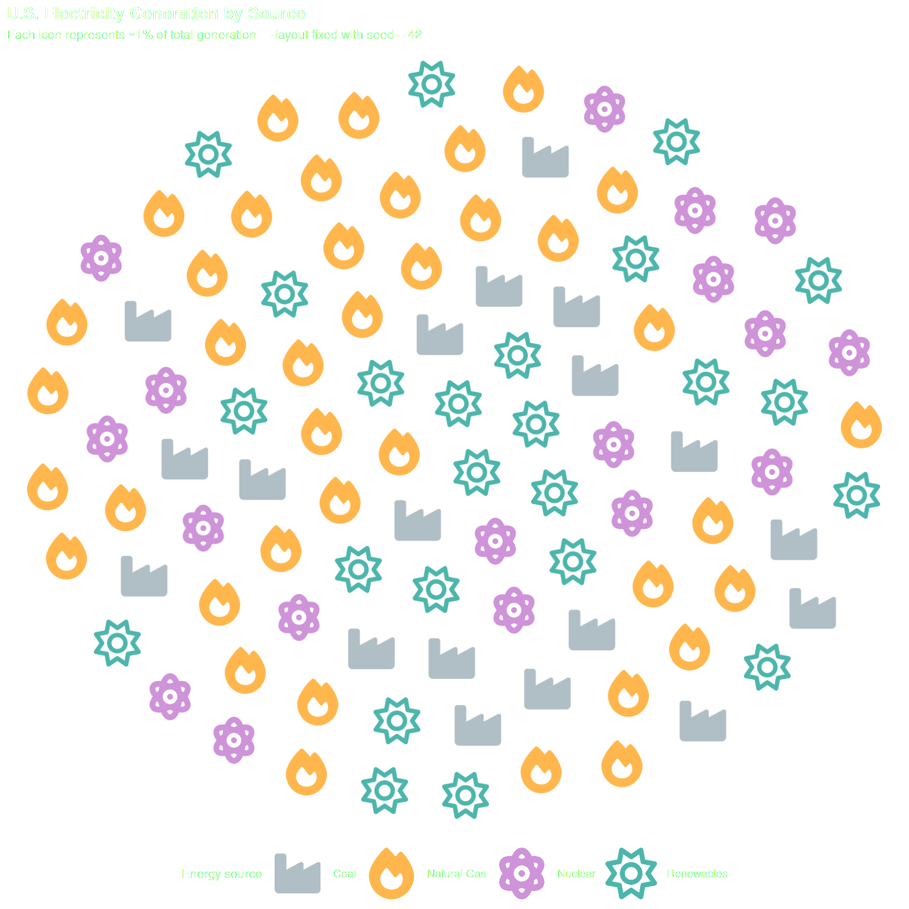

  

------------------------------------------------------------------------

## Tip 10 — Use `arrange = TRUE` to cluster icons by group

Use `arrange = FALSE` (default) for a scattered effect. Use
`arrange = TRUE` to cluster icons by group, making boundaries between
groups visible.

``` r

df_tip12 <- data.frame(
  outcome = c(rep("Recovered", 65), rep("Ongoing", 25), rep("Worsened", 10)),
  icon    = c(rep("circle-check", 65), rep("arrow-right", 25), rep("circle-xmark", 10)),
  stringsAsFactors = FALSE
)

df_tip12$outcome <- factor(df_tip12$outcome,
  levels = c("Recovered", "Ongoing", "Worsened"))

ggplot(data = df_tip12, aes(icon = icon, color = outcome)) +
  geom_pop(size = 2, dpi = 100, legend_icons = TRUE, arrange = TRUE) +
  scale_color_manual(values = c(
    "Recovered" = "#2E7D32",
    "Ongoing"   = "#F9A825",
    "Worsened"  = "#C62828"
  )) +
  theme_pop() +
  theme(plot.title = element_text(color = "white"),
        plot.subtitle = element_text(color = "white"),
        legend.text = element_text(color = "white"),
        legend.title = element_text(color = "white"),
        legend.position = "bottom") +
  scale_legend_icon(size = 8) +
  labs(
    title    = "Tip 12: arrange = TRUE clusters icons by group",
    subtitle = "Groups appear contiguously — proportional boundaries are clear",
    color    = "Outcome"
  )
```

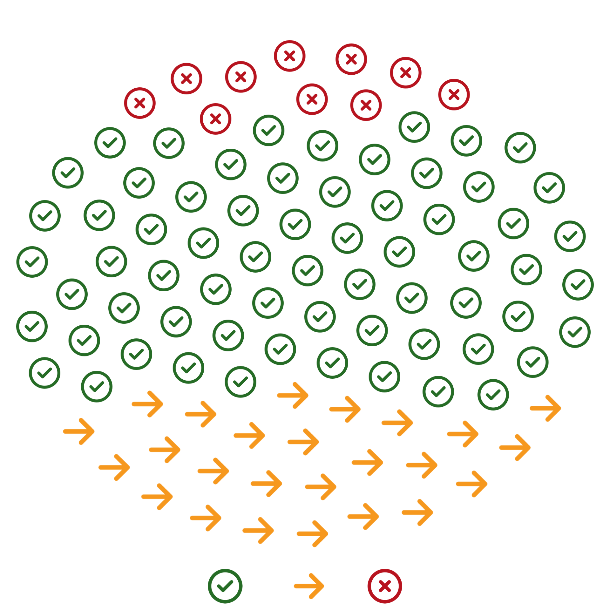

  

------------------------------------------------------------------------

## Tip 11 — Per-group alpha: rename the column and hide the alpha legend entry

When you want different transparency per group, follow this three-step
workflow:

1.  **Rename** your transparency column — `alpha` is a reserved internal
    name, use `opacity` or any other name
2.  **Map** it in
    [`aes()`](https://ggplot2.tidyverse.org/reference/aes.html):
    `aes(alpha = opacity)`
3.  **Suppress** the auto-generated alpha legend with
    `guides(alpha = "none")` — the color legend already encodes all the
    information

Skipping step 3 leaves an unwanted legend entry. Skipping step 1 causes
an error.

> **What NOT to do**
>
> ``` r
>
> # Error — alpha is a reserved internal column name in ggpop
> df$alpha <- c(1.0, 0.6, 0.3)
> aes(alpha = alpha)   # Error
> ```

``` r

df_tip13 <- data.frame(
  status  = c(rep("Confirmed", 60), rep("Probable", 25), rep("Suspected", 15)),
  icon    = c(rep("circle-check", 60), rep("clock", 25), rep("circle-question", 15)),
  opacity = c(rep(1.0, 60), rep(0.6, 25), rep(0.3, 15))  # ← named "opacity", not "alpha"
)

df_tip13$status <- factor(df_tip13$status,
  levels = c("Confirmed", "Probable", "Suspected"))

ggplot(data = df_tip13, aes(icon = icon, color = status, alpha = opacity)) +
  geom_pop(size = 2, dpi = 100, legend_icons = TRUE) +
  scale_color_manual(values = c(
    "Confirmed" = "#1565C0",
    "Probable"  = "#6A1B9A",
    "Suspected" = "#E64A19"
  )) +
  guides(alpha = "none") + #step 3: hide the auto alpha legend
  theme_pop() +
  theme(plot.title = element_text(color = "white"),
        plot.subtitle = element_text(color = "white"),
        legend.text = element_text(color = "white"),
        legend.title = element_text(color = "white"),
        legend.position = "bottom") +
  scale_legend_icon(size = 8) +
  labs(
    title    = "Tip 13: Per-group alpha — rename column, map it, hide the extra legend",
    subtitle = "opacity → aes(alpha = opacity) + guides(alpha = 'none')",
    color    = "Case status"
  )
```

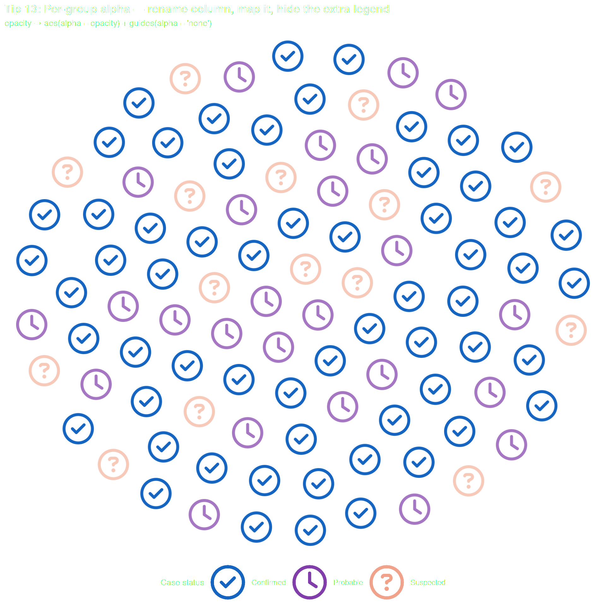

  

------------------------------------------------------------------------

## Tip 12 — With `facet_wrap()`, the icon limit applies per panel

[`geom_pop()`](https://jurjoroa.github.io/ggpop/reference/geom_pop.md)
enforces a maximum of **1,000 icons per facet panel** — not globally.
Four panels of 250 icons each (1,000 total) is well within limits; two
panels of 1,001 each will error.

Use `high_group_var` in
[`process_data()`](https://jurjoroa.github.io/ggpop/reference/process_data.md)
to sample independently per panel and keep `sample_size` low enough that
no single panel exceeds the cap. Tell
[`geom_pop()`](https://jurjoroa.github.io/ggpop/reference/geom_pop.md)
which column drives the faceting by passing `facet = group`.

> **Rule of thumb**
>
> Keep `sample_size` ≤ 1,000 ÷ number of panels to leave headroom in
> every panel.

``` r

df_tip14_raw <- data.frame(
  region = rep(c("North", "South", "East", "West"), each = 2),
  sex    = rep(c("Male", "Female"), times = 4),
  n      = c(2100000, 1900000, 3200000, 2800000, 1500000, 1400000, 2700000, 2500000)
)

# 50 icons per panel × 4 panels = 200 total — well within the 1,000-per-panel limit
df_tip14 <- process_data(
  data           = df_tip14_raw,
  high_group_var = "region",
  group_var      = sex,
  sum_var        = n,
  sample_size    = 50
) %>%
  mutate(icon = case_when(
    type == "Male"   ~ "mars",
    type == "Female" ~ "venus"
  ))

ggplot(data = df_tip14, aes(icon = icon, color = type)) +
  geom_pop(size = 2, dpi = 100, legend_icons = TRUE, facet = group) +
  facet_wrap(~ group) +
  scale_color_manual(values = c("Male" = "#1565C0", "Female" = "#C62828")) +
  theme_pop() +
  theme(plot.title = element_text(color = "white"),
        plot.subtitle = element_text(color = "white"),
        legend.text = element_text(color = "white"),
        legend.title = element_text(color = "white"),
        strip.text= element_text(color = "white"),
        legend.position = "bottom") +
  scale_legend_icon(size = 8) +
  labs(
    title    = "Tip 14: Facet icon limit is per panel",
    subtitle = "50 icons per panel × 4 panels — each well within the 1,000-per-panel cap",
    color    = "Sex"
  )
```

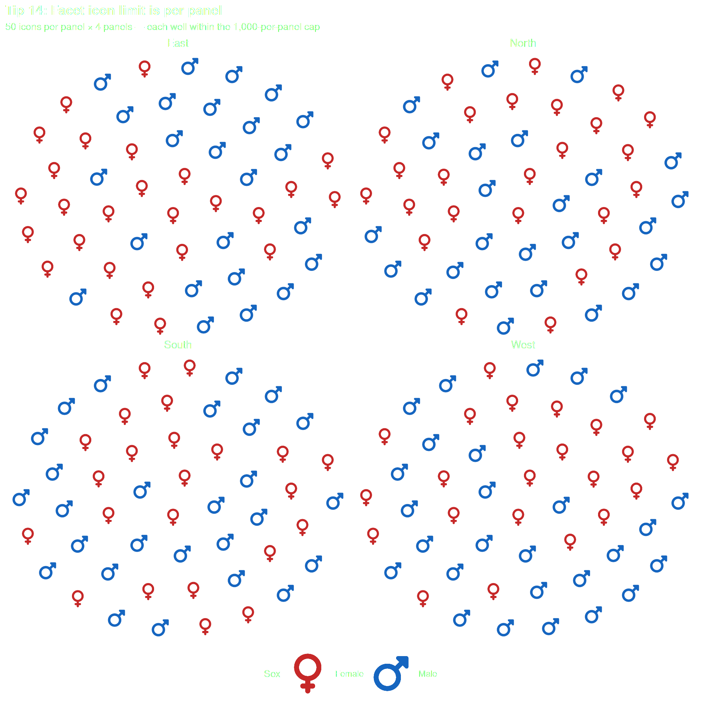

  

------------------------------------------------------------------------

## Tip 13 – Combine an icon legend with a separate fill legend

When you want an icon legend (via `geom_icon_point`) and an unrelated
fill legend (e.g. for a dominance status) on the same plot, use two
dummy data layers – one per legend – both with `inherit.aes = FALSE`.
This keeps the aesthetics completely isolated and prevents icons from
bleeding into the fill legend keys.

> **Key rules**
>
> - `dummy_icons`: contains the icon and group columns. Drives the icon
>   legend.
> - `dummy_status`: contains only the status column – **no icon
>   column**. Drives the fill legend.
> - Both use `inherit.aes = FALSE` so they do not inherit the top-level
>   [`aes()`](https://ggplot2.tidyverse.org/reference/aes.html).
> - The main
>   [`geom_icon_point()`](https://jurjoroa.github.io/ggpop/reference/geom_icon_point.md)
>   layer uses `show.legend = FALSE` – the legend is driven entirely by
>   the dummy layers.

``` r

status_cols <- c("ND" = "#06D6A0", "ED" = "#1A78C2", "D" = "#E69F00")

df_cea <- data.frame(
  effect      = c(277.25, 277.57, 277.78, 277.83, 277.76) / 12,
  cost        = c(26000, 27000, 28020, 28440, 29440),
  strategy    = c("Status Quo", "One-Time", "Every 5yr", "Every 3yr", "Annual"),
  group_label = c("Status Quo", "Infrequent", "Infrequent", "Frequent", "Frequent"),
  icon_col    = c("person", "vial", "vial", "syringe", "syringe"),
  status      = factor(c("ND", "ND", "ND", "ND", "D"), levels = c("ND", "ED", "D")),
  stringsAsFactors = FALSE
)
dummy_icons <- data.frame(
  effect      = rep(NA_real_, 3), cost = rep(NA_real_, 3),
  icon_col    = c("person", "vial", "syringe"),
  group_label = factor(c("Status Quo", "Infrequent", "Frequent"),
                       levels = c("Status Quo", "Infrequent", "Frequent")),
  stringsAsFactors = FALSE
)
dummy_status <- data.frame(
  effect = rep(NA_real_, 2), cost = rep(NA_real_, 2),
  status = factor(c("ND", "D"), levels = c("ND", "ED", "D")),
  stringsAsFactors = FALSE
)
dummy_ef <- data.frame(effect = NA_real_, cost = NA_real_,
                       frontier = "Efficient Frontier")

suppressWarnings(
  ggplot(df_cea, aes(x = effect, y = cost, icon = icon_col, color = status)) +
    geom_line(data = df_cea %>% filter(status == "ND") %>% arrange(effect),
              aes(x = effect, y = cost, group = 1),
              color = "#06D6A0", linewidth = 1, alpha = 0.6, inherit.aes = FALSE) +
    geom_icon_point(size = 2, dpi = 120, show.legend = FALSE) +
    geom_icon_point(data = dummy_icons,
                    aes(x = effect, y = cost, icon = icon_col, color = group_label),
                    size = 2, dpi = 120, inherit.aes = FALSE, show.legend = TRUE) +
    geom_point(data = dummy_status, aes(x = effect, y = cost, fill = status),
               shape = 22, size = 0, alpha = 0, inherit.aes = FALSE, show.legend = TRUE) +
    geom_point(data = dummy_ef, aes(x = effect, y = cost, fill = frontier),
               shape = NA, size = 0, alpha = 0, inherit.aes = FALSE,
               show.legend = TRUE, key_glyph = "path") +
    geom_label(data = df_cea %>% filter(status != "ND"),
               aes(x = effect, y = cost, label = strategy, fill = status),
               color = "white", size = 2.5, vjust = -1.5,
               label.size = NA, fontface = "bold",
               inherit.aes = FALSE, show.legend = FALSE) +
    geom_label(data = df_cea %>% filter(status == "ND"),
               aes(x = effect, y = cost, label = strategy),
               color = "white", fill = "#06D6A0", size = 2.5,
               hjust = -0.1, label.size = NA, fontface = "bold",
               inherit.aes = FALSE, show.legend = FALSE) +
    scale_color_manual(
      name   = "HIV Screening",
      values = c(status_cols, "Status Quo" = "#2C3E50",
                 "Infrequent" = "#2C3E50", "Frequent" = "#2C3E50"),
      breaks = c("Status Quo", "Infrequent", "Frequent"),
      guide  = guide_legend(order = 1, ncol = 3,
                            override.aes = list(alpha = 1, size = 4,
                                                color = "#2C3E50", fill = NA, shape = NA))
    ) +
    scale_fill_manual(
      name   = "Dominance Status",
      values = c("Efficient Frontier" = "#06D6A0", "ND" = "#06D6A0", "D" = "#E69F00"),
      breaks = c("Efficient Frontier", "ND", "D"),
      labels = c("Efficient Frontier" = "Efficient Frontier",
                 "ND" = "Non-Dominated", "D" = "Dominated"),
      guide  = guide_legend(order = 2, ncol = 3,
                            override.aes = list(
                              shape     = c(NA, 22, 22),
                              fill      = c(NA, "#06D6A0", "#E69F00"),
                              linetype  = c("solid", "blank", "blank"),
                              color     = c("#06D6A0", NA, NA),
                              linewidth = c(1, 0, 0),
                              size      = c(0, 4, 4),
                              alpha     = 1
                            ))
    ) +
    scale_x_continuous(name = "Effectiveness (QALYs)",
                       labels = scales::number_format(accuracy = 0.01),
                       expand = expansion(mult = c(0.05, 0.2))) +
    scale_y_continuous(name = "Cost (USD)", labels = scales::dollar,
                       expand = expansion(mult = c(0.05, 0.2))) +
    theme_minimal(base_size = 13) +
    theme(legend.position = "bottom", legend.box = "vertical",
          panel.grid.minor = element_blank()) +
    scale_legend_icon(size = 4, which = "HIV Screening") +
    labs(title = "Cost-Effectiveness of HIV Screening Strategies",
         subtitle = "Paltiel et al. (2006) Ann Intern Med -- High-risk population")
)
```

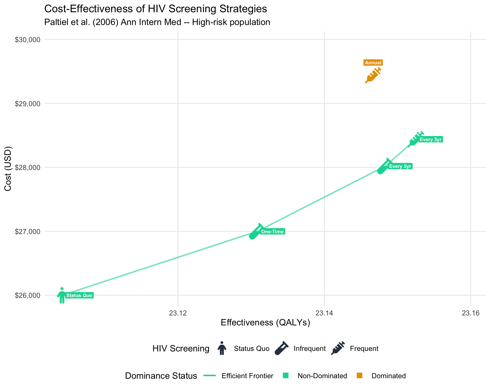
