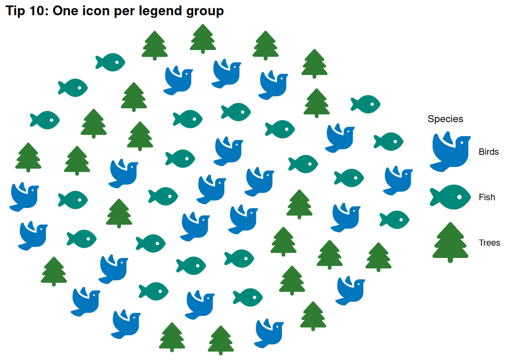
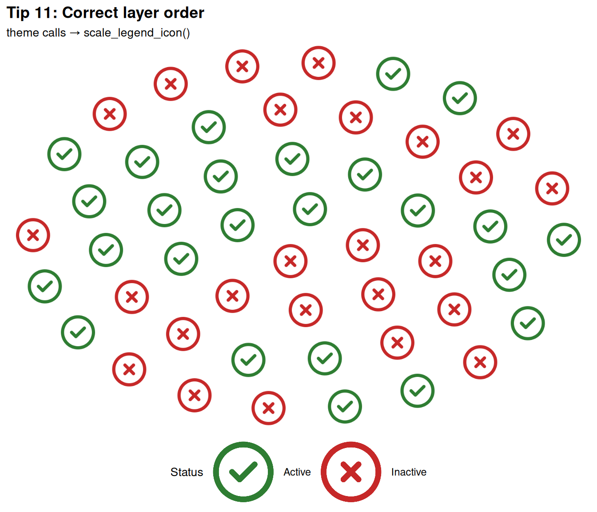

# Tips & Best Practices

This page collects the most important rules and conventions to keep in
mind when working with `ggpop`. Each tip explains what to do (and why),
followed by a working example.

  

------------------------------------------------------------------------

## Tip 1 — Use valid Font Awesome icon names

The `icon` column (or `aes(icon = ...)`) must contain **valid Font
Awesome icon names** — no `NA` values, no whitespace-only strings, and
no names that don’t exist in Font Awesome. Use
[`fa_icons()`](https://jurjoroa.github.io/ggpop/reference/fa_icons.md)
to look up available names before building your plot.

> **How to find valid icon names**
>
> ``` r
> # Search by keyword
> fa_icons(query = "person")
> fa_icons(query = "car")
> fa_icons(query = "heart")
> ```

``` r
df_tip2 <- data.frame(
  transport = rep(c("Car", "Bicycle", "Plane"), each = 10),
  icon      = rep(c("car", "bicycle", "plane"), each = 10),
  stringsAsFactors = FALSE
)

ggplot() +
  geom_pop(
    data = df_tip2,
    aes(icon = icon, color = transport),
    size = 3, dpi = 96, legend_icons = TRUE
  ) +
  scale_color_manual(values = c(
    "Car"     = "#E64A19",
    "Bicycle" = "#2E7D32",
    "Plane"   = "#1565C0"
  )) +
  theme_pop() +
  scale_legend_icon(size = 8) +
  labs(title = "Tip 2: Valid FA icon names", color = "Transport")
```


  

------------------------------------------------------------------------

## Tip 2 — Avoid reserved column names

`ggpop` uses several internal column names during layout computation. If
your data already contains any of these names, the geom will throw an
error:

| Reserved name       | Purpose             |
|:--------------------|:--------------------|
| `x1`                | Computed x position |
| `y1`                | Computed y position |
| `pos`               | Icon position index |
| `image`             | PNG path (internal) |
| `coord_size`        | Coordinate scaling  |
| `icon_size`         | Icon rendering size |
| `icon_stroke_width` | Stroke scaling      |

**Rename any conflicting columns before calling
[`geom_pop()`](https://jurjoroa.github.io/ggpop/reference/geom_pop.md)
or
[`geom_icon_point()`](https://jurjoroa.github.io/ggpop/reference/geom_icon_point.md).**

``` r
# Safe column names — no conflict with internal reserved names
df_tip3 <- data.frame(
  sex      = rep(c("Male", "Female"), each = 20),
  icon     = rep(c("mars", "venus"), each = 20),
  age_grp  = rep(c("Adult", "Child"), times = 20),  # safe name
  stringsAsFactors = FALSE
)

ggplot() +
  geom_pop(
    data = df_tip3,
    aes(icon = icon, color = sex),
    size = 3, dpi = 96, legend_icons = TRUE
  ) +
  scale_color_manual(values = c("Male" = "#1565C0", "Female" = "#C62828")) +
  theme_pop() +
  scale_legend_icon(size = 8) +
  labs(title = "Tip 3: Safe column names", color = "Sex")
```


  

------------------------------------------------------------------------

## Tip 3 — Use `color`, not `fill` or `alpha`

[`geom_pop()`](https://jurjoroa.github.io/ggpop/reference/geom_pop.md)
renders icons as raster images. This means:

- `fill` is **not supported** → hard error
- `alpha` is **not supported** in
  [`geom_pop()`](https://jurjoroa.github.io/ggpop/reference/geom_pop.md)
  → hard error
- **`color`** is the correct aesthetic for icon styling

For
[`geom_icon_point()`](https://jurjoroa.github.io/ggpop/reference/geom_icon_point.md),
`alpha` is accepted as a parameter (not in
[`aes()`](https://ggplot2.tidyverse.org/reference/aes.html)), but values
below `0.1` will warn.

> **What NOT to do**
>
> ``` r
> # Both of these will error in geom_pop():
> aes(icon = icon, group = sex, fill  = sex)   # Error
> aes(icon = icon, group = sex, alpha = sex)   # Error
> geom_pop(..., alpha = 0.5)                   # Error
> ```

``` r
df_tip4 <- data.frame(
  region = rep(c("North", "South", "East", "West"), each = 15),
  icon   = rep(c("compass", "arrow-down", "arrow-right", "arrow-left"), each = 15),
  stringsAsFactors = FALSE
)

ggplot() +
  geom_pop(
    data = df_tip4,
    aes(icon = icon, color = region),   # color ✓ — not fill or alpha
    size = 3, dpi = 96, legend_icons = TRUE
  ) +
  scale_color_manual(values = c(
    "North" = "#00897B", "South" = "#E64A19",
    "East"  = "#7B1FA2", "West"  = "#F9A825"
  )) +
  theme_pop() +
  scale_legend_icon(size = 8) +
  labs(title = "Tip 4: Use color, not fill or alpha", color = "Region")
```


  

------------------------------------------------------------------------

## Tip 4 — Keep your total icon count at or below 1,000

[`geom_pop()`](https://jurjoroa.github.io/ggpop/reference/geom_pop.md)
enforces a hard limit of **1,000 icons** — both globally and per facet
panel. Exceeding this limit raises an error immediately. Use
[`process_data()`](https://jurjoroa.github.io/ggpop/reference/process_data.md)
with a `sample_size` argument to control the icon count automatically.

``` r
df_tip5_raw <- data.frame(
  group = c("Group A", "Group B", "Group C"),
  n     = c(4500000, 3200000, 2100000)
)

# process_data samples down to sample_size icons total
df_tip5 <- process_data(
  data        = df_tip5_raw,
  group_var   = group,
  sum_var     = n,
  sample_size = 100          # stays well under the 1,000 limit
) %>%
  mutate(icon = case_when(
    type == "Group A" ~ "circle",
    type == "Group B" ~ "square",
    type == "Group C" ~ "triangle-exclamation"
  ))

ggplot() +
  geom_pop(
    data = df_tip5,
    aes(icon = icon, color = type),
    size = 3, dpi = 96, legend_icons = TRUE
  ) +
  scale_color_manual(values = c(
    "Group A" = "#1565C0",
    "Group B" = "#2E7D32",
    "Group C" = "#E64A19"
  )) +
  theme_pop() +
  scale_legend_icon(size = 8) +
  labs(
    title    = "Tip 5: Use process_data() to control icon count",
    subtitle = "sample_size = 100 — well under the 1,000-icon limit",
    color    = "Group"
  )
```


  

------------------------------------------------------------------------

## Tip 5 — Don’t map `x` or `y` in `geom_pop()`

[`geom_pop()`](https://jurjoroa.github.io/ggpop/reference/geom_pop.md)
computes icon positions internally in a grid layout. Mapping `x` or `y`
in [`aes()`](https://ggplot2.tidyverse.org/reference/aes.html) has no
effect — ggpop ignores them and issues a warning. Leave those aesthetics
unmapped.

> **This will warn (and x/y are silently ignored)**
>
> ``` r
> geom_pop(data = df, aes(icon = icon, group = sex, x = sex, y = sex))
> ```

``` r
df_tip6 <- data.frame(
  type = rep(c("Urban", "Rural"), each = 25),
  icon = rep(c("building", "tree"), each = 25),
  stringsAsFactors = FALSE
)

# Correct: no x or y in aes() — geom_pop() handles layout automatically
ggplot() +
  geom_pop(
    data = df_tip6,
    aes(icon = icon, color = type),
    size = 3, dpi = 96, legend_icons = TRUE
  ) +
  scale_color_manual(values = c("Urban" = "#5C6BC0", "Rural" = "#388E3C")) +
  theme_pop() +
  scale_legend_icon(size = 8) +
  labs(title = "Tip 6: No x/y mapping needed in geom_pop()", color = "Area")
```


  

------------------------------------------------------------------------

------------------------------------------------------------------------

## Tip 6 — One icon per legend group when using `legend_icons = TRUE`

When `legend_icons = TRUE`, ggpop reads the first icon from each group
to render in the legend. If a single group contains **multiple different
icons**, ggpop issues a warning because it can only show one icon per
legend key.

**Ensure each value of your `color` grouping variable maps to exactly
one icon name.**

``` r
# Each group maps to exactly one icon — clean legend
df_tip10 <- data.frame(
  species = rep(c("Birds", "Fish", "Trees"), each = 20),
  icon    = rep(c("dove", "fish", "tree"), each = 20),
  stringsAsFactors = FALSE
)

ggplot() +
  geom_pop(
    data = df_tip10,
    aes(icon = icon, color = species),
    size = 3, dpi = 96,
    legend_icons = TRUE            # one icon per group ✓ — no warning
  ) +
  scale_color_manual(values = c(
    "Birds" = "#0277BD",
    "Fish"  = "#00897B",
    "Trees" = "#2E7D32"
  )) +
  theme_pop() +
  scale_legend_icon(size = 8) +
  labs(title = "Tip 10: One icon per legend group", color = "Species")
```



  

------------------------------------------------------------------------

## Tip 7 — `scale_legend_icon()` must come after all theme calls

[`scale_legend_icon()`](https://jurjoroa.github.io/ggpop/reference/scale_legend_icon.md)
intercepts ggplot2’s theme system to resize legend keys. If a
[`theme()`](https://ggplot2.tidyverse.org/reference/theme.html) or
`theme_*()` call appears **after**
[`scale_legend_icon()`](https://jurjoroa.github.io/ggpop/reference/scale_legend_icon.md),
it can reset the legend key size and break the sizing.

**Rule:** all
[`theme_pop()`](https://jurjoroa.github.io/ggpop/reference/theme_pop.md),
[`theme_minimal()`](https://ggplot2.tidyverse.org/reference/ggtheme.html),
[`theme()`](https://ggplot2.tidyverse.org/reference/theme.html) calls
must precede
[`scale_legend_icon()`](https://jurjoroa.github.io/ggpop/reference/scale_legend_icon.md).

> **Wrong order — theme() after scale_legend_icon() resets key size**
>
> ``` r
> ggplot(...) +
>   geom_pop(...) +
>   scale_legend_icon(size = 10) +   # ← scale_legend_icon first
>   theme_pop()                       # ← then theme — WRONG
> ```

``` r
df_tip11 <- data.frame(
  status = rep(c("Active", "Inactive"), each = 25),
  icon   = rep(c("circle-check", "circle-xmark"), each = 25),
  stringsAsFactors = FALSE
)

# Correct order: theme calls BEFORE scale_legend_icon()
ggplot() +
  geom_pop(
    data = df_tip11,
    aes(icon = icon, color = status),
    size = 3, dpi = 96, legend_icons = TRUE
  ) +
  scale_color_manual(values = c("Active" = "#2E7D32", "Inactive" = "#C62828")) +
  theme_pop() +                     # ← theme first  ✓
  theme(legend.position = "bottom") +
  scale_legend_icon(size = 10) +    # ← scale_legend_icon last  ✓
  labs(
    title    = "Tip 11: Correct layer order",
    subtitle = "theme calls → scale_legend_icon()",
    color    = "Status"
  )
```



  

------------------------------------------------------------------------

## Tip 8 — Use `process_data()` to convert count data

If your data has one row per group with a **count column** (not one row
per icon), use
[`process_data()`](https://jurjoroa.github.io/ggpop/reference/process_data.md)
to expand it. It handles proportional sampling, reproducibility, and
returns one row per icon — ready for
[`geom_pop()`](https://jurjoroa.github.io/ggpop/reference/geom_pop.md).

``` r
# Your raw count data
df_counts_raw <- data.frame(
  education = c("No degree", "High school", "Bachelor's", "Graduate"),
  population = c(12500000, 38000000, 45000000, 18000000)
)

# Expand to one row per icon
df_edu <- process_data(
  data        = df_counts_raw,
  group_var   = education,
  sum_var     = population,
  sample_size = 100
) %>%
  mutate(icon = case_when(
    type == "No degree"   ~ "xmark",
    type == "High school" ~ "school",
    type == "Bachelor's"  ~ "graduation-cap",
    type == "Graduate"    ~ "user-graduate"
  ))

df_edu$type <- factor(df_edu$type,
  levels = c("No degree", "High school", "Bachelor's", "Graduate"))

ggplot() +
  geom_pop(
    data = df_edu,
    aes(icon = icon, color = type),
    size = 3, dpi = 96, legend_icons = TRUE, arrange = TRUE
  ) +
  scale_color_manual(values = c(
    "No degree"   = "#B71C1C",
    "High school" = "#E65100",
    "Bachelor's"  = "#1565C0",
    "Graduate"    = "#1B5E20"
  )) +
  theme_pop() +
  scale_legend_icon(size = 8) +
  labs(
    title    = "Tip 12: Use process_data() for count-based data",
    subtitle = "Each icon ≈ 1% of the total population sample",
    color    = "Education"
  )
```


