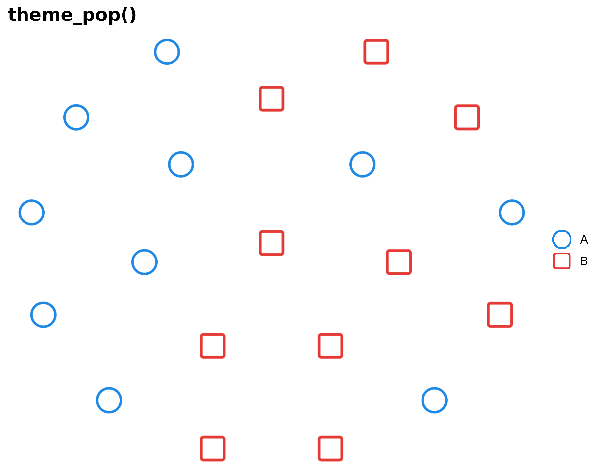
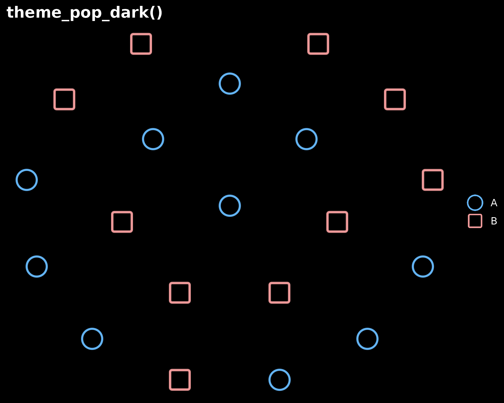
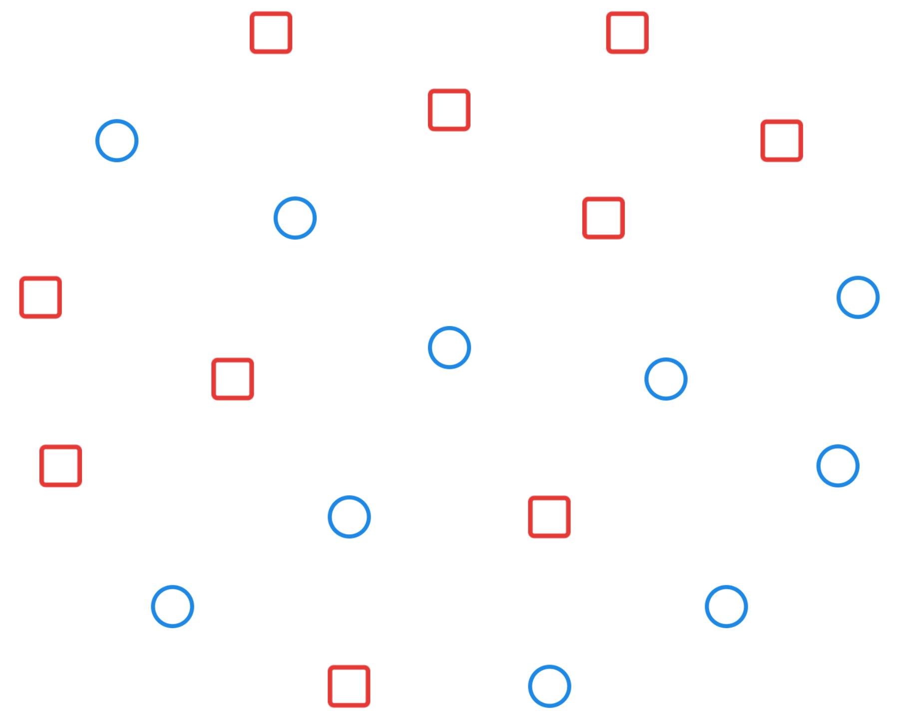

# Themes

`ggpop` ships three built-in themes optimized for icon charts:

| Theme                                                                                    | Description                        |
|:-----------------------------------------------------------------------------------------|:-----------------------------------|
| [`theme_pop()`](https://jurjoroa.github.io/ggpop/reference/theme_pop.md)                 | Default – clean, no axes           |
| [`theme_pop_dark()`](https://jurjoroa.github.io/ggpop/reference/theme_pop_dark.md)       | Dark background variant            |
| [`theme_pop_minimal()`](https://jurjoroa.github.io/ggpop/reference/theme_pop_minimal.md) | Ultra-minimal, no legend or titles |

## `theme_pop()`

Default theme. Removes axes and gridlines. Layer standard
[`theme()`](https://ggplot2.tidyverse.org/reference/theme.html) calls on
top to customize further.

``` r
ggplot() +
  geom_pop(data = df_t, aes(icon = icon, color = grp), size = 2, dpi = 72) +
  scale_color_manual(values = c(A = "#1E88E5", B = "#E53935")) +
  theme_pop() +
  labs(title = "theme_pop()", color = NULL)
```



## `theme_pop_dark()`

Dark background variant. Use lighter colors to maintain contrast.

``` r
ggplot() +
  geom_pop(data = df_t, aes(icon = icon, color = grp), size = 2, dpi = 72) +
  scale_color_manual(values = c(A = "#64B5F6", B = "#EF9A9A")) +
  theme_pop_dark() +
  labs(title = "theme_pop_dark()", color = NULL)
```



## `theme_pop_minimal()`

Ultra-minimal. No axes, no legend, no titles. Useful for embedding
charts in dashboards or slides where context is provided externally.

``` r
ggplot() +
  geom_pop(data = df_t, aes(icon = icon, color = grp), size = 2, dpi = 72) +
  scale_color_manual(values = c(A = "#1E88E5", B = "#E53935")) +
  theme_pop_minimal()
```


